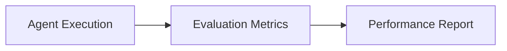

# TraceGraph :: Eval

## Overview
The `tracegraph-eval` module provides an evaluation framework to test, score, and validate the behavior of TraceGraph agents. This is essential for iterative improvement and quality assurance of complex agentic workflows.

## Evaluation Process

## Features
- Extensible scoring metrics for deterministic and non-deterministic outputs
- Deep integration with observability data
- AssertJ and JUnit support for test-driven agent development
