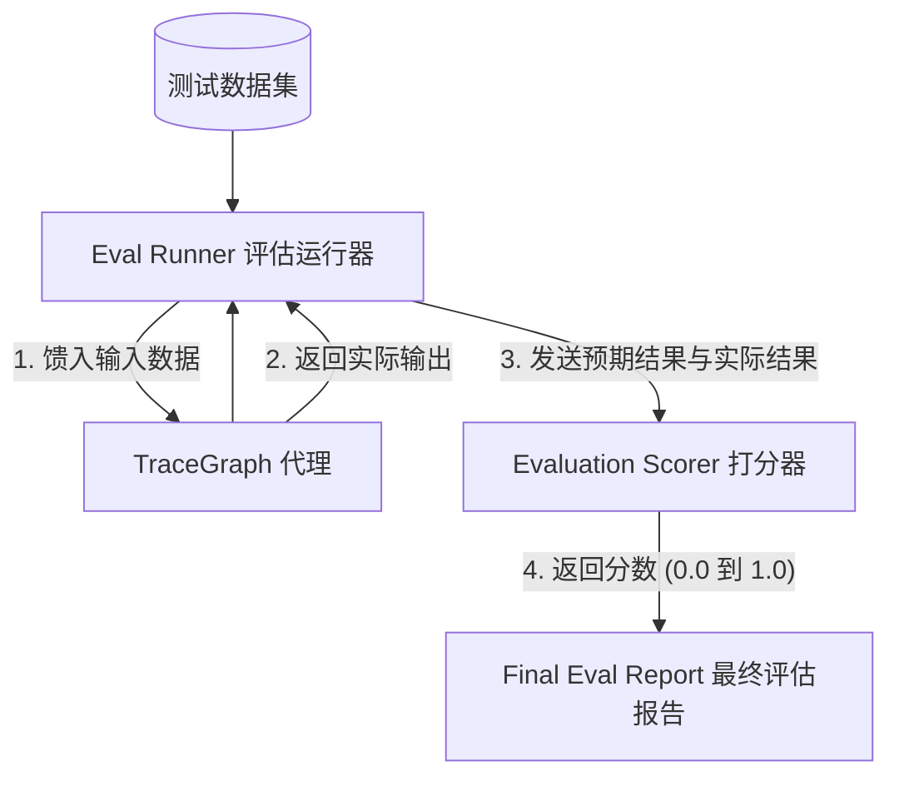

# TraceGraph :: Eval (评估模块)

## 📖 评估 (Evaluation) 简介
欢迎使用 `tracegraph-eval` 模块！当您编写普通程序时，您完全知道给定输入的预期输出是什么（例如 `2 + 2 = 4`）。但是，当您使用大语言模型 (LLM) 时，输出是*非确定性*的（每次都会略有变化），并且通常是自然语言。

当您调整代理的提示词或其执行图逻辑时，您如何知道代理实际上是否变得更好了？

`tracegraph-eval` 模块提供了工具，可以通过比对包含预期答案的数据集，对您的代理进行科学的**打分**和**评估**。

### 核心概念
- **数据集 (Dataset)**: 一系列 `(输入, 预期输出)` 对的列表，用作真实标准基准。
- **打分器 (Scorer / Judge)**: 将代理的实际输出与预期输出进行比较的函数。这可以是完全匹配、正则表达式提取，甚至是“LLM-as-a-Judge”（让像 GPT-4 这样的大模型给小模型的输出打分）。
- **评估运行 (Evaluation Run)**: 让代理在整个数据集上自动运行，并生成汇总得分（比如 85% 的准确率）的过程。

## 🏗️ 评估工作流

下图说明了 `EvalRunner` 如何编排测试数据集、您的代理和打分器以生成最终报告。



## 🚀 如何使用

### 1. 创建打分器
您可以创建自定义打分器来精确定义如何对输出进行评分。TraceGraph 支持创建多个打分器并汇总它们的结果。

```java
import site.tracegraph.eval.Scorer;

public class ExactMatchScorer implements Scorer {
    @Override
    public double score(String expected, String actual) {
        // 如果完全匹配则返回 1.0，否则返回 0.0
        return expected.trim().equalsIgnoreCase(actual.trim()) ? 1.0 : 0.0;
    }
}
```

### 2. 运行评估
使用 `EvalRunner` 针对批量数据集执行代理并打印得出的准确率。

```java
import site.tracegraph.eval.EvalRunner;
import site.tracegraph.eval.Dataset;
import site.tracegraph.eval.EvalReport;

public class MyAgentEvaluation {
    public static void main(String[] args) {
        TraceGraph myAgent = // ... 初始化您的 TraceGraph 代理
        
        // 加载您的测试问答数据
        Dataset dataset = Dataset.fromCsv("src/test/resources/eval-data.csv");
        
        // 使用您的代理和打分器初始化运行器
        EvalRunner runner = new EvalRunner(myAgent, new ExactMatchScorer());
        
        // 在整个数据集上运行评估！
        EvalReport report = runner.evaluate(dataset);
        
        System.out.println("=================================");
        System.out.println("评估的样本总数: " + report.getTotalSamples());
        System.out.println("代理准确率: " + (report.getAverageScore() * 100) + "%");
        System.out.println("失败的样本数: " + report.getFailedSamples().size());
        System.out.println("=================================");
    }
}
```

## 🧠 进阶用法: LLM-as-a-Judge
对于对话式代理，完全匹配通常过于严格。与 `ExactMatchScorer` 不同，您可以配置一个 `LlmScorer`。该打分器将用户的问题、预期输出和实际输出传递给 LLM，要求它按 1 到 5 分的等级评估实际输出的正确性。
