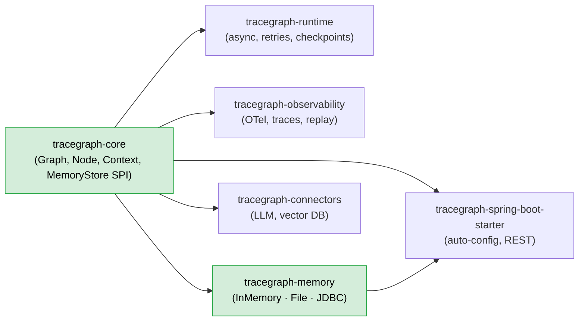
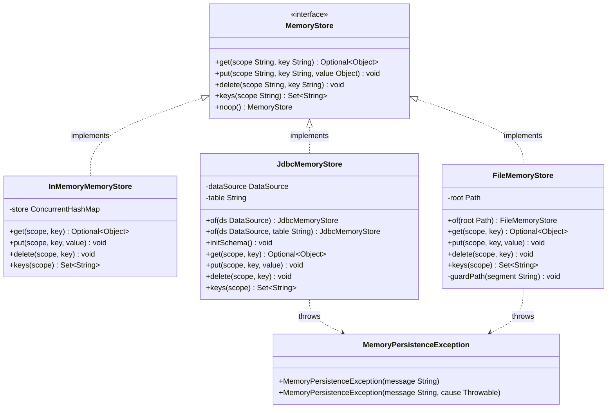
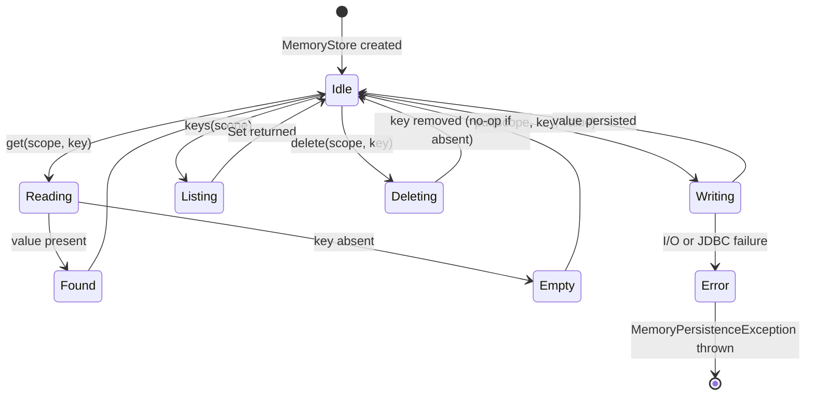
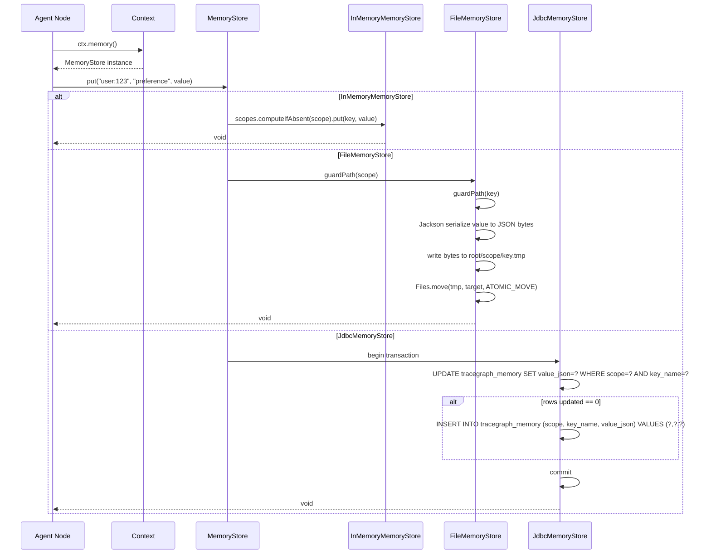
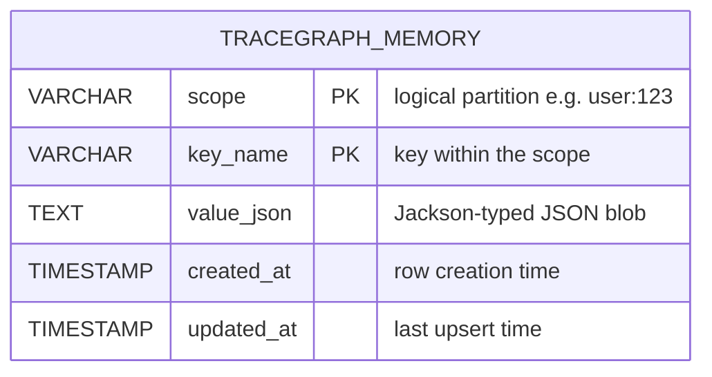

# tracegraph-memory

[](https://central.sonatype.com/artifact/io.tracegraph/tracegraph-memory)
[](https://www.apache.org/licenses/LICENSE-2.0)
[](https://openjdk.org/projects/jdk/21/)

Cross-execution, scoped key-value memory for TraceGraph agents — backed by in-memory, file, or JDBC stores.

---

## What it does

`tracegraph-memory` provides the `MemoryStore` SPI and three production-ready implementations so
that agent nodes can persist and retrieve facts, preferences, and intermediate results that outlive a
single graph run. Working memory (the graph state object `<S>`) flows through edges during one
execution; `MemoryStore` is for data that must survive across executions or be shared between them.

Memory is always addressed by a **scope** string — a logical partition like `"user:123"` or
`"session:abc"` — so different agents, users, or sessions cannot accidentally observe each other's
data. Values are serialised with Jackson polymorphic type information, which means a
`Map<String, Object>`, a custom Java record, or a `List<Integer>` all round-trip faithfully without
requiring manual type tokens.

The three implementations cover the full spectrum from unit tests (`InMemoryMemoryStore`) through
local-script durability (`FileMemoryStore`) to production RDBMS (`JdbcMemoryStore`). TTL/expiry and
vector/semantic search are out of scope for this module; they are deferred to future slices that
build on this substrate.

---

## System Context



`tracegraph-core` defines the `MemoryStore` interface (zero heavy dependencies). This module
supplies the concrete implementations. The Spring Boot starter auto-wires `JdbcMemoryStore` when a
`DataSource` bean is present and Jackson is on the classpath.

---

## Internal Architecture



---

## Lifecycle / State Diagram



---

## Sequence Diagram — Write Path



---

## Data Model — JDBC



The composite primary key `(scope, key_name)` enforces at-most-one value per logical address.
The portable UPDATE-then-INSERT upsert works on PostgreSQL, MySQL, H2, and other JDBC-compatible
databases without requiring database-specific `UPSERT` or `ON CONFLICT` clauses.

---

## Core Concepts

### Scoped Key-Value Model

Every read and write requires an explicit **scope** string. Scopes are opaque strings — the
conventions recommended for TraceGraph agents are:

| Pattern | Typical meaning |
|---|---|
| `"user:42"` | Per-user long-term preferences, profiles |
| `"session:abc"` | Data tied to one conversation session |
| `"execution:exec-001"` | Temporary data within a single graph run |
| `"global"` | Shared across all executions |

Scopes are not hierarchical by default. If you need hierarchy, encode it in the scope string. The
store enforces only the path-traversal guard — it does not validate scope format or ownership.

### Jackson Polymorphic Typing

`FileMemoryStore` and `JdbcMemoryStore` serialise values using Jackson with
`DefaultTyping.NON_FINAL`, which embeds a `@class` property in the JSON:

```json
{
  "@class": "java.util.LinkedHashMap",
  "theme": "dark",
  "fontSize": 14
}
```

This means you get the original Java type back from `get()` without manual casting through a type
token. The trade-off is that the JSON is tied to your class names: if you rename a persistent class,
existing stored data will fail to deserialise until migrated.

### FileMemoryStore — Atomic Write and Crash Safety

Every write to `FileMemoryStore` follows a crash-safe three-step sequence:

1. Serialise the value to JSON bytes.
2. Write bytes to a sibling temp file: `{root}/{scope}/{key}.tmp`.
3. `Files.move(tmp, target, StandardCopyOption.ATOMIC_MOVE)`.

Step 3 is atomic on POSIX file systems (a `rename(2)` syscall) and is best-effort atomic on NTFS.
A crash between steps 2 and 3 leaves a harmless `.tmp` file; the committed file is never partially
written.

### Path Traversal Guard

Both `FileMemoryStore` and `JdbcMemoryStore` reject any scope or key string that contains `/`,
`\`, or `..` as a path component. This prevents escaping the root directory:

```java
// Both of these throw IllegalArgumentException
store.put("../bad-scope", "key", value);
store.put("ok-scope", "../../dangerous-key", value);
```

### JdbcMemoryStore — Upsert Semantics

The JDBC store uses an UPDATE-then-INSERT pattern inside a single transaction, making it portable
across all major relational databases:

```sql
-- Attempt to update an existing row
UPDATE tracegraph_memory
   SET value_json = ?,
       updated_at = CURRENT_TIMESTAMP
 WHERE scope = ?
   AND key_name = ?;

-- If the UPDATE matched zero rows, insert a new one
INSERT INTO tracegraph_memory (scope, key_name, value_json, created_at, updated_at)
VALUES (?, ?, ?, CURRENT_TIMESTAMP, CURRENT_TIMESTAMP);
```

Concurrent writes to the same `(scope, key_name)` are serialised by the database row lock; the
last writer wins. There is no optimistic concurrency control or version column.

---

## Complete Usage Walkthrough

### Step 1 — Add the Dependency

```xml
<dependency>
    <groupId>io.tracegraph</groupId>
    <artifactId>tracegraph-memory</artifactId>
    <version>0.1.0</version>
</dependency>
```

Jackson (`jackson-databind`) is an **optional** transitive dependency. It is only required when you
use `FileMemoryStore` or `JdbcMemoryStore`. If you use only `InMemoryMemoryStore`, Jackson does not
need to be on the classpath.

### Step 2 — InMemoryMemoryStore for Development and Tests

`InMemoryMemoryStore` requires no configuration or external process:

```java
import io.tracegraph.memory.InMemoryMemoryStore;
import io.tracegraph.core.spi.MemoryStore;

MemoryStore store = new InMemoryMemoryStore();
```

All data lives in a `ConcurrentHashMap<String, ConcurrentHashMap<String, Object>>`, partitioned
by scope. Data does not survive JVM restarts. This is the recommended store for all JUnit tests.

### Step 3 — FileMemoryStore for Local Scripts

```java
import io.tracegraph.memory.FileMemoryStore;
import java.nio.file.Path;

MemoryStore store = FileMemoryStore.of(Path.of("/tmp/agent-memory"));
```

The root directory is created on first use. Each scope becomes a subdirectory and each key becomes
a `.json` file within it:

```
/tmp/agent-memory/
  user:123/
    preference.json
    last-login.json
  session:abc/
    context.json
```

### Step 4 — JdbcMemoryStore for Production

```java
import io.tracegraph.memory.JdbcMemoryStore;
import javax.sql.DataSource;

// Default table name: "tracegraph_memory"
JdbcMemoryStore store = JdbcMemoryStore.of(dataSource);

// Create the table if it does not exist (idempotent — safe to call at startup)
store.initSchema();
```

To use a custom table name:

```java
JdbcMemoryStore store = JdbcMemoryStore.of(dataSource, "my_agent_memory");
store.initSchema();
```

### Step 5 — Wire the Store into the Graph

```java
import io.tracegraph.core.Graph;

Graph<OrderState> graph = Graph.<OrderState>builder()
    .memoryStore(store)
    // ... nodes, edges
    .build();
```

The store is then accessible in every node via `ctx.memory()`.

### Step 6 — Storing a Value Inside a Node

```java
graph.node("capturePreference", (state, ctx) -> {
    // Store a user preference map under a user-scoped key
    ctx.memory().put("user:123", "preference", Map.of(
        "theme",    "dark",
        "language", "en",
        "timezone", "UTC"
    ));
    return state;
});
```

The value can be any Jackson-serialisable object: `Map`, a custom record, a `List`, a primitive
wrapper, etc.

### Step 7 — Reading a Value Inside a Node

```java
graph.node("applyPreference", (state, ctx) -> {
    Optional<Object> raw = ctx.memory().get("user:123", "preference");
    if (raw.isPresent()) {
        @SuppressWarnings("unchecked")
        Map<String, Object> prefs = (Map<String, Object>) raw.get();
        String theme = (String) prefs.get("theme");
        // use theme ...
    }
    return state;
});
```

`get()` returns `Optional<Object>`. The concrete Java type is the same class that was stored
(preserved by polymorphic typing), so a direct cast is safe.

### Step 8 — Listing Keys in a Scope

```java
graph.node("auditUserData", (state, ctx) -> {
    Set<String> keys = ctx.memory().keys("user:123");
    // e.g. ["preference", "last-login", "cart"]
    return state;
});
```

`keys(scope)` returns all keys present in the given scope. If the scope does not exist, an empty
set is returned — no exception.

### Step 9 — Deleting a Key

```java
graph.node("clearPreference", (state, ctx) -> {
    ctx.memory().delete("user:123", "preference");
    // Deleting an absent key is a silent no-op
    return state;
});
```

### Step 10 — Custom Record Round-Trip

This example demonstrates that polymorphic typing faithfully restores a Java record:

```java
record UserProfile(String name, int age, List<String> roles) {}

// --- Write in one graph run ---
graph.node("saveProfile", (state, ctx) -> {
    ctx.memory().put("user:42", "profile",
        new UserProfile("Alice", 30, List.of("admin", "editor")));
    return state;
});

// --- Read in a later run ---
graph.node("loadProfile", (state, ctx) -> {
    UserProfile profile =
        (UserProfile) ctx.memory().get("user:42", "profile").orElseThrow();
    // profile.name()  == "Alice"
    // profile.age()   == 30
    // profile.roles() == ["admin", "editor"]
    return state;
});
```

---

## Configuration Reference

| Setting | Description | Default |
|---|---|---|
| `JdbcMemoryStore` table name | SQL table used for memory rows | `tracegraph_memory` |
| `JdbcMemoryStore.initSchema()` | Creates the table if absent; idempotent | Must be called manually |
| `FileMemoryStore` root path | Directory under which scope subdirectories are created | Required — no default |
| Spring: `tracegraph.memory.jdbc.enabled` | Enable / disable `JdbcMemoryStore` auto-wiring | `true` |
| Spring: `tracegraph.memory.jdbc.init-schema` | Whether to call `initSchema()` at startup | `true` |
| Spring: `tracegraph.memory.jdbc.table` | Override the default table name | `tracegraph_memory` |

---

## Integration with Other Modules

### Spring Boot Starter Auto-Configuration

When `tracegraph-spring-boot-starter`, a `DataSource` bean, and Jackson are all on the classpath,
`MemoryAutoConfiguration` automatically provides a `JdbcMemoryStore` as the `MemoryStore` bean. It
runs before `TraceGraphAutoConfiguration` so it wins over the built-in no-op default.

Opt out entirely:

```yaml
# application.yaml
tracegraph:
  memory:
    jdbc:
      enabled: false
```

Override with a custom bean (your bean wins because of `@ConditionalOnMissingBean`):

```java
@Configuration
public class AgentConfig {

    @Bean
    MemoryStore memoryStore() {
        return FileMemoryStore.of(Path.of("/data/agent-memory"));
    }
}
```

### No-Op Store for Stateless Graphs

If your graph does not need cross-execution memory, wire the no-op store to make the intent
explicit and avoid any confusion with the default:

```java
Graph<MyState> graph = Graph.<MyState>builder()
    .memoryStore(MemoryStore.noop())
    // ...
    .build();
```

The no-op store silently discards all writes, returns `Optional.empty()` for all reads, and returns
an empty set for `keys()`. Every method succeeds without throwing.

### Combining Memory with Observability

```java
import io.tracegraph.observability.otel.OtelNodeListener;
import io.tracegraph.observability.replay.RecordingTraceRecorder;
import io.tracegraph.observability.store.InMemoryTraceStore;

var traceStore = new InMemoryTraceStore<OrderState>();
var recorder   = new RecordingTraceRecorder<>(traceStore);

Graph<OrderState> graph = Graph.<OrderState>builder()
    .memoryStore(JdbcMemoryStore.of(dataSource))
    .listener(OtelNodeListener.usingGlobal())
    .traceRecorder(recorder)
    // ... nodes, edges
    .build();
```

The OTel listener emits spans for every node; the trace recorder stores full before/after state per
step; the memory store persists cross-run agent knowledge. All three are independent and compose
cleanly.

---

## Testing Guidance

Use `InMemoryMemoryStore` in all unit and integration tests — it requires no external
infrastructure and is trivially fast.

### Basic Put and Get

```java
import io.tracegraph.memory.InMemoryMemoryStore;
import org.junit.jupiter.api.Test;

import static org.assertj.core.api.Assertions.assertThat;

class InMemoryMemoryStoreTest {

    private final InMemoryMemoryStore store = new InMemoryMemoryStore();

    @Test
    void storesAndRetrievesValue() {
        store.put("user:1", "theme", "dark");

        assertThat(store.get("user:1", "theme")).contains("dark");
    }

    @Test
    void returnsEmptyForAbsentKey() {
        assertThat(store.get("user:99", "missing")).isEmpty();
    }

    @Test
    void deleteRemovesKey() {
        store.put("user:1", "key", "value");
        store.delete("user:1", "key");

        assertThat(store.get("user:1", "key")).isEmpty();
    }

    @Test
    void deleteOnAbsentKeyIsNoOp() {
        // Should not throw
        store.delete("user:1", "nonexistent");
    }
}
```

### Scope Isolation

A critical invariant: writing to one scope must never affect another scope.

```java
@Test
void scopesAreIsolated() {
    store.put("user:A", "color", "red");
    store.put("user:B", "color", "blue");

    assertThat(store.get("user:A", "color")).contains("red");
    assertThat(store.get("user:B", "color")).contains("blue");

    store.delete("user:A", "color");

    // A's key is gone; B's key is unaffected
    assertThat(store.get("user:A", "color")).isEmpty();
    assertThat(store.get("user:B", "color")).contains("blue");
}
```

### Key Listing

```java
@Test
void keysReturnsAllKeysInScope() {
    store.put("session:1", "a", 1);
    store.put("session:1", "b", 2);
    store.put("session:2", "x", 3);

    assertThat(store.keys("session:1")).containsExactlyInAnyOrder("a", "b");
    assertThat(store.keys("session:2")).containsExactly("x");
    assertThat(store.keys("session:99")).isEmpty();
}
```

### Complex Record Round-Trip (FileMemoryStore)

```java
import io.tracegraph.memory.FileMemoryStore;
import org.junit.jupiter.api.io.TempDir;
import java.nio.file.Path;
import java.util.List;

record Tag(String label, int priority) {}

class FileMemoryStoreTest {

    @Test
    void recordRoundTripPreservesType(@TempDir Path tmp) {
        var store = FileMemoryStore.of(tmp);
        var original = new Tag("urgent", 1);

        store.put("test", "tag", original);

        Tag loaded = (Tag) store.get("test", "tag").orElseThrow();

        assertThat(loaded.label()).isEqualTo("urgent");
        assertThat(loaded.priority()).isEqualTo(1);
    }

    @Test
    void scopeIsolationOnDisk(@TempDir Path tmp) {
        var store = FileMemoryStore.of(tmp);
        store.put("scopeA", "k", "valA");
        store.put("scopeB", "k", "valB");

        assertThat(store.get("scopeA", "k")).contains("valA");
        assertThat(store.get("scopeB", "k")).contains("valB");
    }
}
```

### MemoryPersistenceException Wrapping

When the underlying I/O or JDBC layer throws, the exception is wrapped in
`MemoryPersistenceException`:

```java
import io.tracegraph.memory.JdbcMemoryStore;
import io.tracegraph.memory.MemoryPersistenceException;

import static org.assertj.core.api.Assertions.assertThatThrownBy;

@Test
void jdbcFailureSurfacesAsPersistenceException() {
    var brokenDs = brokenDataSource(); // a DataSource that always throws SQLException
    var store = JdbcMemoryStore.of(brokenDs);

    assertThatThrownBy(() -> store.put("scope", "key", "value"))
        .isInstanceOf(MemoryPersistenceException.class);
}
```

### Graph Integration Test

```java
import io.tracegraph.core.Graph;
import io.tracegraph.core.ExecutionResult;

@Test
void nodeCanWriteAndReadAcrossExecutions() {
    var store = new InMemoryMemoryStore();

    // First run: write a value into memory
    Graph<Integer> writer = Graph.<Integer>builder()
        .memoryStore(store)
        .node("write", (s, ctx) -> {
            ctx.memory().put("global", "count", s);
            return s;
        })
        .entry("write")
        .build();

    // Second run: read it back
    Graph<Integer> reader = Graph.<Integer>builder()
        .memoryStore(store)
        .node("read", (s, ctx) -> {
            int stored = (int) ctx.memory().get("global", "count").orElse(0);
            return stored;
        })
        .entry("read")
        .build();

    writer.run(42);
    ExecutionResult<Integer> result = reader.run(0);

    assertThat(result.finalState()).isEqualTo(42);
}
```

---

## FAQ

### Q: Is TTL / expiry supported?

Not yet. Time-based expiry and automatic eviction are deferred to a future slice. For now, data in
all three stores persists indefinitely. If you need time-based expiry, implement a periodic cleanup
job that calls `delete(scope, key)` for stale entries, or filter by an `updated_at` column query
in `JdbcMemoryStore`.

### Q: Is MemoryStore thread-safe?

All three implementations are safe for concurrent use from multiple threads or virtual threads:

- `InMemoryMemoryStore` uses `ConcurrentHashMap` throughout — no explicit locking needed.
- `FileMemoryStore` relies on `ATOMIC_MOVE` at the OS level. Concurrent writers for the same key
  will both succeed; one will overwrite the other. No in-JVM lock is held across the write.
- `JdbcMemoryStore` wraps each write in a database transaction, relying on row-level locking to
  serialise concurrent writes to the same `(scope, key_name)`.

### Q: What does "scope" really mean? Is the format enforced?

Scope is a plain string that acts as a logical namespace. The store does not validate the format
beyond the path-traversal guard (reject `/`, `\`, `..`). The calling code is responsible for
choosing scope strings that correctly partition data. A common pattern is to include an entity type
and identifier: `"user:42"`, `"order:XYZ-001"`, `"tenant:acme"`.

### Q: Can I store heterogeneous value types — a String in one key, a Map in another?

Yes. Jackson's polymorphic typing strategy embeds the concrete class name in the JSON blob, so
different keys in the same scope can hold different Java types. Each `get()` call returns the
original type without extra casting boilerplate. The constraint is that the class must be on the
classpath at the time `get()` is called — if you remove a class, old stored values become
unreadable.

### Q: What happens if I rename a class stored by FileMemoryStore or JdbcMemoryStore?

The stored JSON still references the old class name (e.g., `"@class": "com.example.OldRecord"`).
When Jackson tries to deserialise that JSON after the rename, it throws a `JsonMappingException`.
Migrate stored data before renaming persistent domain types — either by reading and re-writing with
a migration tool, or by providing a Jackson `TypeIdResolver` override that maps old names to new
ones.

### Q: Does the no-op store throw exceptions?

No. `MemoryStore.noop()` silently discards all writes and returns `Optional.empty()` for all reads
and an empty set for `keys()`. Every method completes without throwing. This makes it safe to write
node code that always calls `ctx.memory().put(...)` without checking whether a store was wired.
