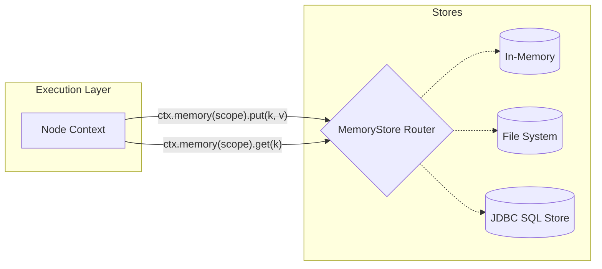

# TraceGraph Memory

`tracegraph-memory` empowers AI agents with durable, pluggable memory to remember facts, user constraints, conversational history, and semantics across multi-turn sessions or long-running workflows.

## Features

- **Layered / Scoped Memory**: Store key-value facts per execution trace, per user, or per workspace. You control the scope via explicit `context.memory(scope)` calls.
- **Implementations**:
  - `InMemoryMemoryStore`: Volatile memory backed by a `ConcurrentHashMap`. Great for tests and stateless ephemeral runs.
  - `FileMemoryStore`: File-backed persistence using JSON. Good for local scripts and single-node apps.
  - `JdbcMemoryStore`: SQL persistence layer for robust, production-grade RDBMS environments.
- **Serialization Guarantee**: Jackson-based polymorphic typing safeguards heterogeneous objects, ensuring that complex Java records and POJOs are cleanly round-tripped.

## Usage

Nodes access the memory store via the `Context` object injected during execution. 

```java
graph.node("savePreference", (state, ctx) -> {
    // Save to the user-level scope
    ctx.memory("user-123").put("theme", "dark");
    return state;
});

graph.node("loadPreference", (state, ctx) -> {
    // Read from the user-level scope
    String theme = ctx.memory("user-123").get("theme", String.class);
    System.out.println("User prefers " + theme);
    return state;
});
```

## Memory Layer Architecture

