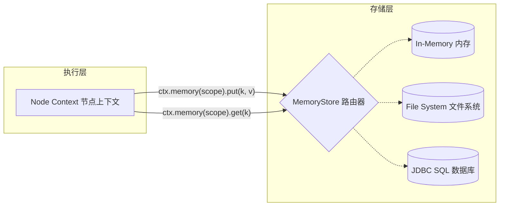

# TraceGraph 内存 (Memory)

`tracegraph-memory` 模块通过提供持久化、可插拔的内存机制，赋予 AI 代理（Agents）在多轮对话或长时间运行的工作流中“记住”事实、用户约束、对话历史和语义的能力。

## 核心特性

- **分层/按作用域划分的内存**: 可以按执行追踪 (trace)、按用户 (user) 或按工作空间 (workspace) 存储键值对。您可以通过显式的 `context.memory(scope)` 调用来控制作用域。
- **多种存储实现**:
  - `InMemoryMemoryStore`: 由 `ConcurrentHashMap` 支持的易失性内存。非常适合单元测试和无状态的临时运行。
  - `FileMemoryStore`: 使用 JSON 的基于文件的持久化。适合本地脚本和单节点应用。
  - `JdbcMemoryStore`: 面向生产级关系型数据库环境（RDBMS）的 SQL 持久化层。
- **序列化保证**: 基于 Jackson 的多态类型系统可保护异构对象，确保复杂的 Java Record 和 POJO 对象在序列化和反序列化之间干净利落。

## 使用方法

节点在执行期间通过注入的 `Context`（上下文）对象访问内存存储。

```java
graph.node("savePreference", (state, ctx) -> {
    // 保存到 user 级别的作用域
    ctx.memory("user-123").put("theme", "dark");
    return state;
});

graph.node("loadPreference", (state, ctx) -> {
    // 从 user 级别的作用域读取
    String theme = ctx.memory("user-123").get("theme", String.class);
    System.out.println("用户偏好 " + theme);
    return state;
});
```

## 内存层架构图


