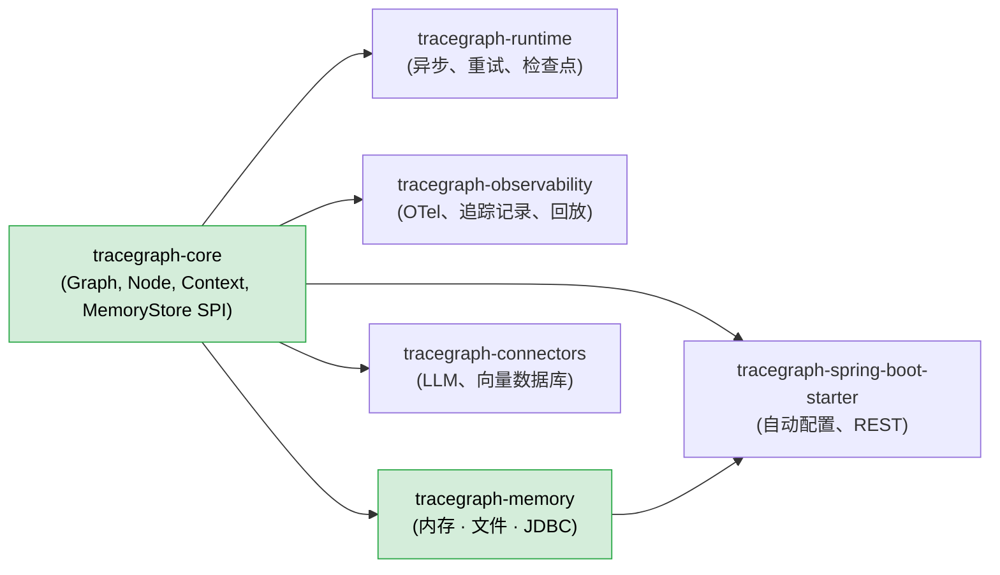
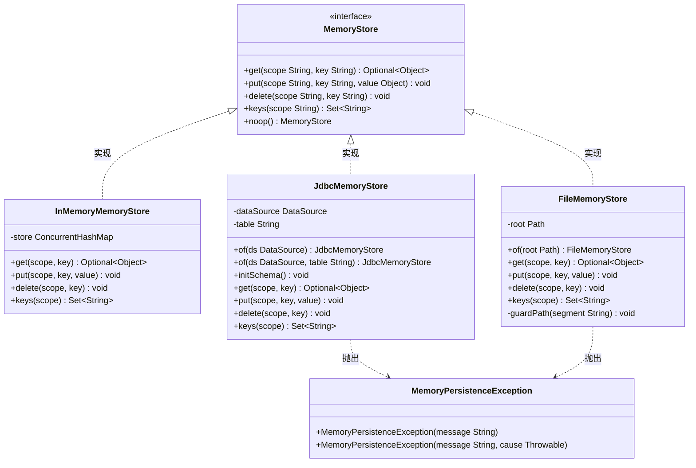
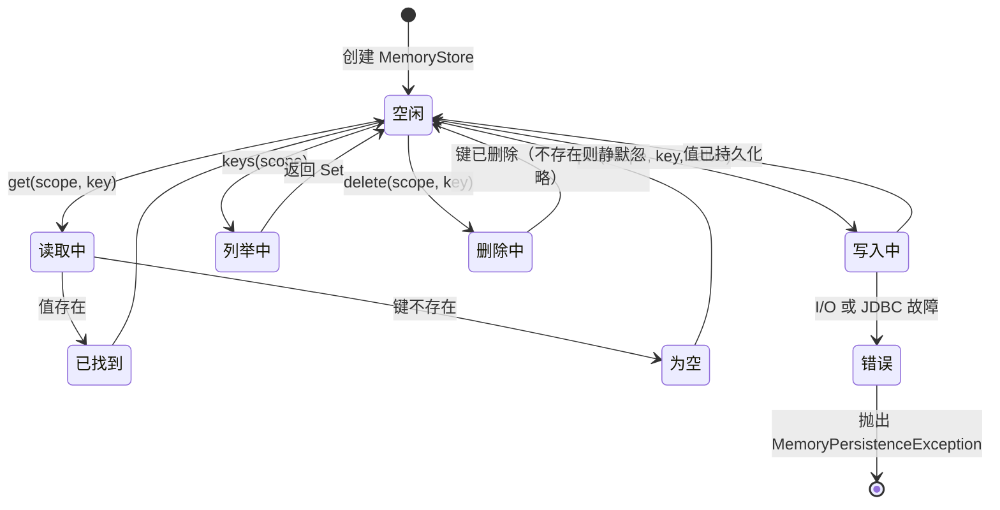
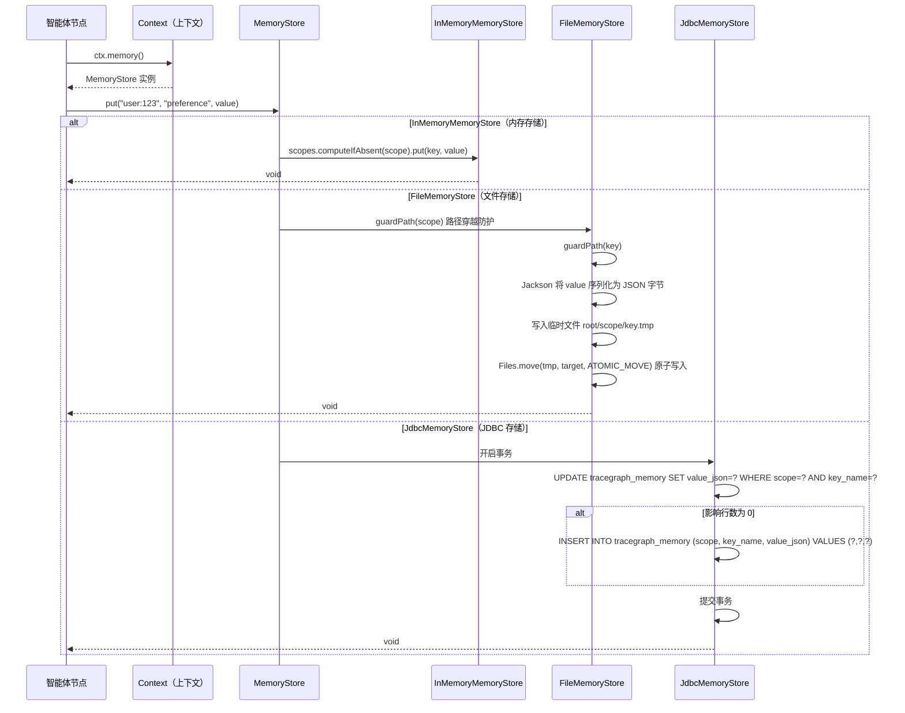
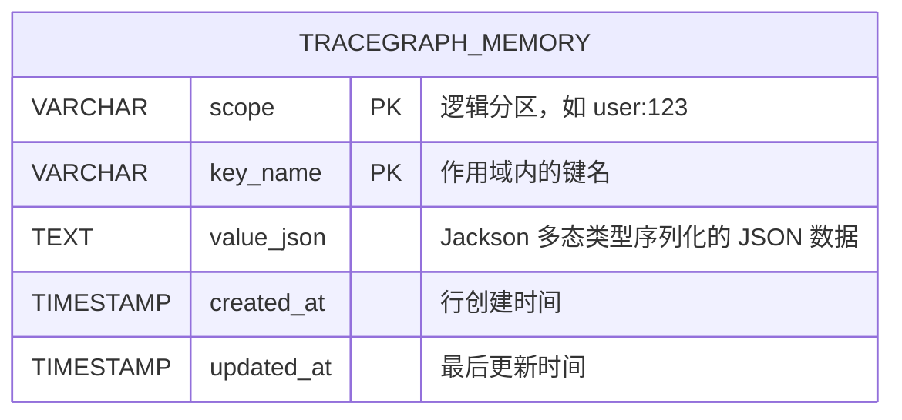

# tracegraph-memory

[](https://central.sonatype.com/artifact/io.tracegraph/tracegraph-memory)
[](https://www.apache.org/licenses/LICENSE-2.0)
[](https://openjdk.org/projects/jdk/21/)

为 TraceGraph 智能体提供跨执行、按作用域划分的键值对存储 — 支持内存、文件和 JDBC 三种后端。

---

## 模块简介

`tracegraph-memory` 提供 `MemoryStore` 服务提供接口 (SPI) 及三种生产就绪的实现，使智能体节点能够持久化并检索在单次图执行结束后仍需保留的事实、偏好设置和中间结果。工作内存（图的状态对象 `<S>`）在一次执行的边之间流动；`MemoryStore` 用于跨执行共享或持久化的数据。

所有读写操作都必须指定一个**作用域**字符串——例如 `"user:123"` 或 `"session:abc"`——作为逻辑分区，从而防止不同智能体、用户或会话之间意外访问彼此的数据。值通过带有多态类型信息的 Jackson 进行序列化，这意味着 `Map<String, Object>`、自定义 Java Record 或 `List<Integer>` 都能在不借助手动类型令牌的情况下完整地往返（序列化和反序列化）。

三种实现覆盖了从单元测试（`InMemoryMemoryStore`）、本地脚本持久化（`FileMemoryStore`）到生产级关系数据库（`JdbcMemoryStore`）的完整场景。TTL/过期和向量/语义搜索不在本模块范围内，留作未来功能切片。

---

## 系统上下文图



`tracegraph-core` 定义了 `MemoryStore` 接口（零重量级依赖）。本模块提供具体实现。Spring Boot Starter 会在 `DataSource` Bean 和 Jackson 同时存在于类路径时自动装配 `JdbcMemoryStore`。

---

## 内部架构图



---

## 生命周期 / 状态图



---

## 时序图 — 写入路径



---

## 数据模型 — JDBC



复合主键 `(scope, key_name)` 保证每个逻辑地址最多只有一个值。可移植的 UPDATE-then-INSERT 写法无需依赖特定数据库的 `UPSERT` 或 `ON CONFLICT` 语法，可在 PostgreSQL、MySQL、H2 等主流数据库上正常运行。

---

## 核心概念

### 按作用域划分的键值对模型

每次读写都需要明确指定**作用域**字符串。作用域是不透明的字符串，仅作为逻辑命名空间使用。TraceGraph 智能体推荐的作用域命名规范如下：

| 模式 | 典型含义 |
|---|---|
| `"user:42"` | 单用户的长期偏好、个人资料 |
| `"session:abc"` | 与单次对话会话绑定的数据 |
| `"execution:exec-001"` | 单次图执行期间的临时数据 |
| `"global"` | 跨所有执行共享的数据 |

作用域默认没有层级结构。如需层级，请在作用域字符串中自行编码。存储层只执行路径穿越防护，不校验作用域格式或所有权。

### 多态类型序列化（Jackson Polymorphic Typing）

`FileMemoryStore` 和 `JdbcMemoryStore` 使用 Jackson 的 `DefaultTyping.NON_FINAL` 策略将值序列化为带有 `@class` 属性的 JSON：

```json
{
  "@class": "java.util.LinkedHashMap",
  "theme": "dark",
  "fontSize": 14
}
```

这意味着从 `get()` 取回的值已经是原始 Java 类型，无需额外的类型令牌强制转换。代价是 JSON 与类名绑定：若重命名持久化的类，必须先迁移已存储的数据，否则反序列化将失败。

### FileMemoryStore — 原子写入与崩溃安全

`FileMemoryStore` 的每次写操作都遵循三步崩溃安全流程：

1. 将值序列化为 JSON 字节。
2. 将字节写入临时文件：`{root}/{scope}/{key}.tmp`。
3. 调用 `Files.move(tmp, target, StandardCopyOption.ATOMIC_MOVE)` 进行原子写入。

第 3 步在 POSIX 文件系统上是原子的（底层为 `rename(2)` 系统调用），在 NTFS 上也尽力保证原子性。在步骤 2 与步骤 3 之间发生崩溃，只会留下无害的 `.tmp` 临时文件，不会产生半写入的数据文件。

### 路径穿越防护

`FileMemoryStore` 和 `JdbcMemoryStore` 均会拒绝包含 `/`、`\` 或 `..` 路径分量的作用域或键名字符串，以防止恶意或有缺陷的智能体代码逃逸出根目录：

```java
// 以下两行均会抛出 IllegalArgumentException
store.put("../bad-scope", "key", value);
store.put("ok-scope", "../../dangerous-key", value);
```

### JdbcMemoryStore — 幂等 Upsert 语义

JDBC 存储在单个事务内使用 UPDATE-then-INSERT 模式，具备良好的数据库可移植性：

```sql
-- 先尝试更新已有行
UPDATE tracegraph_memory
   SET value_json = ?,
       updated_at = CURRENT_TIMESTAMP
 WHERE scope = ?
   AND key_name = ?;

-- 若影响行数为 0，则插入新行
INSERT INTO tracegraph_memory (scope, key_name, value_json, created_at, updated_at)
VALUES (?, ?, ?, CURRENT_TIMESTAMP, CURRENT_TIMESTAMP);
```

对同一 `(scope, key_name)` 的并发写操作由数据库行锁串行化，最后写入者获胜。当前没有乐观并发控制或版本列。

---

## 完整使用演练

### 第 1 步 — 添加依赖

```xml
<dependency>
    <groupId>io.tracegraph</groupId>
    <artifactId>tracegraph-memory</artifactId>
    <version>0.1.0</version>
</dependency>
```

Jackson (`jackson-databind`) 是**可选**传递依赖，仅在使用 `FileMemoryStore` 或 `JdbcMemoryStore` 时才需要。若只使用 `InMemoryMemoryStore`，无需 Jackson。

### 第 2 步 — 开发与测试：InMemoryMemoryStore

`InMemoryMemoryStore` 无需任何配置，直接实例化即可：

```java
import io.tracegraph.memory.InMemoryMemoryStore;
import io.tracegraph.core.spi.MemoryStore;

MemoryStore store = new InMemoryMemoryStore();
```

所有数据存储在 `ConcurrentHashMap<String, ConcurrentHashMap<String, Object>>` 中，按作用域分区。数据在 JVM 重启后不会保留，是所有 JUnit 测试的推荐选择。

### 第 3 步 — 本地脚本：FileMemoryStore

```java
import io.tracegraph.memory.FileMemoryStore;
import java.nio.file.Path;

MemoryStore store = FileMemoryStore.of(Path.of("/tmp/agent-memory"));
```

根目录在首次使用时自动创建。每个作用域对应一个子目录，每个键对应该目录下的一个 `.json` 文件：

```
/tmp/agent-memory/
  user:123/
    preference.json
    last-login.json
  session:abc/
    context.json
```

### 第 4 步 — 生产环境：JdbcMemoryStore

```java
import io.tracegraph.memory.JdbcMemoryStore;
import javax.sql.DataSource;

// 使用默认表名 "tracegraph_memory"
JdbcMemoryStore store = JdbcMemoryStore.of(dataSource);

// 若表不存在则自动创建（幂等，可在启动时安全调用）
store.initSchema();
```

若需自定义表名：

```java
JdbcMemoryStore store = JdbcMemoryStore.of(dataSource, "my_agent_memory");
store.initSchema();
```

### 第 5 步 — 将存储接入图

```java
import io.tracegraph.core.Graph;

Graph<OrderState> graph = Graph.<OrderState>builder()
    .memoryStore(store)
    // ... 节点、边
    .build();
```

接入后，每个节点都可通过 `ctx.memory()` 访问该存储实例。

### 第 6 步 — 在节点中写入值

```java
graph.node("capturePreference", (state, ctx) -> {
    // 将用户偏好写入用户作用域下的键
    ctx.memory().put("user:123", "preference", Map.of(
        "theme",    "dark",
        "language", "zh",
        "timezone", "Asia/Shanghai"
    ));
    return state;
});
```

值可以是任何可被 Jackson 序列化的对象：`Map`、自定义 Record、`List`、基本类型包装类等。

### 第 7 步 — 在节点中读取值

```java
graph.node("applyPreference", (state, ctx) -> {
    Optional<Object> raw = ctx.memory().get("user:123", "preference");
    if (raw.isPresent()) {
        @SuppressWarnings("unchecked")
        Map<String, Object> prefs = (Map<String, Object>) raw.get();
        String theme = (String) prefs.get("theme");
        // 应用主题...
    }
    return state;
});
```

`get()` 返回 `Optional<Object>`。由于多态类型序列化保留了具体的 Java 类型，直接强制转换是安全的。

### 第 8 步 — 列举作用域中的所有键

```java
graph.node("auditUserData", (state, ctx) -> {
    Set<String> keys = ctx.memory().keys("user:123");
    // 例如：["preference", "last-login", "cart"]
    return state;
});
```

`keys(scope)` 返回指定作用域下的所有键名。若作用域不存在，返回空集合，不抛出异常。

### 第 9 步 — 删除键

```java
graph.node("clearPreference", (state, ctx) -> {
    ctx.memory().delete("user:123", "preference");
    // 删除不存在的键是静默的空操作，不会抛出异常
    return state;
});
```

### 第 10 步 — 自定义 Record 的完整往返

本示例演示多态类型序列化如何忠实还原 Java Record：

```java
record UserProfile(String name, int age, List<String> roles) {}

// --- 第一次图执行：写入 ---
graph.node("saveProfile", (state, ctx) -> {
    ctx.memory().put("user:42", "profile",
        new UserProfile("Alice", 30, List.of("admin", "editor")));
    return state;
});

// --- 后续图执行：读取 ---
graph.node("loadProfile", (state, ctx) -> {
    UserProfile profile =
        (UserProfile) ctx.memory().get("user:42", "profile").orElseThrow();
    // profile.name()  == "Alice"
    // profile.age()   == 30
    // profile.roles() == ["admin", "editor"]
    return state;
});
```

---

## 配置参考

| 配置项 | 描述 | 默认值 |
|---|---|---|
| `JdbcMemoryStore` 表名 | 用于存储内存行的 SQL 表 | `tracegraph_memory` |
| `JdbcMemoryStore.initSchema()` | 若表不存在则创建；幂等 | 需手动调用 |
| `FileMemoryStore` 根路径 | 作用域子目录的父目录 | 必填，无默认值 |
| Spring: `tracegraph.memory.jdbc.enabled` | 是否启用 `JdbcMemoryStore` 自动装配 | `true` |
| Spring: `tracegraph.memory.jdbc.init-schema` | 是否在启动时调用 `initSchema()` | `true` |
| Spring: `tracegraph.memory.jdbc.table` | 覆盖默认表名 | `tracegraph_memory` |

---

## 与其他模块的集成

### Spring Boot Starter 自动配置

当 `tracegraph-spring-boot-starter`、`DataSource` Bean 和 Jackson 同时在类路径上时，`MemoryAutoConfiguration` 会自动将 `JdbcMemoryStore` 注册为 `MemoryStore` Bean。它在 `TraceGraphAutoConfiguration` 之前运行，因此会覆盖内置的空操作默认实现。

完全禁用自动装配：

```yaml
# application.yaml
tracegraph:
  memory:
    jdbc:
      enabled: false
```

通过自定义 Bean 覆盖（由于 `@ConditionalOnMissingBean`，您的 Bean 会优先生效）：

```java
@Configuration
public class AgentConfig {

    @Bean
    MemoryStore memoryStore() {
        return FileMemoryStore.of(Path.of("/data/agent-memory"));
    }
}
```

### 无状态图使用 noop 存储

若图不需要跨执行内存，显式接入 noop 存储以明确意图：

```java
Graph<MyState> graph = Graph.<MyState>builder()
    .memoryStore(MemoryStore.noop())
    // ...
    .build();
```

noop 存储静默丢弃所有写操作，所有读操作返回 `Optional.empty()`，`keys()` 返回空集合，任何方法都不会抛出异常。

### 与可观测性模块组合使用

```java
import io.tracegraph.observability.otel.OtelNodeListener;
import io.tracegraph.observability.replay.RecordingTraceRecorder;
import io.tracegraph.observability.store.InMemoryTraceStore;

var traceStore = new InMemoryTraceStore<OrderState>();
var recorder   = new RecordingTraceRecorder<>(traceStore);

Graph<OrderState> graph = Graph.<OrderState>builder()
    .memoryStore(JdbcMemoryStore.of(dataSource))
    .listener(OtelNodeListener.usingGlobal())
    .traceRecorder(recorder)
    // ... 节点、边
    .build();
```

OTel 监听器为每个节点发出追踪跨度（Span）；追踪记录器为每个步骤存储完整的执行前后状态；内存存储持久化智能体的跨执行知识。三者相互独立，可自由组合。

---

## 测试指南

在所有单元测试和集成测试中，优先使用 `InMemoryMemoryStore`——无需外部基础设施，速度极快。

### 基础读写

```java
import io.tracegraph.memory.InMemoryMemoryStore;
import org.junit.jupiter.api.Test;

import static org.assertj.core.api.Assertions.assertThat;

class InMemoryMemoryStoreTest {

    private final InMemoryMemoryStore store = new InMemoryMemoryStore();

    @Test
    void 写入后可正确读取() {
        store.put("user:1", "theme", "dark");

        assertThat(store.get("user:1", "theme")).contains("dark");
    }

    @Test
    void 不存在的键返回空Optional() {
        assertThat(store.get("user:99", "missing")).isEmpty();
    }

    @Test
    void 删除后键不再存在() {
        store.put("user:1", "key", "value");
        store.delete("user:1", "key");

        assertThat(store.get("user:1", "key")).isEmpty();
    }

    @Test
    void 删除不存在的键是空操作() {
        // 不应抛出异常
        store.delete("user:1", "nonexistent");
    }
}
```

### 作用域隔离

作用域隔离是核心不变量：向一个作用域写入，绝不能影响另一个作用域。

```java
@Test
void 不同作用域互相隔离() {
    store.put("user:A", "color", "red");
    store.put("user:B", "color", "blue");

    assertThat(store.get("user:A", "color")).contains("red");
    assertThat(store.get("user:B", "color")).contains("blue");

    store.delete("user:A", "color");

    // A 的键已删除，B 的键不受影响
    assertThat(store.get("user:A", "color")).isEmpty();
    assertThat(store.get("user:B", "color")).contains("blue");
}
```

### 键列举

```java
@Test
void keys返回作用域下的所有键() {
    store.put("session:1", "a", 1);
    store.put("session:1", "b", 2);
    store.put("session:2", "x", 3);

    assertThat(store.keys("session:1")).containsExactlyInAnyOrder("a", "b");
    assertThat(store.keys("session:2")).containsExactly("x");
    assertThat(store.keys("session:99")).isEmpty();
}
```

### 复杂 Record 的往返测试（FileMemoryStore）

```java
import io.tracegraph.memory.FileMemoryStore;
import org.junit.jupiter.api.io.TempDir;
import java.nio.file.Path;
import java.util.List;

record Tag(String label, int priority) {}

class FileMemoryStoreTest {

    @Test
    void record往返保留类型(@TempDir Path tmp) {
        var store = FileMemoryStore.of(tmp);
        var original = new Tag("紧急", 1);

        store.put("test", "tag", original);

        Tag loaded = (Tag) store.get("test", "tag").orElseThrow();

        assertThat(loaded.label()).isEqualTo("紧急");
        assertThat(loaded.priority()).isEqualTo(1);
    }

    @Test
    void 磁盘上的作用域互相隔离(@TempDir Path tmp) {
        var store = FileMemoryStore.of(tmp);
        store.put("scopeA", "k", "valA");
        store.put("scopeB", "k", "valB");

        assertThat(store.get("scopeA", "k")).contains("valA");
        assertThat(store.get("scopeB", "k")).contains("valB");
    }
}
```

### MemoryPersistenceException 的包装验证

底层 I/O 或 JDBC 层抛出的异常会被包装为 `MemoryPersistenceException`：

```java
import io.tracegraph.memory.JdbcMemoryStore;
import io.tracegraph.memory.MemoryPersistenceException;

import static org.assertj.core.api.Assertions.assertThatThrownBy;

@Test
void JDBC故障以MemoryPersistenceException形式抛出() {
    var brokenDs = brokenDataSource(); // 始终抛出 SQLException 的 DataSource
    var store = JdbcMemoryStore.of(brokenDs);

    assertThatThrownBy(() -> store.put("scope", "key", "value"))
        .isInstanceOf(MemoryPersistenceException.class);
}
```

### 图集成测试

```java
import io.tracegraph.core.Graph;
import io.tracegraph.core.ExecutionResult;

@Test
void 节点可跨执行读写内存() {
    var store = new InMemoryMemoryStore();

    // 第一次运行：写入值
    Graph<Integer> writer = Graph.<Integer>builder()
        .memoryStore(store)
        .node("write", (s, ctx) -> {
            ctx.memory().put("global", "count", s);
            return s;
        })
        .entry("write")
        .build();

    // 第二次运行：读取写入的值
    Graph<Integer> reader = Graph.<Integer>builder()
        .memoryStore(store)
        .node("read", (s, ctx) -> {
            int stored = (int) ctx.memory().get("global", "count").orElse(0);
            return stored;
        })
        .entry("read")
        .build();

    writer.run(42);
    ExecutionResult<Integer> result = reader.run(0);

    assertThat(result.finalState()).isEqualTo(42);
}
```

---

## 常见问题解答

### 问：支持 TTL / 过期吗？

暂不支持。基于时间的过期和自动淘汰留作未来功能切片。目前三种存储实现都会无限期保留数据。如需按时间过期，请实现一个定期清理任务，对过期条目调用 `delete(scope, key)`；或在 `JdbcMemoryStore` 中查询 `updated_at` 字段并过滤。

### 问：MemoryStore 是线程安全的吗？

三种实现都支持多线程（包括虚拟线程）并发访问：

- `InMemoryMemoryStore` 全程使用 `ConcurrentHashMap`，无需显式加锁。
- `FileMemoryStore` 依赖操作系统级别的原子写入（`ATOMIC_MOVE`）。对同一键的并发写操作都会成功，最后写入者的值生效。JVM 内部不持有横跨写操作的锁。
- `JdbcMemoryStore` 将每次写操作封装在数据库事务中，依靠数据库行锁串行化对同一 `(scope, key_name)` 的并发写操作。

### 问："作用域"究竟是什么意思？格式有强制要求吗？

作用域是一个普通字符串，充当逻辑命名空间。存储层除路径穿越防护（拒绝 `/`、`\`、`..`）外，不校验任何格式或所有权。调用方负责选择能够正确分区数据的作用域字符串。推荐的命名模式是将实体类型和 ID 组合起来：`"user:42"`、`"order:XYZ-001"`、`"tenant:acme"`。

### 问：可以在同一作用域下存储不同类型的值吗——比如一个键存字符串，另一个键存 Map？

可以。Jackson 的多态类型序列化策略在 JSON 中嵌入了具体的类名，因此同一作用域下的不同键可以存放不同的 Java 类型，每次 `get()` 调用都能返回原始类型，无需额外的类型令牌转换。约束条件是：调用 `get()` 时，该类必须在类路径上——若删除了某个类，对应的旧存储值将无法反序列化。

### 问：如果重命名了 FileMemoryStore 或 JdbcMemoryStore 中存储的类，会发生什么？

已存储的 JSON 仍然引用旧类名（例如 `"@class": "com.example.OldRecord"`）。重命名后，Jackson 在尝试反序列化时会抛出 `JsonMappingException`，因为该类已不存在。请在重命名持久化领域类型之前先迁移存储数据——可通过读取旧类数据并以新类重写，或者提供 Jackson `TypeIdResolver` 将旧名映射到新名。

### 问：noop 存储会抛出异常吗？

不会。`MemoryStore.noop()` 静默丢弃所有写操作，所有读操作返回 `Optional.empty()`，`keys()` 返回空集合。所有方法都能正常完成，不会抛出异常。这使得节点代码即便在未接入存储的情况下调用 `ctx.memory().put(...)` 也能安全运行。
