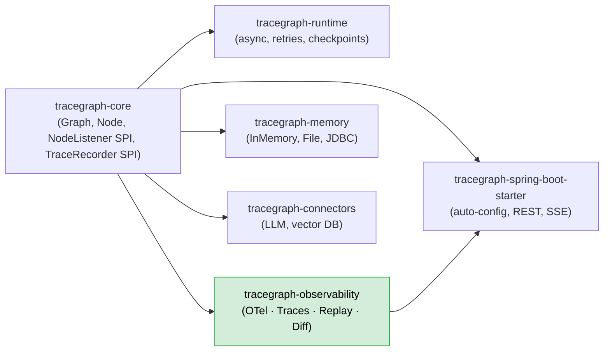
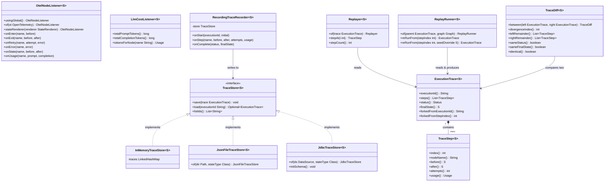
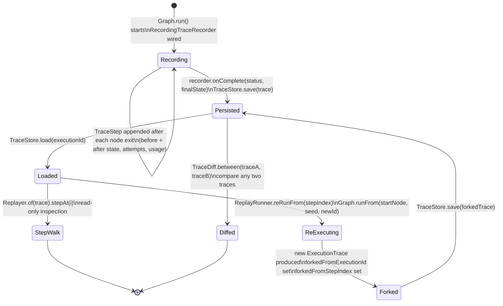
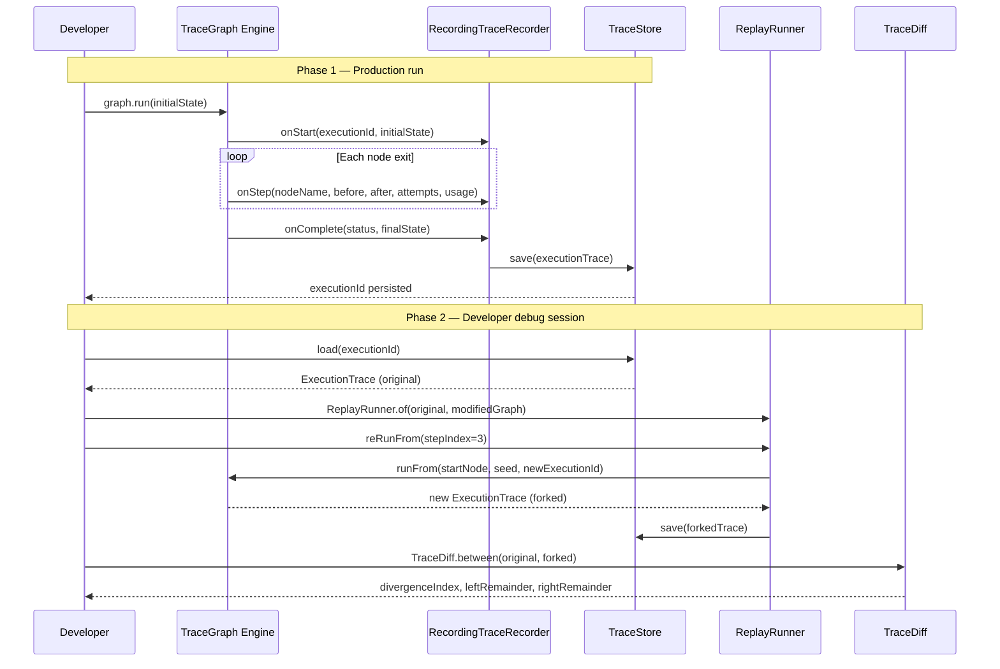
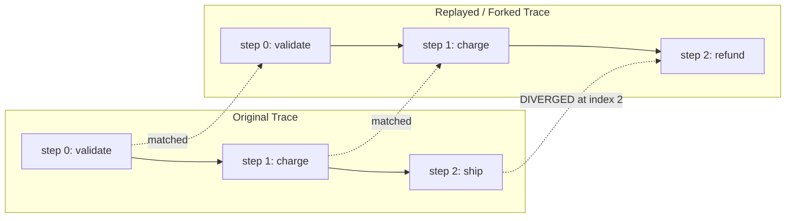
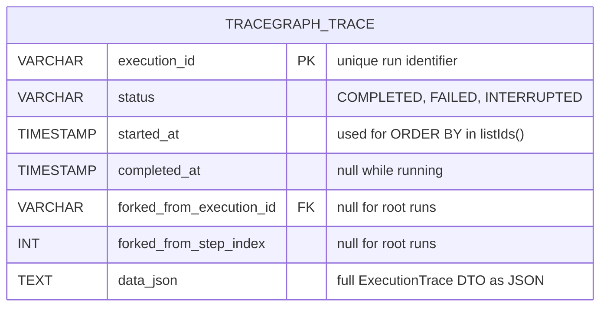

# tracegraph-observability

[](https://central.sonatype.com/artifact/io.tracegraph/tracegraph-observability)
[](https://www.apache.org/licenses/LICENSE-2.0)
[](https://openjdk.org/projects/jdk/21/)

Full-fidelity execution traces, OpenTelemetry spans, deterministic replay, and divergence analysis for TraceGraph agents.

---

## What it does

`tracegraph-observability` turns a TraceGraph execution from an opaque black box into a fully
inspectable, replayable record. Every node entry, every state transition, and every failure is
captured in a structured `ExecutionTrace<S>` that can be persisted to memory, disk, or a relational
database and retrieved at any point in the future.

On top of the trace infrastructure, the module provides an OpenTelemetry listener that emits one
span per node execution — complete with state diffs, LLM token usage, and error recording — so
agent executions appear naturally in any OTel-compatible APM tool such as Jaeger, Datadog, or
Honeycomb.

When a production execution goes wrong, `ReplayRunner` lets you load the saved trace, re-execute
it against a modified graph starting from any step, and produce a new `ExecutionTrace` with full
lineage back to the original. `TraceDiff` then compares two traces step-by-step to identify the
exact node where behaviour diverged and what the state looked like on both sides.

---

## System Context



`tracegraph-core` defines the `NodeListener` and `TraceRecorder` SPIs. This module provides
`OtelNodeListener`, `LlmCostListener`, `RecordingTraceRecorder`, the `TraceStore` family, and the
replay/diff utilities. The Spring Boot starter exposes REST and SSE endpoints that delegate to
these types.

---

## Internal Architecture



---

## Trace Lifecycle



---

## Sequence Diagram — Production Run and Replay



---

## TraceDiff Concept



`TraceDiff.between(traceA, traceB)` walks both traces step-by-step, matching steps by
`nodeName + before-state equality`. The longest common prefix is the matched region. The first
non-matching index is `divergenceIndex`. Steps after that index are the `leftRemainder` (from
traceA) and `rightRemainder` (from traceB). `identical()` is `true` only when there is no
divergence AND `sameStatus` AND `sameFinalState`.

---

## Data Model — JDBC Trace Store



The `data_json` column carries the complete serialised `ExecutionTrace`, including all
`TraceStep` records with before/after state. The fork lineage columns (`forked_from_execution_id`,
`forked_from_step_index`) are also denormalised into top-level columns for easy SQL queries without
JSON parsing. `listIds()` returns execution IDs ordered by `started_at` ascending.

---

## Core Concepts

### OtelNodeListener — One Span Per Node

`OtelNodeListener<S>` implements `NodeListener` and produces one OpenTelemetry span per node
execution. The span name is the node name. Span events are used for sub-node observations:

| Event / Attribute | Trigger |
|---|---|
| `state` span event with `before`/`after` attrs | `NodeListener.onState()` — once per successful node exit |
| `retry` span event with `attempt` attribute | `NodeListener.onRetry()` — each retry attempt |
| `StatusCode.ERROR` + `Span.recordException` | `NodeListener.onError()` — node fails |
| `llm.usage.input_tokens` span attribute | `NodeListener.onUsage()` — after any ChatNode call |
| `llm.usage.output_tokens` span attribute | `NodeListener.onUsage()` |
| `llm.usage.total_tokens` span attribute | `NodeListener.onUsage()` |

Branches inside `parallel(...)` do not get spans — they are invisible to the listener by design
(Phase 2c contract). Retries do not produce new spans; each retry adds a `retry` event to the
same span.

### StateRenderer — Pluggable State Representation

By default, `OtelNodeListener` renders state as `String.valueOf(state)`. Provide a custom
`StateRenderer` to control what appears in span attributes:

```java
OtelNodeListener.<OrderState>of(openTelemetry)
    .stateRenderer(s -> s.toJson()); // or s.orderId() + ":" + s.status()
```

The renderer is called twice per successful node exit (before and after). Keep it cheap — it runs
on the hot path.

### LlmCostListener — Token Accumulation

`LlmCostListener<S>` implements `NodeListener` and accumulates token usage across the entire
execution. Compose it alongside `OtelNodeListener` using `Listeners.compose(...)`:

```java
var costListener = new LlmCostListener<OrderState>();
var otelListener = OtelNodeListener.<OrderState>usingGlobal();

Graph<OrderState> graph = Graph.<OrderState>builder()
    .listener(Listeners.compose(otelListener, costListener))
    // ...
    .build();

graph.run(initial);

long promptTokens     = costListener.totalPromptTokens();
long completionTokens = costListener.totalCompletionTokens();
```

### TraceStore — Three Implementations

| Implementation | Best for |
|---|---|
| `InMemoryTraceStore<S>` | Unit tests; no external process |
| `JsonFileTraceStore<S>` | Local dev, single-node apps, audit logs on disk |
| `JdbcTraceStore<S>` | Production; queryable; multi-instance safe |

All three implement the same `TraceStore<S>` interface. Swap implementations without touching
node or graph code.

### Replayer — Read-Only Step Walk

`Replayer<S>` provides read-only access to a saved trace:

```java
Replayer<OrderState> replayer = Replayer.of(trace);
int count = replayer.stepCount();
for (int i = 0; i < count; i++) {
    TraceStep<OrderState> step = replayer.stepAt(i);
    System.out.printf("step %d | node: %s | attempts: %d%n",
        step.index(), step.nodeName(), step.attempts());
}
```

`Replayer` does not re-execute anything — it is a structured cursor over a frozen trace.

### ReplayRunner — Re-Execution with Fork Lineage

`ReplayRunner<S>` re-runs a trace from a chosen step against a (potentially modified) graph:

- `reRunFrom(-1)` re-runs from the very beginning (entry node, original initial state).
- `reRunFrom(i)` re-runs starting at step `i`, using `trace.steps().get(i).before()` as the seed.
- `reRunFrom(i, seedOverride)` uses a custom seed state instead of the saved one.

The resulting `ExecutionTrace` carries `forkedFromExecutionId` and `forkedFromStepIndex` to record
lineage. The new trace is independent of `CheckpointStore` — no checkpoint is read or written
during a replay. The graph structure must be compatible (nodes referenced by the replay step must
exist); node implementations may differ freely.

### TraceDiff — Divergence Analysis

`TraceDiff<S>` compares two `ExecutionTrace<S>` objects and reports:

| Field | Meaning |
|---|---|
| `divergenceIndex` | First step index where traces differ; `-1` if all steps match |
| `leftRemainder` | Steps from the left trace after the divergence point |
| `rightRemainder` | Steps from the right trace after the divergence point |
| `sameStatus` | Whether both traces ended with the same `Status` |
| `sameFinalState` | Whether both traces ended with equal final states |
| `identical()` | `true` only if no divergence AND `sameStatus` AND `sameFinalState` |

Step matching uses `nodeName + before-state equality`. If `before` states differ at the same
index, that index is the divergence point, even if the node names match.

### Throwable Round-Trip — Intentional Lossy Serialisation

`JsonFileTraceStore` and `JdbcTraceStore` serialise `Throwable` failure information as only
`className + message`. On load, the exception is reconstituted as a plain `RuntimeException`:

```
RuntimeException("[com.example.OrderException] Payment gateway timeout")
```

Stack traces are **not** stored. This is intentional: replay debugging cares about _which node
failed_ and _what the state was_, not the full Java stack. If you need the original stack trace
for an exception, check your APM tool (via `OtelNodeListener.Span.recordException`) or your
application logs at the time of the original run.

---

## Complete Usage Walkthrough

### Step 1 — Add the Dependency

```xml
<dependency>
    <groupId>io.tracegraph</groupId>
    <artifactId>tracegraph-observability</artifactId>
    <version>0.1.0</version>
</dependency>
```

Jackson (`jackson-databind` + `jackson-datatype-jsr310`) is required for `JsonFileTraceStore` and
`JdbcTraceStore`. OpenTelemetry API is required for `OtelNodeListener`.

### Step 2 — OTel with Global OpenTelemetry

```java
import io.tracegraph.observability.otel.OtelNodeListener;
import io.tracegraph.core.Graph;

Graph<OrderState> graph = Graph.<OrderState>builder()
    .listener(OtelNodeListener.usingGlobal())
    // ... nodes, edges
    .build();
```

`usingGlobal()` uses the SDK instance registered via `GlobalOpenTelemetry.set(...)` at startup.
This is the recommended path when your application already configures OTel (e.g., via the
OpenTelemetry Java agent or a Spring Boot auto-configuration).

### Step 3 — OTel with an Explicit Instance

```java
import io.opentelemetry.api.OpenTelemetry;

OpenTelemetry openTelemetry = // ... your SDK instance

Graph<OrderState> graph = Graph.<OrderState>builder()
    .listener(OtelNodeListener.of(openTelemetry))
    // ...
    .build();
```

### Step 4 — Custom StateRenderer

```java
Graph<OrderState> graph = Graph.<OrderState>builder()
    .listener(
        OtelNodeListener.<OrderState>of(openTelemetry)
            .stateRenderer(s -> "orderId=" + s.orderId() + " status=" + s.status())
    )
    // ...
    .build();
```

The rendered string appears in the `state` span event as `before` and `after` attributes.

### Step 5 — RecordingTraceRecorder with InMemoryTraceStore

```java
import io.tracegraph.observability.replay.RecordingTraceRecorder;
import io.tracegraph.observability.store.InMemoryTraceStore;

var traceStore = new InMemoryTraceStore<OrderState>();
var recorder   = new RecordingTraceRecorder<>(traceStore);

Graph<OrderState> graph = Graph.<OrderState>builder()
    .traceRecorder(recorder)
    // ...
    .build();

ExecutionResult<OrderState> result = graph.run(initialState);
String executionId = result.executionId();

// Retrieve the trace later
ExecutionTrace<OrderState> trace = traceStore.load(executionId).orElseThrow();
```

### Step 6 — JsonFileTraceStore for Local Dev

```java
import io.tracegraph.observability.store.JsonFileTraceStore;
import java.nio.file.Path;

JsonFileTraceStore<OrderState> traceStore =
    JsonFileTraceStore.of(Path.of("/tmp/traces"), OrderState.class);

var recorder = new RecordingTraceRecorder<>(traceStore);
```

The `Class<S>` argument is mandatory — it tells Jackson how to deserialise the state values
when loading a trace. One JSON file is written per execution, named by `executionId`.

### Step 7 — JdbcTraceStore for Production

```java
import io.tracegraph.observability.store.JdbcTraceStore;
import javax.sql.DataSource;

JdbcTraceStore<OrderState> traceStore =
    JdbcTraceStore.of(dataSource, OrderState.class);

// Create the table if it does not exist (idempotent)
traceStore.initSchema();

var recorder = new RecordingTraceRecorder<>(traceStore);
```

### Step 8 — Reading a Trace with Replayer

```java
import io.tracegraph.observability.replay.Replayer;

ExecutionTrace<OrderState> trace = traceStore.load(executionId).orElseThrow();
Replayer<OrderState> replayer = Replayer.of(trace);

System.out.println("Total steps: " + replayer.stepCount());

for (int i = 0; i < replayer.stepCount(); i++) {
    TraceStep<OrderState> step = replayer.stepAt(i);
    System.out.printf(
        "[%d] %s  attempts=%d  promptTokens=%d%n",
        step.index(),
        step.nodeName(),
        step.attempts(),
        step.usage() != null ? step.usage().promptTokens() : 0
    );
    System.out.println("  before: " + step.before());
    System.out.println("  after:  " + step.after());
}
```

### Step 9 — Re-Executing with ReplayRunner

```java
import io.tracegraph.observability.replay.ReplayRunner;

ExecutionTrace<OrderState> original = traceStore.load(executionId).orElseThrow();

// Re-run from step 2 (step index is 0-based) with the saved state at step 2
ExecutionTrace<OrderState> forked =
    ReplayRunner.of(original, modifiedGraph).reRunFrom(2);

System.out.println("Forked from:  " + forked.forkedFromExecutionId());
System.out.println("Forked step:  " + forked.forkedFromStepIndex());
System.out.println("New exec id:  " + forked.executionId());

// Persist the fork
traceStore.save(forked);
```

To replay from the very beginning:

```java
ExecutionTrace<OrderState> rerun = ReplayRunner.of(original, graph).reRunFrom(-1);
```

To replay from step 3 with a custom state override:

```java
OrderState tweakedState = original.steps().get(3).before().withAmount(999);
ExecutionTrace<OrderState> forked =
    ReplayRunner.of(original, graph).reRunFrom(3, tweakedState);
```

### Step 10 — Diffing Two Traces

```java
import io.tracegraph.observability.replay.TraceDiff;

ExecutionTrace<OrderState> original = traceStore.load("exec-001").orElseThrow();
ExecutionTrace<OrderState> forked   = traceStore.load("exec-002").orElseThrow();

TraceDiff<OrderState> diff = TraceDiff.between(original, forked);

if (diff.identical()) {
    System.out.println("Traces are identical.");
} else {
    System.out.println("Diverged at step: " + diff.divergenceIndex());
    System.out.println("Same status:      " + diff.sameStatus());
    System.out.println("Same final state: " + diff.sameFinalState());

    diff.leftRemainder().forEach(s ->
        System.out.println("  original: " + s.nodeName()));
    diff.rightRemainder().forEach(s ->
        System.out.println("  forked:   " + s.nodeName()));
}
```

### Step 11 — Cost Tracking with LlmCostListener

```java
import io.tracegraph.observability.otel.LlmCostListener;
import io.tracegraph.core.spi.Listeners;

var costListener = new LlmCostListener<OrderState>();

Graph<OrderState> graph = Graph.<OrderState>builder()
    .listener(Listeners.compose(OtelNodeListener.usingGlobal(), costListener))
    // ...
    .build();

graph.run(initialState);

System.out.printf("Total prompt tokens:     %d%n", costListener.totalPromptTokens());
System.out.printf("Total completion tokens: %d%n", costListener.totalCompletionTokens());
System.out.printf("Tokens for 'classify':   %s%n", costListener.tokensForNode("classify"));
```

---

## Configuration Reference

| Setting | Description | Default |
|---|---|---|
| `JdbcTraceStore` table name | SQL table for trace rows | `tracegraph_trace` |
| `JdbcTraceStore.initSchema()` | Creates the table if absent; idempotent | Must be called manually |
| `JsonFileTraceStore` directory | Root dir for per-execution JSON files | Required — no default |
| `JsonFileTraceStore` state type | `Class<S>` required to deserialise state | Required — no default |
| `OtelNodeListener.usingGlobal()` | Uses `GlobalOpenTelemetry` | Preferred for agent-based OTel |
| `OtelNodeListener.stateRenderer` | Converts state to a string for span attributes | `String::valueOf` |
| Spring: `tracegraph.web.enabled` | Enable / disable `TraceController` REST endpoints | `true` |
| Spring Boot starter replay endpoint | `POST /tracegraph/traces/{id}/replay?step=N` | Auto-wired if `Graph` bean present |

---

## Integration with Other Modules

### Spring Boot Starter REST Endpoints

When `tracegraph-spring-boot-starter`, `spring-webmvc`, and `tracegraph-observability` are all
present, `TraceWebAutoConfiguration` registers:

| Method | Path | Description |
|---|---|---|
| `GET` | `/tracegraph/traces` | List execution IDs; optional `?limit=N&offset=M`; `X-Total-Count` header |
| `GET` | `/tracegraph/traces/{id}` | Full trace JSON; 404 if unknown |
| `GET` | `/tracegraph/traces/{a}/diff/{b}` | `TraceDiff` JSON; 404 if either unknown |
| `DELETE` | `/tracegraph/traces/{id}` | 204 on success; 404 if unknown |
| `POST` | `/tracegraph/traces/{id}/replay?step=N` | Re-execute from step N; returns new executionId |

The replay endpoint requires a single `Graph<?>` bean (`@ConditionalOnSingleCandidate`).

### Composing Listeners

Use `Listeners.compose(...)` from `tracegraph-core` to combine multiple listeners:

```java
import io.tracegraph.core.spi.Listeners;

var otel = OtelNodeListener.<OrderState>usingGlobal();
var cost = new LlmCostListener<OrderState>();

Graph<OrderState> graph = Graph.<OrderState>builder()
    .listener(Listeners.compose(otel, cost))
    .traceRecorder(new RecordingTraceRecorder<>(traceStore))
    // ...
    .build();
```

### Resume Appends to the Prior Trace

When `Graph.resume(executionId)` is called on an interrupted or checkpointed execution, the
`RecordingTraceRecorder` loads the existing trace from the `TraceStore` and appends new steps to
it. The final persisted trace is a continuous record of the entire execution, across all resumes.

---

## Testing Guidance

Use `InMemoryTraceStore` in all unit tests — no file system or database required.

### Verify TraceStep Fields

```java
import io.tracegraph.observability.replay.RecordingTraceRecorder;
import io.tracegraph.observability.store.InMemoryTraceStore;
import io.tracegraph.core.Graph;
import io.tracegraph.core.ExecutionResult;
import io.tracegraph.observability.replay.ExecutionTrace;
import io.tracegraph.observability.replay.TraceStep;
import org.junit.jupiter.api.Test;

import static org.assertj.core.api.Assertions.assertThat;

class TraceRecorderTest {

    @Test
    void recordsBeforeAndAfterStatePerStep() {
        var store    = new InMemoryTraceStore<Integer>();
        var recorder = new RecordingTraceRecorder<>(store);

        Graph<Integer> graph = Graph.<Integer>builder()
            .traceRecorder(recorder)
            .node("increment", (s, ctx) -> s + 1)
            .entry("increment")
            .build();

        ExecutionResult<Integer> result = graph.run(10);
        String executionId = result.executionId();

        ExecutionTrace<Integer> trace = store.load(executionId).orElseThrow();
        assertThat(trace.steps()).hasSize(1);

        TraceStep<Integer> step = trace.steps().get(0);
        assertThat(step.nodeName()).isEqualTo("increment");
        assertThat(step.before()).isEqualTo(10);
        assertThat(step.after()).isEqualTo(11);
        assertThat(step.attempts()).isEqualTo(1);
    }
}
```

### Verify Fork Lineage from ReplayRunner

```java
@Test
void replayRunnerSetsForkedFromLineage() {
    var store    = new InMemoryTraceStore<Integer>();
    var recorder = new RecordingTraceRecorder<>(store);

    Graph<Integer> graph = Graph.<Integer>builder()
        .traceRecorder(recorder)
        .node("double", (s, ctx) -> s * 2)
        .entry("double")
        .build();

    ExecutionResult<Integer> original = graph.run(5);
    ExecutionTrace<Integer> trace = store.load(original.executionId()).orElseThrow();

    ExecutionTrace<Integer> forked = ReplayRunner.of(trace, graph).reRunFrom(-1);

    assertThat(forked.forkedFromExecutionId()).isEqualTo(original.executionId());
    assertThat(forked.forkedFromStepIndex()).isEqualTo(-1);
    assertThat(forked.executionId()).isNotEqualTo(original.executionId());
}
```

### Verify TraceDiff for Identical Traces

```java
@Test
void identicalTracesReportNoDiv() {
    var store    = new InMemoryTraceStore<Integer>();
    var recorder = new RecordingTraceRecorder<>(store);

    Graph<Integer> graph = Graph.<Integer>builder()
        .traceRecorder(recorder)
        .node("noop", (s, ctx) -> s)
        .entry("noop")
        .build();

    graph.run(1);
    graph.run(1); // same input, same graph → same trace

    var ids = store.listIds();
    ExecutionTrace<Integer> a = store.load(ids.get(0)).orElseThrow();
    ExecutionTrace<Integer> b = store.load(ids.get(1)).orElseThrow();

    TraceDiff<Integer> diff = TraceDiff.between(a, b);
    assertThat(diff.identical()).isTrue();
}
```

### Verify Throwable Round-Trip

```java
@Test
void throwableIsReconstitutedAsRuntimeException(@TempDir Path tmp) {
    // Use JsonFileTraceStore to exercise Throwable serialisation
    var store    = JsonFileTraceStore.of(tmp, Integer.class);
    var recorder = new RecordingTraceRecorder<>(store);

    Graph<Integer> graph = Graph.<Integer>builder()
        .traceRecorder(recorder)
        .node("fail", (s, ctx) -> { throw new IllegalStateException("boom"); })
        .entry("fail")
        .build();

    ExecutionResult<Integer> result = graph.run(0);

    // Load from disk — Throwable has been round-tripped
    ExecutionTrace<Integer> loaded = store.load(result.executionId()).orElseThrow();
    assertThat(loaded.status()).isEqualTo(Status.FAILED);
    // The failure cause is a RuntimeException wrapping className + message
    assertThat(loaded.failureCause())
        .isInstanceOf(RuntimeException.class)
        .hasMessageContaining("IllegalStateException")
        .hasMessageContaining("boom");
}
```

---

## FAQ

### Q: Why is Throwable serialisation lossy?

Replay debugging cares about two things: which node failed, and what the state looked like at
that point. Neither requires a stack trace. Stack frames reference internal TraceGraph and JVM
classes that have no meaning in the replayed context. Storing the full stack would bloat the
JSON, couple stored data to internal class names, and provide no replay value. If you need the
original stack trace, look in your APM tool (it's in the OTel span from `OtelNodeListener`) or
in your application logs at the time of the original run.

### Q: Do branches inside `parallel(...)` each get their own TraceStep?

No. A `parallel(...)` call produces exactly one `TraceStep` in the trace, covering the composite
entry, the merged result, and the total attempt count. Individual branches are invisible to both
`NodeListener` and `TraceRecorder` — this is a deliberate Phase 2c design decision. Branch-level
visibility is a deferred slice.

### Q: Do retries create extra TraceSteps?

No. Each node execution produces exactly one `TraceStep` regardless of how many times it was
retried. The `attempts` field on `TraceStep` records the retry count. This keeps the trace
compact and mirrors the logical view of the graph (one node = one step), not the physical retry
mechanics.

### Q: Can I replay into a modified graph?

Yes, with one constraint: the node referenced by `reRunFrom(stepIndex)` must exist in the modified
graph, because `ReplayRunner` calls `Graph.runFrom(startNode, ...)` using the node name from the
saved step. The node's implementation can differ freely — that is the entire point of replay.
Adding or removing nodes that are not in the replay path has no effect. Renaming the entry node
for the replay step requires passing the correct name through `reRunFrom(stepIndex, seedOverride)`.

### Q: What does `listIds()` return if no traces have been saved?

An empty `List<String>`. `TraceStore.listIds()` is a `default` method on the interface that
returns `List.of()`, so any implementation that does not override it returns empty. The
`InMemoryTraceStore` and `JsonFileTraceStore` override it to return actual IDs.

### Q: Can I use `TraceDiff` to compare traces from completely different graph runs?

Yes — `TraceDiff` does not require the two traces to share a `forkedFromExecutionId`. It compares
any two `ExecutionTrace<S>` objects step by step. The comparison is purely structural (node names
and state equality), so it is meaningful even for independent runs as long as the state type `<S>`
implements `equals` correctly.
