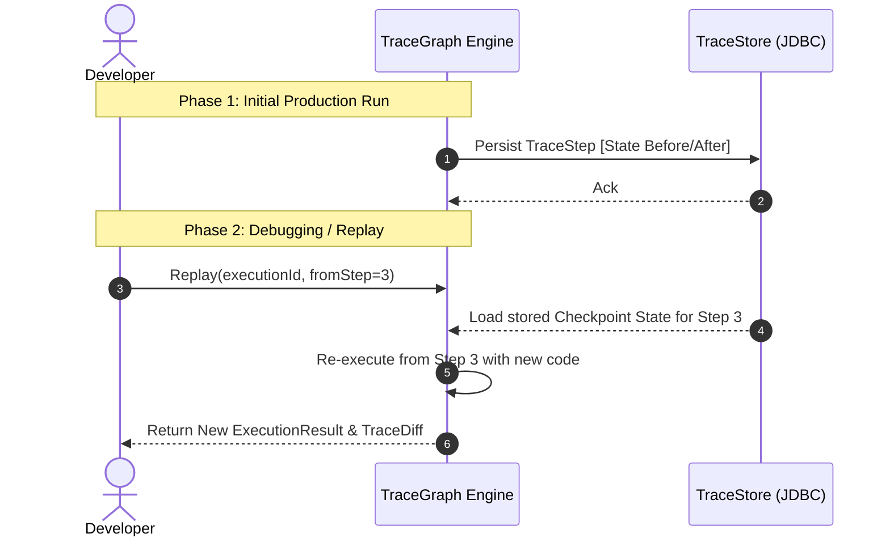

# TraceGraph :: Observability

## 📖 Introduction to Observability
Welcome to `tracegraph-observability`! When your AI agents are deployed in production, they are "black boxes." If an agent makes a weird decision or throws an error halfway through a 20-node graph, how do you debug it?

This module acts as the lens into TraceGraph, handling deterministic traces, state changes, historical replays, and OpenTelemetry (OTel) integrations.

### Key Features
- **OTel Integration**: `OtelNodeListener` provides one span per node execution, tracking latencies, structural state diffs, and LLM token metric accumulations out of the box.
- **Full Trace Recording**: Persists complete agent traces (inputs, outputs, sub-steps) via `JsonFileTraceStore` or `JdbcTraceStore`.
- **Replay Mechanism**: Deterministically re-run a preserved `ExecutionTrace` against a modified graph codebase for deep debugging and "what-if" analysis.
- **Trace Diffing**: `TraceDiff` compares two distinct executions to pinpoint the precise divergent node and state delta.

## 🏗️ Full Agent Replay Flow

When an error occurs, you can replay the exact trace from the database starting at any node.



## 🚀 How to Implement Observability

### 1. Attaching an OpenTelemetry Listener
If you use APM tools like Datadog, Jaeger, or New Relic, attach the OTel listener to your graph.

```java
import site.tracegraph.observability.otel.OtelNodeListener;

// Obtain your OpenTelemetry instance
OpenTelemetry openTelemetry = // ...

Graph<MyState> graph = Graph.<MyState>builder()
    // ... nodes and edges
    .listener(new OtelNodeListener(openTelemetry))
    .build();
```

### 2. Recording Traces for Replay
To save traces to the database so you can view them in the UI or replay them:

```java
import site.tracegraph.observability.trace.JdbcTraceStore;
import site.tracegraph.observability.trace.RecordingTraceRecorder;

JdbcTraceStore store = new JdbcTraceStore(dataSource);
RecordingTraceRecorder recorder = new RecordingTraceRecorder(store);

Graph<MyState> graph = Graph.<MyState>builder()
    // ... nodes and edges
    .traceRecorder(recorder)
    .build();
```

### 3. Executing a Replay
Once a trace is recorded, you can replay it from any node (e.g., if node "charge_card" failed, you can fix the API key and resume exactly from "charge_card").

```java
import site.tracegraph.observability.replay.Replayer;

Replayer<MyState> replayer = new Replayer<>(store, graph);

// Replay execution "exec-123" starting from the "charge_card" node
ExecutionResult<MyState> newResult = replayer.replay("exec-123", "charge_card");
```