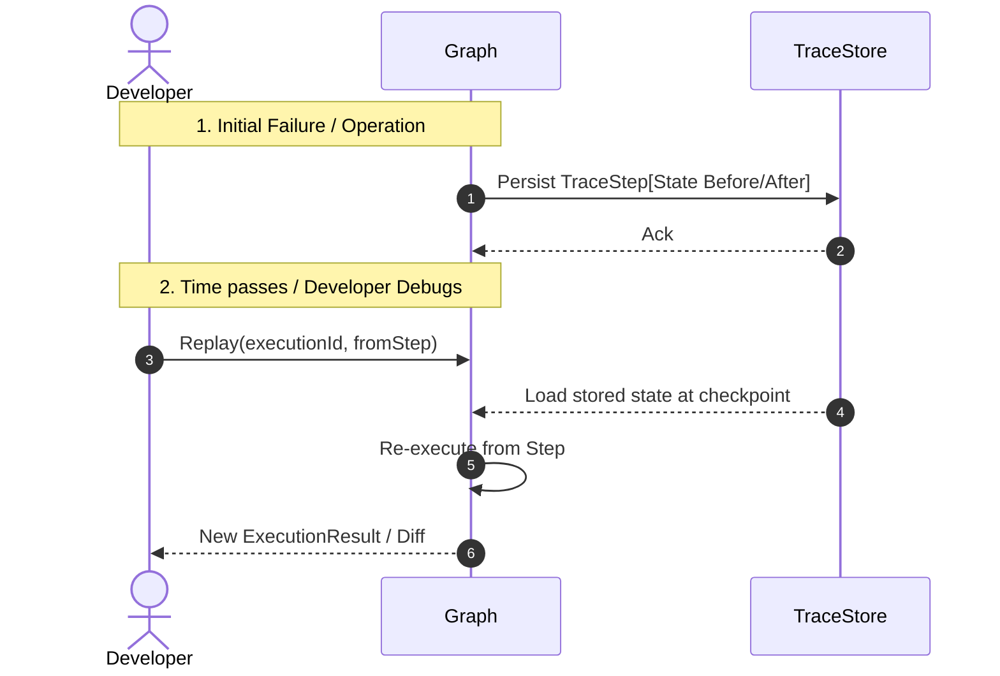

# TraceGraph Observability

`tracegraph-observability` acts as the lens into TraceGraph, handling deterministic traces, state changes, replays, and OpenTelemetry integrations.

## Features
- **OTel Integration**: `OtelNodeListener` provides one span per node, structured state diff tracking, and metric accumulation out of the box.
- **Full Trace Recording**: Persists complete agent traces (input, output, sub-steps) via `JsonFileTraceStore` or `JdbcTraceStore`.
- **Replay Mechanism**: Deterministically re-run a preserved `ExecutionTrace` against a possibly modified graph iteration for deep debugging.
- **Trace Diffing**: `TraceDiff` compares two distinct executions to pinpoint the precise divergent node and state delta.

## Full Agent Replay Flow

