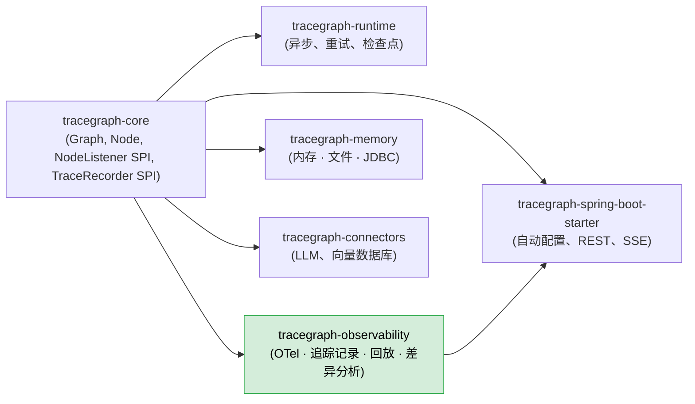
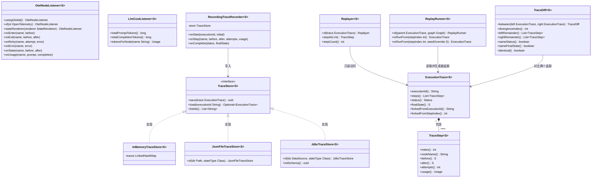
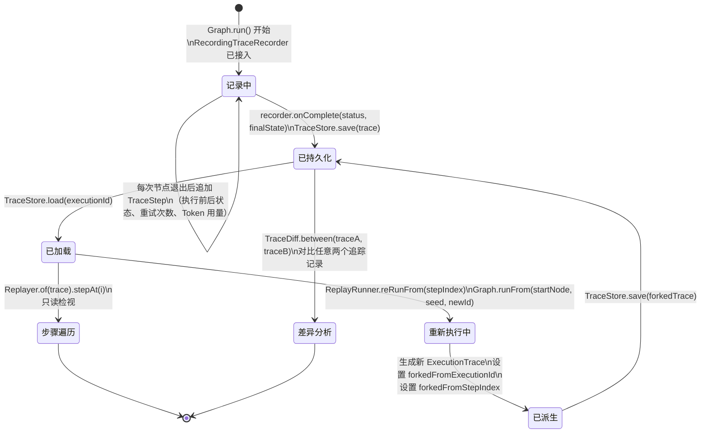
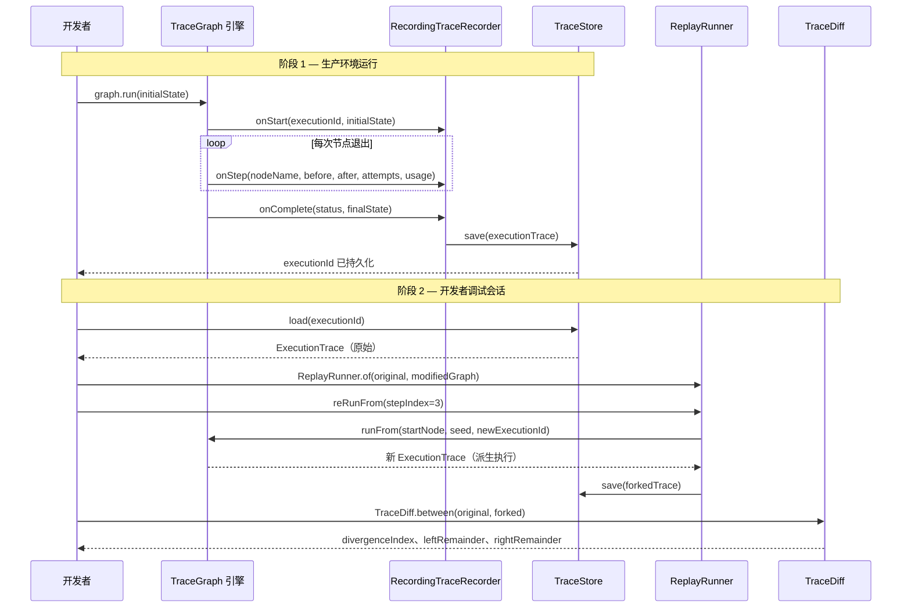
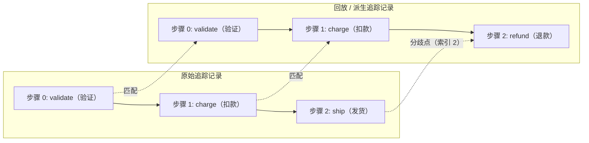
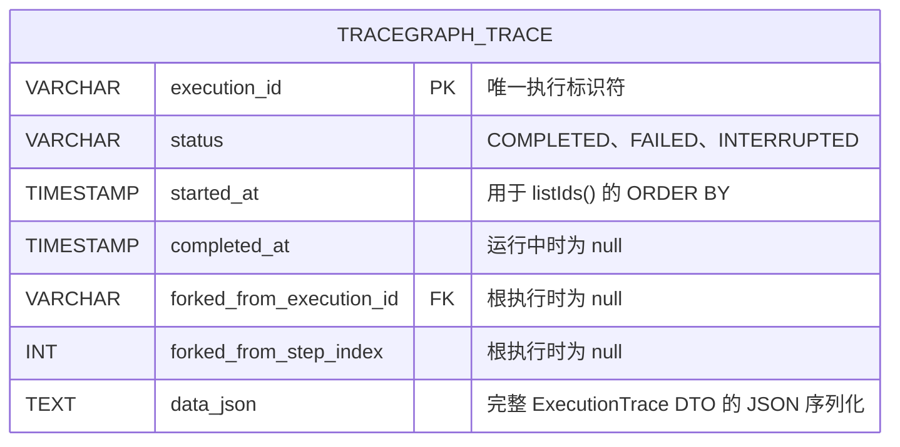

# tracegraph-observability

[](https://central.sonatype.com/artifact/io.tracegraph/tracegraph-observability)
[](https://www.apache.org/licenses/LICENSE-2.0)
[](https://openjdk.org/projects/jdk/21/)

为 TraceGraph 智能体提供完整保真的执行追踪记录、OpenTelemetry 追踪跨度（Span）、确定性回放和分歧分析。

---

## 模块简介

`tracegraph-observability` 将 TraceGraph 的执行过程从不透明的黑盒变成可完整检视、可回放的结构化记录。每次节点进入、每次状态转换以及每次失败，都会被捕获到结构化的 `ExecutionTrace<S>` 中，该记录可持久化到内存、磁盘或关系数据库，并在未来任意时刻检索。

在追踪基础设施之上，本模块还提供了 OpenTelemetry 监听器，为每次节点执行发出一个追踪跨度（Span）——包含状态差异、LLM Token 用量和错误记录——使智能体执行过程自然地呈现在 Jaeger、Datadog 或 Honeycomb 等 OTel 兼容的 APM 工具中。

当生产环境的执行出现问题时，`ReplayRunner` 允许加载已保存的追踪记录，从任意步骤开始针对修改后的图重新执行，并生成带有完整原始追踪溯源的新 `ExecutionTrace`。`TraceDiff` 则可逐步对比两个追踪记录，精确定位行为发生分歧的节点以及两侧的状态差异。

---

## 系统上下文图



`tracegraph-core` 定义了 `NodeListener` 和 `TraceRecorder` 服务提供接口 (SPI)。本模块提供 `OtelNodeListener`、`LlmCostListener`、`RecordingTraceRecorder`、`TraceStore` 家族以及回放/差异分析工具。Spring Boot Starter 将这些类型封装为 REST 和 SSE 接口。

---

## 内部架构图



---

## 追踪记录生命周期



---

## 时序图 — 生产运行与回放



---

## TraceDiff 概念图



`TraceDiff.between(traceA, traceB)` 逐步对比两个追踪记录，以 `nodeName + 执行前状态相等` 为匹配条件。最长公共前缀是已匹配区域，第一个不匹配的索引即 `divergenceIndex`。该索引之后的步骤分别是 `leftRemainder`（来自 traceA）和 `rightRemainder`（来自 traceB）。`identical()` 仅在无分歧且 `sameStatus` 且 `sameFinalState` 时返回 `true`。

---

## 数据模型 — JDBC 追踪存储



`data_json` 列存储完整序列化的 `ExecutionTrace`，包含所有带执行前后状态的 `TraceStep` 记录。派生溯源列（`forked_from_execution_id`、`forked_from_step_index`）也被反规范化为顶层列，便于无需解析 JSON 即可进行 SQL 查询。`listIds()` 按 `started_at` 升序返回执行 ID 列表。

---

## 核心概念

### OtelNodeListener — 每节点一个 Span

`OtelNodeListener<S>` 实现了 `NodeListener` 接口，为每次节点执行创建一个 OpenTelemetry Span。Span 名称即节点名称。子节点级别的观测通过 Span 事件（Span Event）表达：

| 事件 / 属性 | 触发时机 |
|---|---|
| `state` Span 事件（含 `before`/`after` 属性） | `NodeListener.onState()` — 每次节点成功退出后触发一次 |
| `retry` Span 事件（含 `attempt` 属性） | `NodeListener.onRetry()` — 每次重试时触发 |
| `StatusCode.ERROR` + `Span.recordException` | `NodeListener.onError()` — 节点失败时 |
| `llm.usage.input_tokens` Span 属性 | `NodeListener.onUsage()` — 任意 ChatNode 调用完成后 |
| `llm.usage.output_tokens` Span 属性 | `NodeListener.onUsage()` |
| `llm.usage.total_tokens` Span 属性 | `NodeListener.onUsage()` |

`parallel(...)` 内部的分支不会生成各自的 Span——这些分支对监听器（Listener）不可见，是 Phase 2c 的设计决策。重试不会产生新的 Span；每次重试只在同一 Span 上追加一个 `retry` 事件。

### StateRenderer — 可插拔的状态表示

默认情况下，`OtelNodeListener` 使用 `String.valueOf(state)` 渲染状态。可提供自定义 `StateRenderer` 来控制 Span 属性中显示的内容：

```java
OtelNodeListener.<OrderState>of(openTelemetry)
    .stateRenderer(s -> "orderId=" + s.orderId() + " status=" + s.status())
```

渲染器在每次成功的节点退出时被调用两次（执行前和执行后）。请保持其轻量——它运行在热路径上。

### LlmCostListener — Token 用量累计

`LlmCostListener<S>` 实现了 `NodeListener` 接口，在整个执行过程中累计 Token 用量。使用 `Listeners.compose(...)` 将其与 `OtelNodeListener` 组合使用：

```java
var costListener = new LlmCostListener<OrderState>();
var otelListener = OtelNodeListener.<OrderState>usingGlobal();

Graph<OrderState> graph = Graph.<OrderState>builder()
    .listener(Listeners.compose(otelListener, costListener))
    // ...
    .build();

graph.run(initial);

long promptTokens     = costListener.totalPromptTokens();
long completionTokens = costListener.totalCompletionTokens();
```

### TraceStore — 三种实现

| 实现 | 适用场景 |
|---|---|
| `InMemoryTraceStore<S>` | 单元测试，无需外部进程 |
| `JsonFileTraceStore<S>` | 本地开发、单节点应用、磁盘审计日志 |
| `JdbcTraceStore<S>` | 生产环境；支持 SQL 查询；多实例安全 |

三种实现均满足相同的 `TraceStore<S>` 接口，可在不修改节点或图代码的情况下自由切换。

### Replayer — 只读步骤遍历

`Replayer<S>` 提供对已保存追踪记录的只读访问：

```java
Replayer<OrderState> replayer = Replayer.of(trace);
int count = replayer.stepCount();
for (int i = 0; i < count; i++) {
    TraceStep<OrderState> step = replayer.stepAt(i);
    System.out.printf("步骤 %d | 节点: %s | 重试次数: %d%n",
        step.index(), step.nodeName(), step.attempts());
}
```

`Replayer` 不会重新执行任何内容——它是冻结追踪记录上的结构化游标。

### ReplayRunner — 带派生溯源的重新执行

`ReplayRunner<S>` 从指定步骤开始，针对（可能已修改的）图重新执行追踪记录：

- `reRunFrom(-1)` 从入口节点和原始初始状态重新执行。
- `reRunFrom(i)` 从第 `i` 步开始，以 `trace.steps().get(i).before()` 为初始状态。
- `reRunFrom(i, seedOverride)` 使用自定义初始状态替代保存的状态。

生成的 `ExecutionTrace` 携带 `forkedFromExecutionId` 和 `forkedFromStepIndex` 以记录派生溯源。新追踪记录与 `CheckpointStore` 无关——回放期间不读取也不写入检查点。图的结构必须兼容（回放步骤引用的节点必须存在），但节点实现可以自由修改。

### TraceDiff — 分歧分析

`TraceDiff<S>` 对比两个 `ExecutionTrace<S>` 对象并报告：

| 字段 | 含义 |
|---|---|
| `divergenceIndex` | 首个不匹配步骤的索引；若全部匹配则为 `-1` |
| `leftRemainder` | 分歧点之后来自左侧追踪的步骤列表 |
| `rightRemainder` | 分歧点之后来自右侧追踪的步骤列表 |
| `sameStatus` | 两个追踪是否以相同的 `Status` 结束 |
| `sameFinalState` | 两个追踪是否以相等的最终状态结束 |
| `identical()` | 无分歧且 `sameStatus` 且 `sameFinalState` 时才为 `true` |

步骤匹配使用 `nodeName + 执行前状态相等` 作为条件。若同一索引的执行前状态不同，即便节点名称相同，该索引也是分歧点。

### Throwable 往返序列化 — 有意为之的有损设计

`JsonFileTraceStore` 和 `JdbcTraceStore` 仅将异常的 `className + message` 存储为字符串。加载时，异常被重建为普通的 `RuntimeException`：

```
RuntimeException("[com.example.OrderException] 支付网关超时")
```

堆栈跟踪**不会**被存储。这是设计决策：回放调试关注的是_哪个节点失败_以及_彼时状态是什么_，而非完整的 Java 调用栈。如需查看原始堆栈跟踪，请在 APM 工具（通过 `OtelNodeListener` 的 `Span.recordException`）或原始运行时的应用日志中查找。

---

## 完整使用演练

### 第 1 步 — 添加依赖

```xml
<dependency>
    <groupId>io.tracegraph</groupId>
    <artifactId>tracegraph-observability</artifactId>
    <version>0.1.0</version>
</dependency>
```

`JsonFileTraceStore` 和 `JdbcTraceStore` 需要 Jackson（`jackson-databind` + `jackson-datatype-jsr310`）。`OtelNodeListener` 需要 OpenTelemetry API。

### 第 2 步 — 使用全局 OpenTelemetry

```java
import io.tracegraph.observability.otel.OtelNodeListener;
import io.tracegraph.core.Graph;

Graph<OrderState> graph = Graph.<OrderState>builder()
    .listener(OtelNodeListener.usingGlobal())
    // ... 节点、边
    .build();
```

`usingGlobal()` 使用通过 `GlobalOpenTelemetry.set(...)` 在启动时注册的 SDK 实例。当应用程序已配置 OTel（例如通过 OpenTelemetry Java Agent 或 Spring Boot 自动配置）时，推荐使用此方式。

### 第 3 步 — 使用显式 OpenTelemetry 实例

```java
import io.opentelemetry.api.OpenTelemetry;

OpenTelemetry openTelemetry = // ... 您的 SDK 实例

Graph<OrderState> graph = Graph.<OrderState>builder()
    .listener(OtelNodeListener.of(openTelemetry))
    // ...
    .build();
```

### 第 4 步 — 自定义 StateRenderer

```java
Graph<OrderState> graph = Graph.<OrderState>builder()
    .listener(
        OtelNodeListener.<OrderState>of(openTelemetry)
            .stateRenderer(s -> "orderId=" + s.orderId() + " status=" + s.status())
    )
    // ...
    .build();
```

渲染后的字符串将作为 `state` Span 事件中的 `before` 和 `after` 属性显示。

### 第 5 步 — RecordingTraceRecorder 与 InMemoryTraceStore

```java
import io.tracegraph.observability.replay.RecordingTraceRecorder;
import io.tracegraph.observability.store.InMemoryTraceStore;

var traceStore = new InMemoryTraceStore<OrderState>();
var recorder   = new RecordingTraceRecorder<>(traceStore);

Graph<OrderState> graph = Graph.<OrderState>builder()
    .traceRecorder(recorder)
    // ...
    .build();

ExecutionResult<OrderState> result = graph.run(initialState);
String executionId = result.executionId();

// 稍后检索追踪记录
ExecutionTrace<OrderState> trace = traceStore.load(executionId).orElseThrow();
```

### 第 6 步 — 本地开发：JsonFileTraceStore

```java
import io.tracegraph.observability.store.JsonFileTraceStore;
import java.nio.file.Path;

JsonFileTraceStore<OrderState> traceStore =
    JsonFileTraceStore.of(Path.of("/tmp/traces"), OrderState.class);

var recorder = new RecordingTraceRecorder<>(traceStore);
```

`Class<S>` 参数是必填项——它告诉 Jackson 加载追踪记录时如何反序列化状态值。每次执行对应一个以 `executionId` 命名的 JSON 文件。

### 第 7 步 — 生产环境：JdbcTraceStore

```java
import io.tracegraph.observability.store.JdbcTraceStore;
import javax.sql.DataSource;

JdbcTraceStore<OrderState> traceStore =
    JdbcTraceStore.of(dataSource, OrderState.class);

// 若表不存在则自动创建（幂等，可在启动时安全调用）
traceStore.initSchema();

var recorder = new RecordingTraceRecorder<>(traceStore);
```

### 第 8 步 — 使用 Replayer 读取追踪记录

```java
import io.tracegraph.observability.replay.Replayer;

ExecutionTrace<OrderState> trace = traceStore.load(executionId).orElseThrow();
Replayer<OrderState> replayer = Replayer.of(trace);

System.out.println("总步骤数: " + replayer.stepCount());

for (int i = 0; i < replayer.stepCount(); i++) {
    TraceStep<OrderState> step = replayer.stepAt(i);
    System.out.printf(
        "[%d] %s  重试次数=%d  输入Token=%d%n",
        step.index(),
        step.nodeName(),
        step.attempts(),
        step.usage() != null ? step.usage().promptTokens() : 0
    );
    System.out.println("  执行前: " + step.before());
    System.out.println("  执行后: " + step.after());
}
```

### 第 9 步 — 使用 ReplayRunner 重新执行

```java
import io.tracegraph.observability.replay.ReplayRunner;

ExecutionTrace<OrderState> original = traceStore.load(executionId).orElseThrow();

// 从第 2 步（0 索引）重新执行，使用保存的该步骤状态作为初始状态
ExecutionTrace<OrderState> forked =
    ReplayRunner.of(original, modifiedGraph).reRunFrom(2);

System.out.println("派生自:    " + forked.forkedFromExecutionId());
System.out.println("派生步骤:  " + forked.forkedFromStepIndex());
System.out.println("新执行 ID: " + forked.executionId());

// 持久化派生执行
traceStore.save(forked);
```

从最开始重新执行：

```java
ExecutionTrace<OrderState> rerun = ReplayRunner.of(original, graph).reRunFrom(-1);
```

从第 3 步重新执行，并使用自定义初始状态覆盖：

```java
OrderState tweakedState = original.steps().get(3).before().withAmount(999);
ExecutionTrace<OrderState> forked =
    ReplayRunner.of(original, graph).reRunFrom(3, tweakedState);
```

### 第 10 步 — 对比两个追踪记录（差异分析）

```java
import io.tracegraph.observability.replay.TraceDiff;

ExecutionTrace<OrderState> original = traceStore.load("exec-001").orElseThrow();
ExecutionTrace<OrderState> forked   = traceStore.load("exec-002").orElseThrow();

TraceDiff<OrderState> diff = TraceDiff.between(original, forked);

if (diff.identical()) {
    System.out.println("两个追踪记录完全相同。");
} else {
    System.out.println("分歧点步骤索引: " + diff.divergenceIndex());
    System.out.println("状态是否相同:   " + diff.sameStatus());
    System.out.println("最终状态是否相同: " + diff.sameFinalState());

    diff.leftRemainder().forEach(s ->
        System.out.println("  原始追踪: " + s.nodeName()));
    diff.rightRemainder().forEach(s ->
        System.out.println("  派生追踪: " + s.nodeName()));
}
```

### 第 11 步 — 使用 LlmCostListener 追踪 Token 成本

```java
import io.tracegraph.observability.otel.LlmCostListener;
import io.tracegraph.core.spi.Listeners;

var costListener = new LlmCostListener<OrderState>();

Graph<OrderState> graph = Graph.<OrderState>builder()
    .listener(Listeners.compose(OtelNodeListener.usingGlobal(), costListener))
    // ...
    .build();

graph.run(initialState);

System.out.printf("总输入 Token 数:   %d%n", costListener.totalPromptTokens());
System.out.printf("总输出 Token 数:   %d%n", costListener.totalCompletionTokens());
System.out.printf("'classify' 节点:  %s%n", costListener.tokensForNode("classify"));
```

---

## 配置参考

| 配置项 | 描述 | 默认值 |
|---|---|---|
| `JdbcTraceStore` 表名 | 用于追踪行的 SQL 表 | `tracegraph_trace` |
| `JdbcTraceStore.initSchema()` | 若表不存在则创建；幂等 | 需手动调用 |
| `JsonFileTraceStore` 目录 | 每次执行 JSON 文件的存放根目录 | 必填，无默认值 |
| `JsonFileTraceStore` 状态类型 | 用于反序列化状态的 `Class<S>` | 必填，无默认值 |
| `OtelNodeListener.usingGlobal()` | 使用 `GlobalOpenTelemetry` 实例 | 推荐用于基于 Agent 的 OTel 配置 |
| `OtelNodeListener.stateRenderer` | 将状态转换为字符串用于 Span 属性 | `String::valueOf` |
| Spring: `tracegraph.web.enabled` | 是否启用 `TraceController` REST 接口 | `true` |
| Spring Boot 回放接口 | `POST /tracegraph/traces/{id}/replay?step=N` | 存在 `Graph` Bean 时自动装配 |

---

## 与其他模块的集成

### Spring Boot Starter REST 接口

当 `tracegraph-spring-boot-starter`、`spring-webmvc` 和 `tracegraph-observability` 同时存在时，`TraceWebAutoConfiguration` 注册以下接口：

| 方法 | 路径 | 描述 |
|---|---|---|
| `GET` | `/tracegraph/traces` | 列举执行 ID；支持 `?limit=N&offset=M`；响应头 `X-Total-Count` |
| `GET` | `/tracegraph/traces/{id}` | 完整追踪记录 JSON；未知 ID 返回 404 |
| `GET` | `/tracegraph/traces/{a}/diff/{b}` | `TraceDiff` JSON；任一 ID 未知则返回 404 |
| `DELETE` | `/tracegraph/traces/{id}` | 成功返回 204；未知 ID 返回 404 |
| `POST` | `/tracegraph/traces/{id}/replay?step=N` | 从步骤 N 重新执行；返回新的 executionId |

回放接口需要恰好一个 `Graph<?>` Bean（`@ConditionalOnSingleCandidate`）。

### 组合多个监听器

使用 `tracegraph-core` 中的 `Listeners.compose(...)` 组合多个监听器：

```java
import io.tracegraph.core.spi.Listeners;

var otel = OtelNodeListener.<OrderState>usingGlobal();
var cost = new LlmCostListener<OrderState>();

Graph<OrderState> graph = Graph.<OrderState>builder()
    .listener(Listeners.compose(otel, cost))
    .traceRecorder(new RecordingTraceRecorder<>(traceStore))
    // ...
    .build();
```

### Resume 追加到已有追踪记录

当 `Graph.resume(executionId)` 被调用于中断或已有检查点的执行时，`RecordingTraceRecorder` 会从 `TraceStore` 加载已有的追踪记录，并将新步骤追加其中。最终持久化的追踪记录是跨所有恢复操作的连续完整记录。

---

## 测试指南

在所有单元测试中使用 `InMemoryTraceStore`——无需文件系统或数据库。

### 验证 TraceStep 字段

```java
import io.tracegraph.observability.replay.RecordingTraceRecorder;
import io.tracegraph.observability.store.InMemoryTraceStore;
import io.tracegraph.core.Graph;
import io.tracegraph.core.ExecutionResult;
import io.tracegraph.observability.replay.ExecutionTrace;
import io.tracegraph.observability.replay.TraceStep;
import org.junit.jupiter.api.Test;

import static org.assertj.core.api.Assertions.assertThat;

class TraceRecorderTest {

    @Test
    void 每步骤记录执行前后状态() {
        var store    = new InMemoryTraceStore<Integer>();
        var recorder = new RecordingTraceRecorder<>(store);

        Graph<Integer> graph = Graph.<Integer>builder()
            .traceRecorder(recorder)
            .node("increment", (s, ctx) -> s + 1)
            .entry("increment")
            .build();

        ExecutionResult<Integer> result = graph.run(10);
        String executionId = result.executionId();

        ExecutionTrace<Integer> trace = store.load(executionId).orElseThrow();
        assertThat(trace.steps()).hasSize(1);

        TraceStep<Integer> step = trace.steps().get(0);
        assertThat(step.nodeName()).isEqualTo("increment");
        assertThat(step.before()).isEqualTo(10);
        assertThat(step.after()).isEqualTo(11);
        assertThat(step.attempts()).isEqualTo(1);
    }
}
```

### 验证 ReplayRunner 的派生溯源

```java
@Test
void replayRunner设置派生溯源字段() {
    var store    = new InMemoryTraceStore<Integer>();
    var recorder = new RecordingTraceRecorder<>(store);

    Graph<Integer> graph = Graph.<Integer>builder()
        .traceRecorder(recorder)
        .node("double", (s, ctx) -> s * 2)
        .entry("double")
        .build();

    ExecutionResult<Integer> original = graph.run(5);
    ExecutionTrace<Integer> trace = store.load(original.executionId()).orElseThrow();

    ExecutionTrace<Integer> forked = ReplayRunner.of(trace, graph).reRunFrom(-1);

    assertThat(forked.forkedFromExecutionId()).isEqualTo(original.executionId());
    assertThat(forked.forkedFromStepIndex()).isEqualTo(-1);
    assertThat(forked.executionId()).isNotEqualTo(original.executionId());
}
```

### 验证相同追踪记录的 TraceDiff

```java
@Test
void 相同追踪记录无分歧() {
    var store    = new InMemoryTraceStore<Integer>();
    var recorder = new RecordingTraceRecorder<>(store);

    Graph<Integer> graph = Graph.<Integer>builder()
        .traceRecorder(recorder)
        .node("noop", (s, ctx) -> s)
        .entry("noop")
        .build();

    graph.run(1);
    graph.run(1); // 相同输入、相同图 → 相同追踪记录

    var ids = store.listIds();
    ExecutionTrace<Integer> a = store.load(ids.get(0)).orElseThrow();
    ExecutionTrace<Integer> b = store.load(ids.get(1)).orElseThrow();

    TraceDiff<Integer> diff = TraceDiff.between(a, b);
    assertThat(diff.identical()).isTrue();
}
```

### 验证 Throwable 往返重建

```java
@Test
void 异常被重建为RuntimeException(@TempDir Path tmp) {
    var store    = JsonFileTraceStore.of(tmp, Integer.class);
    var recorder = new RecordingTraceRecorder<>(store);

    Graph<Integer> graph = Graph.<Integer>builder()
        .traceRecorder(recorder)
        .node("fail", (s, ctx) -> { throw new IllegalStateException("boom"); })
        .entry("fail")
        .build();

    ExecutionResult<Integer> result = graph.run(0);

    // 从磁盘加载——Throwable 已经历有损往返
    ExecutionTrace<Integer> loaded = store.load(result.executionId()).orElseThrow();
    assertThat(loaded.status()).isEqualTo(Status.FAILED);
    // 失败原因被重建为 RuntimeException，包含类名和消息
    assertThat(loaded.failureCause())
        .isInstanceOf(RuntimeException.class)
        .hasMessageContaining("IllegalStateException")
        .hasMessageContaining("boom");
}
```

---

## 常见问题解答

### 问：为什么 Throwable 序列化是有损的？

回放调试关注两件事：哪个节点失败了，以及当时状态是什么。两者都不需要堆栈跟踪。堆栈帧引用的是 TraceGraph 内部类和 JVM 内部类，在回放上下文中毫无意义。存储完整堆栈会使 JSON 体积膨胀、将存储数据与内部类名耦合，且对回放毫无价值。如需查看原始堆栈跟踪，请查阅 APM 工具中的追踪跨度（由 `OtelNodeListener` 的 `Span.recordException` 写入）或原始运行时的应用日志。

### 问：`parallel(...)` 内部的每个分支都有各自的 TraceStep 吗？

没有。`parallel(...)` 调用在追踪记录中恰好产生一个 `TraceStep`，记录整体的进入、合并结果和总重试次数。单个分支对 `NodeListener` 和 `TraceRecorder` 都不可见——这是 Phase 2c 的刻意设计决策。分支级别的可见性留作未来功能切片。

### 问：重试会产生额外的 TraceStep 吗？

不会。无论重试多少次，每次节点执行恰好产生一个 `TraceStep`。`TraceStep` 的 `attempts` 字段记录重试次数。这使追踪记录保持紧凑，并与图的逻辑视角保持一致（一个节点 = 一个步骤），而非暴露物理层面的重试机制。

### 问：可以回放到修改后的图中吗？

可以，但有一个约束：`reRunFrom(stepIndex)` 引用的节点必须在修改后的图中存在，因为 `ReplayRunner` 使用保存步骤中的节点名称调用 `Graph.runFrom(startNode, ...)`。节点的实现可以自由修改——这正是回放的全部意义所在。添加或删除不在回放路径上的节点不会产生任何影响。若需重命名回放步骤的入口节点，则必须通过 `reRunFrom(stepIndex, seedOverride)` 传入正确的名称。

### 问：如果没有保存任何追踪记录，`listIds()` 返回什么？

返回空的 `List<String>`。`TraceStore.listIds()` 是接口上的 `default` 方法，默认返回 `List.of()`，因此未覆盖该方法的实现都返回空列表。`InMemoryTraceStore` 和 `JsonFileTraceStore` 均覆盖了该方法以返回实际的执行 ID 列表。

### 问：可以用 `TraceDiff` 对比来自完全不同的图运行的两个追踪记录吗？

可以——`TraceDiff` 不要求两个追踪记录共享 `forkedFromExecutionId`。它逐步对比任意两个 `ExecutionTrace<S>` 对象。比较是纯结构性的（节点名称和状态相等性），只要状态类型 `<S>` 正确实现了 `equals` 方法，即便对独立的运行也能得到有意义的结果。
