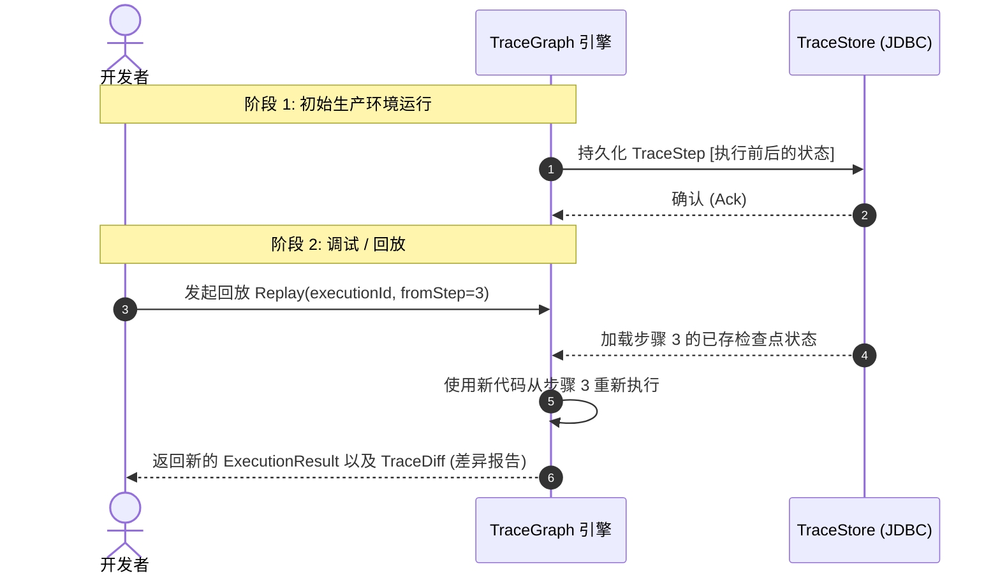

# TraceGraph :: Observability (可观测性模块)

## 📖 可观测性简介
欢迎使用 `tracegraph-observability` 模块！当您的 AI 代理被部署到生产环境时，它们就变成了“黑盒”。如果代理做出了奇怪的决定，或者在一个 20 个节点深度的图中途抛出了错误，您该如何调试？

该模块充当 TraceGraph 的透视镜，处理确定性追踪记录、状态变更、历史执行回放以及 OpenTelemetry (OTel) 的集成。

### 核心特性
- **OTel 集成**: `OtelNodeListener` 能够为每个节点的执行生成一个 Span（跨度），开箱即用地追踪延迟、结构化的状态差异（State Diff）以及 LLM Token 指标的累积。
- **全链路追踪记录**: 通过 `JsonFileTraceStore` 或 `JdbcTraceStore` 持久化完整的代理追踪（包括输入、输出、子步骤）。
- **回放机制 (Replay)**: 针对已修改的图代码库确定性地重新运行已保存的 `ExecutionTrace`，用于深度调试和“假设分析”。
- **追踪对比 (Trace Diffing)**: `TraceDiff` 可比较两次独立的执行记录，以准确定位发生分歧的具体节点和状态增量。

## 🏗️ 完整代理回放流

发生错误时，您可以从数据库加载确切的追踪记录，并从任意节点开始回放（重新执行）。



## 🚀 如何实现可观测性

### 1. 附加 OpenTelemetry 监听器
如果您使用 Datadog、Jaeger 或 New Relic 等 APM 工具，请将 OTel 监听器附加到您的执行图中。

```java
import site.tracegraph.observability.otel.OtelNodeListener;

// 获取您的 OpenTelemetry 实例
OpenTelemetry openTelemetry = // ...

Graph<MyState> graph = Graph.<MyState>builder()
    // ... 节点和边
    .listener(new OtelNodeListener(openTelemetry))
    .build();
```

### 2. 记录追踪以供回放
若要将追踪保存到数据库，以便您在 UI 中查看或进行回放：

```java
import site.tracegraph.observability.trace.JdbcTraceStore;
import site.tracegraph.observability.trace.RecordingTraceRecorder;

JdbcTraceStore store = new JdbcTraceStore(dataSource);
RecordingTraceRecorder recorder = new RecordingTraceRecorder(store);

Graph<MyState> graph = Graph.<MyState>builder()
    // ... 节点和边
    .traceRecorder(recorder)
    .build();
```

### 3. 执行回放
记录追踪后，您可以从任何节点回放它（例如，如果节点 "charge_card" 失败，您可以修复 API 密钥，然后完全从 "charge_card" 恢复执行）。

```java
import site.tracegraph.observability.replay.Replayer;

Replayer<MyState> replayer = new Replayer<>(store, graph);

// 从 "charge_card" 节点开始，回放执行 "exec-123"
ExecutionResult<MyState> newResult = replayer.replay("exec-123", "charge_card");
```
