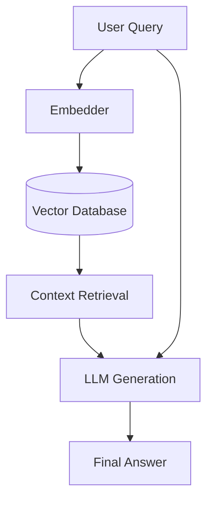

# TraceGraph :: RAG

## Overview
The `tracegraph-rag` module implements Retrieval-Augmented Generation (RAG) capabilities, allowing TraceGraph agents to seamlessly retrieve and utilize external knowledge to ground their responses.

## RAG Flowchart

## Features
- Pluggable vector store interfaces
- Advanced chunking and retrieval strategies
- Extensible abstractions for embedding and generation models
