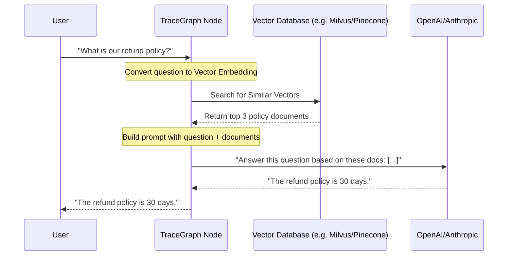

# TraceGraph :: RAG (Retrieval-Augmented Generation)

## 📖 Introduction to RAG
Welcome to `tracegraph-rag`! Large Language Models are incredibly smart, but they only know what they were trained on. They don't know your company's private wiki, today's news, or the specific contents of your database.

**RAG (Retrieval-Augmented Generation)** is the industry standard way to fix this. Instead of just asking the LLM a question, you:
1. **Retrieve** relevant documents from a database.
2. **Augment** the user's prompt by pasting those documents in.
3. Ask the LLM to **Generate** an answer using only the pasted documents.

This module provides all the tools you need to build RAG workflows inside TraceGraph.

## 🏗️ RAG Architecture



## 🚀 How to Use It

### 1. Setting up a Retriever
First, you configure a vector store that can search for documents.

```java
import site.tracegraph.rag.retriever.VectorStoreRetriever;

VectorStoreRetriever retriever = VectorStoreRetriever.builder()
    .collectionName("company_policies")
    .topK(3) // Return top 3 matches
    .build();
```

### 2. Building the RAG Node
Inside your TraceGraph, you create a node that performs the retrieval step before calling the LLM.

```java
import site.tracegraph.core.Node;
import site.tracegraph.core.State;

public class RetrieveDocsNode implements Node {
    private final VectorStoreRetriever retriever;
    
    public RetrieveDocsNode(VectorStoreRetriever retriever) {
        this.retriever = retriever;
    }

    @Override
    public State execute(State state) {
        String question = state.get("question");
        
        // Fetch documents
        List<String> docs = retriever.retrieve(question);
        
        // Save documents into the state for the LLM node to use next
        state.put("context_documents", docs);
        return state;
    }
}
```
