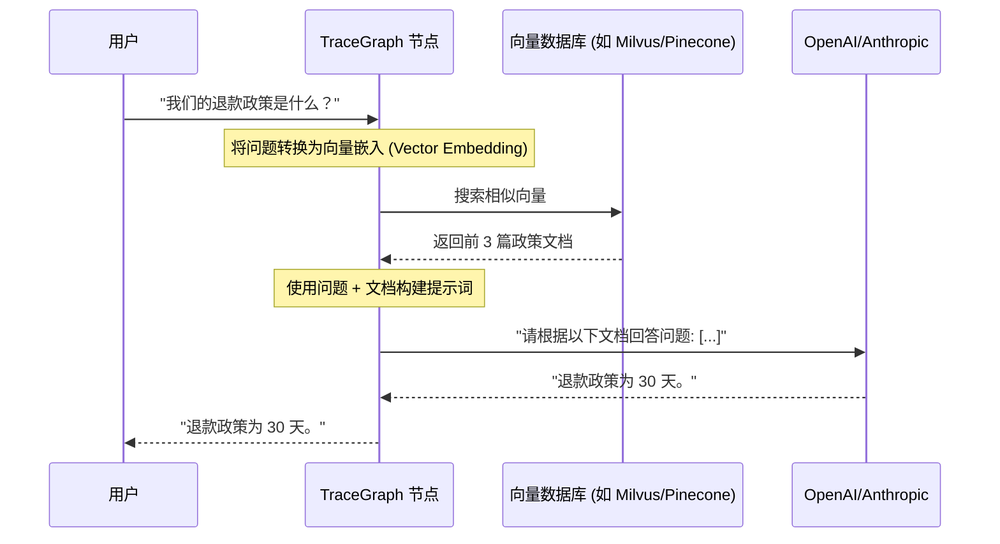

# TraceGraph :: RAG (检索增强生成)

## 📖 RAG 简介

欢迎使用 `tracegraph-rag`！大语言模型 (LLM) 非常聪明，但它们只知道它们在训练时接触过的内容。它们不知道您公司的私有 wiki、今天的新闻或您数据库的具体内容。

**RAG (检索增强生成)** 是解决此问题的行业标准方法。您不再仅仅是直接向 LLM 提问，而是：
1. 从数据库中 **检索 (Retrieve)** 相关的文档。
2. 将这些文档粘贴到提示词中以 **增强 (Augment)** 用户的请求。
3. 让 LLM 仅基于粘贴的文档来 **生成 (Generate)** 答案。

此模块提供了在 TraceGraph 中构建高级 RAG 工作流所需的所有工具。

## 🏗️ RAG 架构



## 🚀 如何使用

### 1. 设置检索器

首先，您需要配置一个可以搜索文档的向量存储。

```java
import site.tracegraph.rag.retriever.VectorStoreRetriever;

VectorStoreRetriever retriever = VectorStoreRetriever.builder()
    .collectionName("company_policies")
    .topK(3) // 返回前 3 个匹配项
    .build();
```

### 2. 构建 RAG 节点

在您的 TraceGraph 中，您创建一个在调用 LLM 之前执行检索步骤的节点。

```java
import site.tracegraph.core.Node;
import site.tracegraph.core.State;

public class RetrieveDocsNode implements Node {
    private final VectorStoreRetriever retriever;
    
    public RetrieveDocsNode(VectorStoreRetriever retriever) {
        this.retriever = retriever;
    }

    @Override
    public State execute(State state) {
        String question = state.get("question");
        
        // 获取文档
        List<String> docs = retriever.retrieve(question);
        
        // 将文档保存到状态中，供下一个 LLM 节点使用
        state.put("context_documents", docs);
        return state;
    }
}
```
