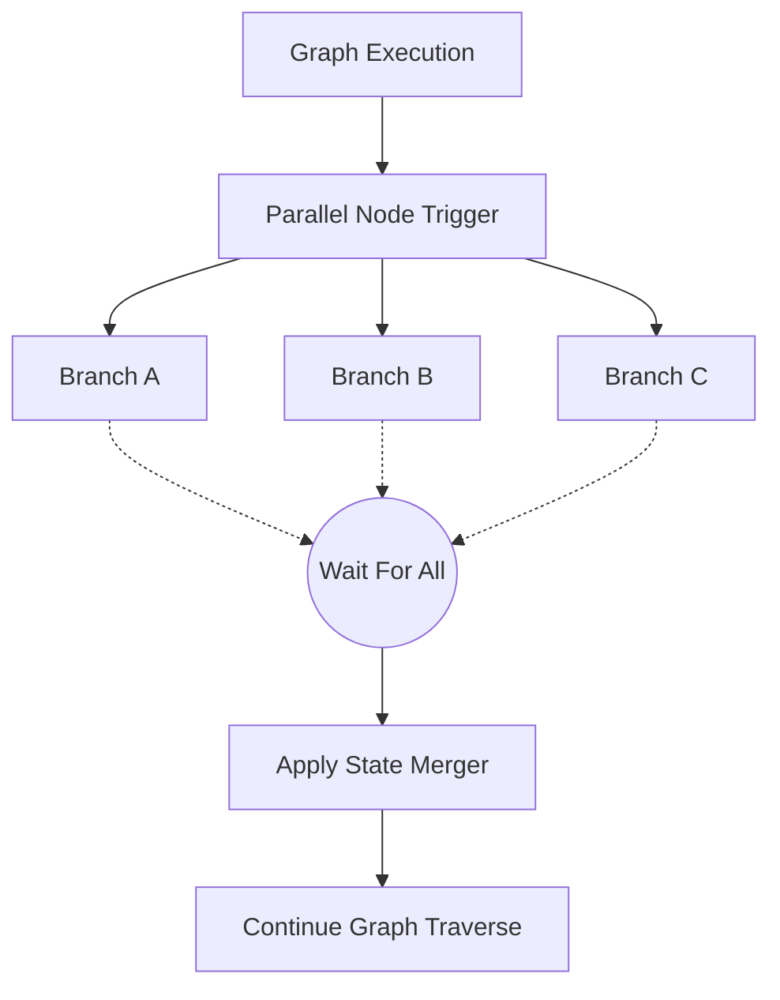

# TraceGraph Runtime

`tracegraph-runtime` extends the core graph functionality to support non-blocking execution, parallelism, durability, and fault tolerance.

## Features
- **Async Execution**: Support for `CompletableFuture<S>` inside nodes without blocking carrier threads (designed for Java 21's Virtual Threads).
- **Parallel Nodes**: Execute multiple branches concurrently with deterministic, declaration-order merging.
- **Checkpointing**: Durable checkpoints allow halting and resuming executions explicitly (e.g., interrupt-before/after). Includes `InMemory` and `Jdbc` storage choices.
- **Retries**: Fault tolerance configured precisely through graph-defined retry policies.

## Parallel Execution Sequence

