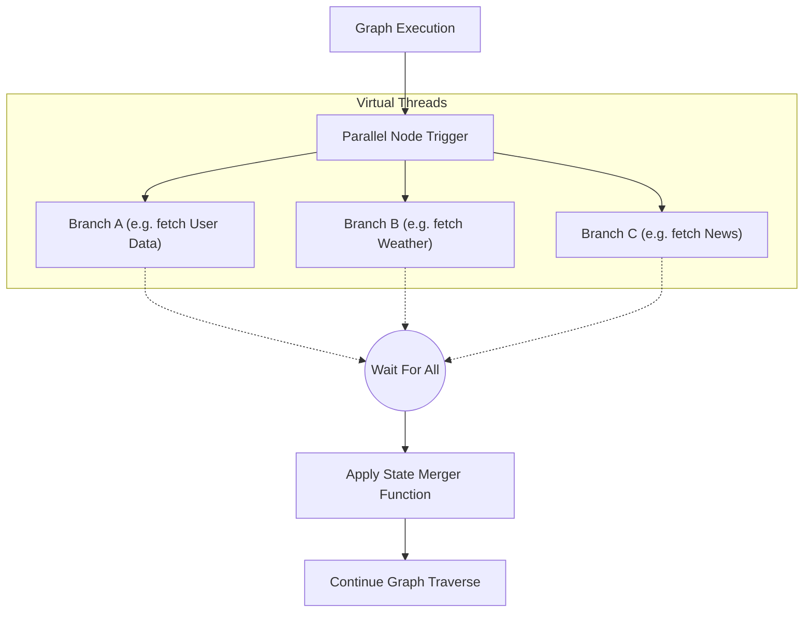

# TraceGraph :: Runtime

## 📖 Introduction to Runtime
Welcome to `tracegraph-runtime`! While `tracegraph-core` provides the foundational abstractions for defining nodes and edges, it executes graphs in a completely synchronous, single-threaded manner. 

If you need to make asynchronous API calls, run multiple nodes in parallel, or pause/resume executions durably, you need the `tracegraph-runtime` module. It extends the core graph functionality to support non-blocking execution, parallelism, durability, and fault tolerance.

### Key Features
- **Async Execution**: Deep support for `CompletableFuture<S>` inside nodes without blocking carrier threads. Highly optimized for Java 21's Virtual Threads.
- **Parallel Nodes**: Execute multiple graph branches concurrently with deterministic, declaration-order merging (Fan-Out / Fan-In).
- **Checkpointing**: Durable checkpoints allow halting and resuming executions explicitly (e.g., interrupt-before/after). Includes `InMemory` and `Jdbc` storage choices.
- **Retries**: Configurable, resilient fault tolerance handled automatically through graph-defined retry policies.

## 🏗️ Parallel Execution Sequence

The runtime module makes it trivial to split your graph into parallel tracks and merge the state back together automatically once all tracks complete.



## 🚀 How to Implement Runtime Features

### 1. Parallel Branches
Use the `.parallel()` builder configuration to split the graph execution into concurrent branches.

```java
import io.tracegraph.core.Graph;

Graph<MyState> graph = Graph.<MyState>builder()
    // ... setup earlier nodes
    .parallel("gather_data", p -> p
        .branch("fetch_user", (state, ctx) -> fetchUser(state))
        .branch("fetch_weather", (state, ctx) -> fetchWeather(state))
        // Combine the results from the branches back into the main state
        .merger((originalState, branchStates) -> {
            // Merge logic here
            return originalState;
        })
    )
    .build();
```

### 2. Async Nodes
Return a `CompletableFuture` from a node to avoid blocking the execution thread while waiting on I/O.

```java
graph.node("call_api", (state, ctx) -> {
    return httpClient.sendAsync(request, BodyHandlers.ofString())
        .thenApply(response -> state.withApiData(response.body()));
});
```

### 3. Checkpointing (Interrupt & Resume)
By configuring a `CheckpointStore` and adding an `interruptBefore` rule, the engine will safely halt execution before the specified node, saving the state to the database.

```java
import site.tracegraph.runtime.checkpoint.JdbcCheckpointStore;

Graph<MyState> graph = Graph.<MyState>builder()
    .node("step1", ... )
    .node("human_approval", ... )
    .checkpointStore(new JdbcCheckpointStore(dataSource))
    .interruptBefore("human_approval") // The graph will pause here
    .build();

// Start the graph (it will pause before human_approval)
ExecutionResult<MyState> r1 = graph.run(initialState);

// ... Later, maybe after a user clicks "Approve" on a UI ...
// Resume the graph from where it left off using the execution ID
ExecutionResult<MyState> r2 = graph.resume(r1.executionId());
```