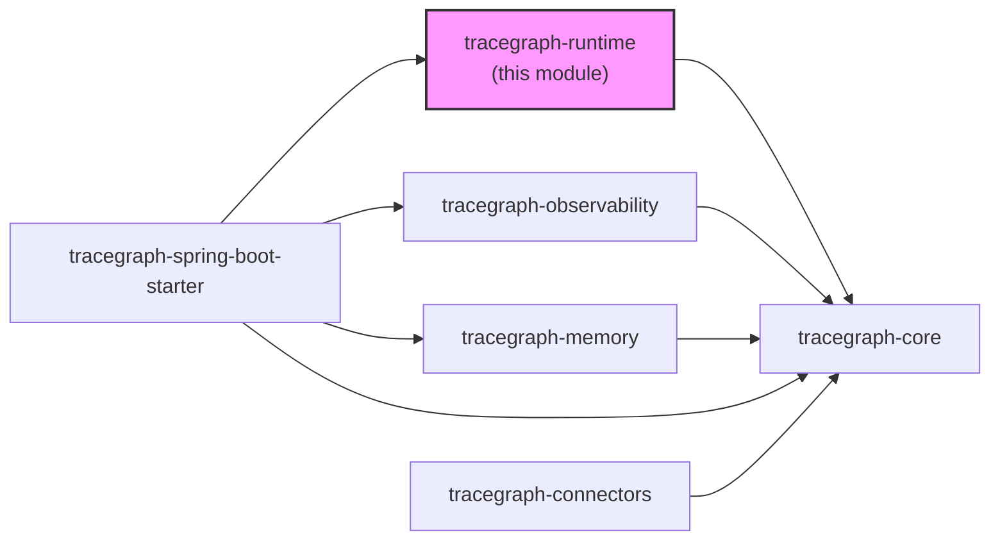
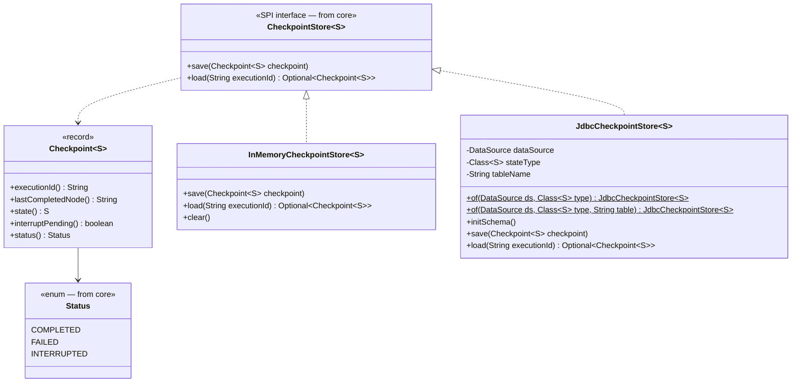
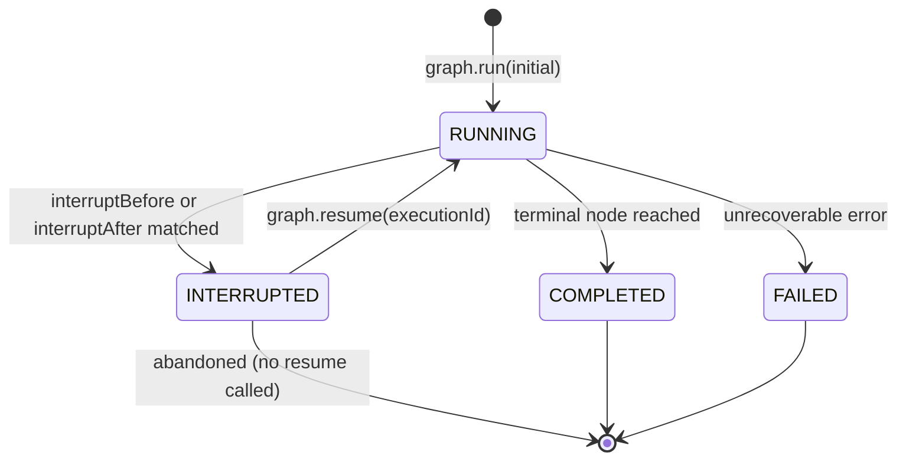
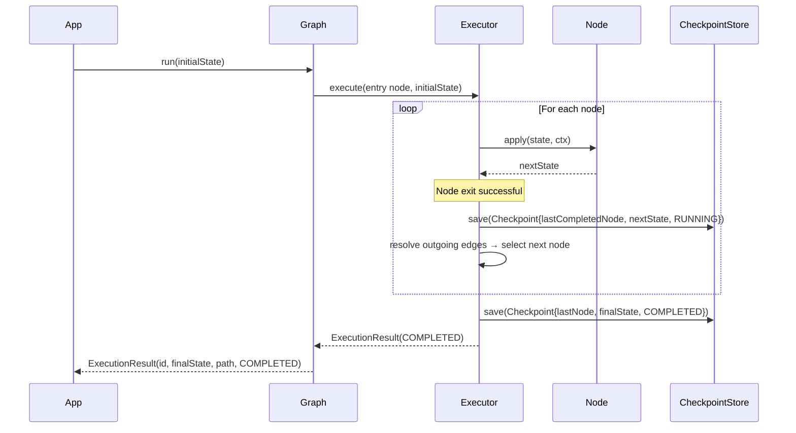
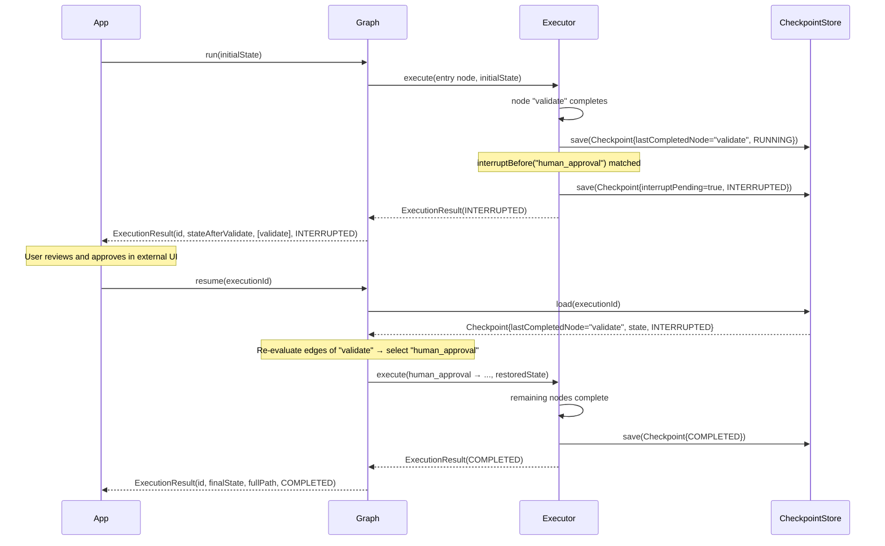
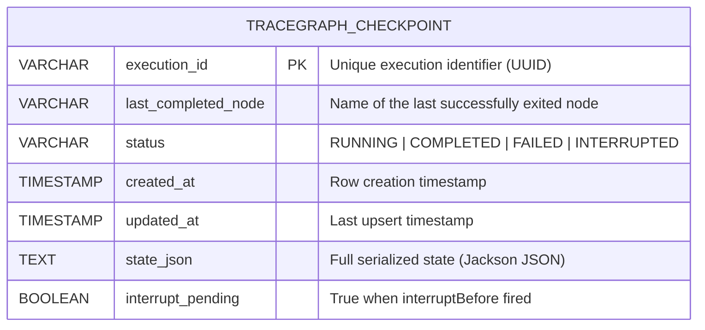
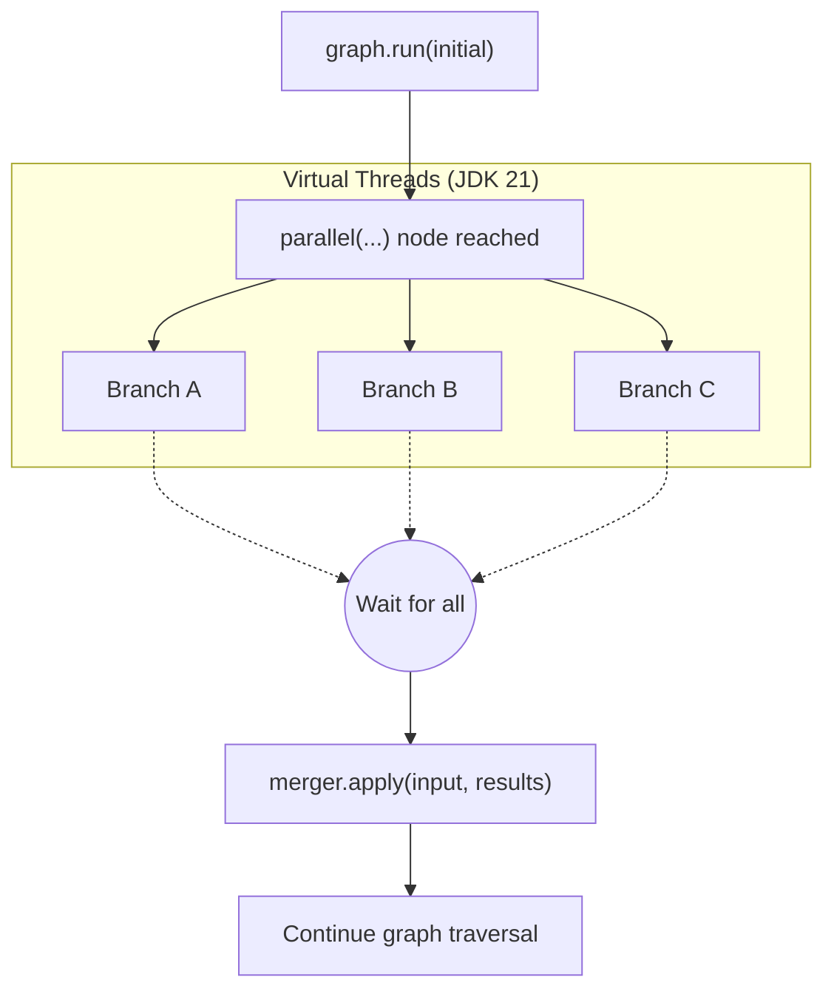

# tracegraph-runtime

[](https://central.sonatype.com/artifact/io.tracegraph/tracegraph-runtime)
[](https://opensource.org/licenses/Apache-2.0)
[](https://openjdk.org/projects/jdk/21/)

Async/parallel node execution, durable checkpointing, human-in-the-loop interrupts, and at-least-once resume for the TraceGraph agent runtime.

---

## What it does

`tracegraph-runtime` extends `tracegraph-core` with the production features needed to operate long-running, fault-tolerant agent workflows. It provides two `CheckpointStore` implementations — an in-memory store for development and a JDBC store for production — plus the execution mechanics for parallel fan-out, async node integration, interrupt-before/after pauses, and durable resume.

The module solves three concrete problems. First, it makes executions recoverable: if a process crashes mid-graph, the next invocation of `graph.resume(executionId)` picks up from the last successfully completed node. Second, it enables human-in-the-loop workflows by pausing execution before a designated approval node and returning `Status.INTERRUPTED` to the caller. Third, it provides genuine parallelism through JDK 21 virtual threads, letting you fan out to multiple concurrent node branches and merge their results deterministically.

The key design constraint is that nodes remain at-least-once on resume — if a crash occurs during node execution, that node re-runs from attempt 1 on the next `resume()` call. Edge predicates must therefore be pure functions of state, and nodes that call external APIs should use `ctx.idempotencyKey()` to prevent duplicate side effects.

---

## System Context



`tracegraph-runtime` depends only on `tracegraph-core`. It adds no Spring, no OTel, and no opinionated serialization library — Jackson is an optional dependency, pulled in only when `JdbcCheckpointStore` is used.

---

## Internal Architecture



---

## Execution Status Lifecycle



---

## Sequence Diagrams

### Scenario A: Normal Checkpoint Flow



### Scenario B: Interrupt and Resume Flow



---

## JDBC Checkpoint Table Schema



The table is created via `initSchema()`, which is idempotent and safe to call on every application start. Persistence uses a portable UPDATE-then-INSERT upsert wrapped in a transaction, so the table is always consistent even if the process crashes mid-write.

---

## Parallel Fan-Out

Parallel branches run concurrently on JDK 21 virtual threads. Branches are anonymous — they have no names, generate no listener events, and produce no path entries. The merger function receives results in declaration order regardless of completion order.



If any branch fails, the first failure (by declaration order) wins and the parallel node itself fails, propagating the exception to the graph executor. Remaining branches are cancelled via `CompletableFuture.cancel()`.

---

## Core Concepts

### InMemoryCheckpointStore\<S\>

A `ConcurrentHashMap`-backed checkpoint store. Suitable for development, testing, and single-process deployments where durability across restarts is not required. State is lost when the JVM exits.

```java
CheckpointStore<OrderState> store = new InMemoryCheckpointStore<>();

Graph<OrderState> graph = Graph.<OrderState>builder()
    // ... nodes and edges ...
    .checkpointStore(store)
    .build();
```

### JdbcCheckpointStore\<S\>

A production-grade checkpoint store backed by a relational database. Requires Jackson for JSON serialization of the state record. The `Class<S>` parameter is required to deserialize state correctly on load.

```java
JdbcCheckpointStore<OrderState> store = JdbcCheckpointStore.of(dataSource, OrderState.class);
store.initSchema();  // idempotent — safe to call on every startup
```

Use a custom table name if the default `tracegraph_checkpoint` conflicts with an existing schema:

```java
JdbcCheckpointStore<OrderState> store =
    JdbcCheckpointStore.of(dataSource, OrderState.class, "my_schema.workflow_checkpoints");
```

### Checkpoint\<S\> record

`Checkpoint<S>` is the data stored after each node completes. Its fields drive the resume mechanic:

| Field | Description |
|---|---|
| `executionId` | Identifies the execution this checkpoint belongs to. |
| `lastCompletedNode` | The name of the node that last exited successfully. Resume re-evaluates its outgoing edges. |
| `state` | The state as it was when `lastCompletedNode` exited. |
| `interruptPending` | `true` when `interruptBefore` fired; `false` otherwise. |
| `status` | `RUNNING`, `COMPLETED`, `FAILED`, or `INTERRUPTED`. |

### Interrupt mechanics

`interruptBefore(name)` writes a checkpoint with `interruptPending=true` before entering the named node, then returns `Status.INTERRUPTED`. `interruptAfter(name)` writes a normal checkpoint after the named node exits, then returns `Status.INTERRUPTED`. In both cases, `graph.resume(executionId)` loads the checkpoint, re-evaluates the outgoing edges of `lastCompletedNode`, and continues execution from there.

```java
// interruptBefore: pauses before entering "human_approval"
Graph<OrderState> graph = Graph.<OrderState>builder()
    .interruptBefore("human_approval")
    .build();

// interruptAfter: pauses after "notify_manager" exits
Graph<OrderState> graph2 = Graph.<OrderState>builder()
    .interruptAfter("notify_manager")
    .build();
```

### At-least-once semantics

Checkpoints are written **after** a node exits and **before** edge resolution. If the process crashes after a node runs but before the checkpoint is written, that node will re-run when execution resumes. Nodes that cause external side effects (HTTP calls, database writes, message publishes) must be designed to be safe for re-execution, using `ctx.idempotencyKey()` to deduplicate at the remote service.

---

## Complete Usage Walkthrough

### Step 1: Add the dependency

```xml
<dependency>
    <groupId>io.tracegraph</groupId>
    <artifactId>tracegraph-runtime</artifactId>
    <version>0.1.0</version>
</dependency>
```

For `JdbcCheckpointStore`, also add Jackson databind (if not already on the classpath):

```xml
<dependency>
    <groupId>com.fasterxml.jackson.core</groupId>
    <artifactId>jackson-databind</artifactId>
    <version>2.17.1</version>
</dependency>
```

### Step 2: Use InMemoryCheckpointStore for development

```java
import io.tracegraph.core.Graph;
import io.tracegraph.core.ExecutionResult;
import io.tracegraph.core.Status;
import io.tracegraph.runtime.checkpoint.InMemoryCheckpointStore;

record ApprovalState(String requestId, boolean validated, boolean approved, boolean processed) {
    ApprovalState withValidated(boolean v)  { return new ApprovalState(requestId, v, approved, processed); }
    ApprovalState withApproved(boolean a)   { return new ApprovalState(requestId, validated, a, processed); }
    ApprovalState withProcessed(boolean p)  { return new ApprovalState(requestId, validated, approved, p); }
}

CheckpointStore<ApprovalState> store = new InMemoryCheckpointStore<>();

Graph<ApprovalState> graph = Graph.<ApprovalState>builder()
    .node("validate",       (s, ctx) -> s.withValidated(true))
    .node("human_approval", (s, ctx) -> s.withApproved(true))
    .node("process",        (s, ctx) -> s.withProcessed(true))
    .entry("validate")
    .edge("validate",       "human_approval")
    .edge("human_approval", "process")
    .terminal("process")
    .checkpointStore(store)
    .interruptBefore("human_approval")
    .build();
```

### Step 3: Run and observe the interrupt

```java
ApprovalState initial = new ApprovalState("req-7", false, false, false);
ExecutionResult<ApprovalState> result = graph.run(initial);

System.out.println(result.status());       // INTERRUPTED
System.out.println(result.path());         // [validate]
System.out.println(result.executionId());  // e.g. 9a3b1c2d-...
```

### Step 4: Resume after human approval

```java
// Store the executionId somewhere durable (database, message queue, etc.)
String executionId = result.executionId();

// ... user reviews the request and clicks "Approve" in your UI ...
// ... your application calls resume() ...

ExecutionResult<ApprovalState> done = graph.resume(executionId);

System.out.println(done.status());          // COMPLETED
System.out.println(done.path());            // [validate, human_approval, process]
System.out.println(done.finalState());
// ApprovalState[requestId=req-7, validated=true, approved=true, processed=true]
```

### Step 5: Switch to JdbcCheckpointStore for production

```java
import io.tracegraph.runtime.checkpoint.JdbcCheckpointStore;
import javax.sql.DataSource;

// Obtain a DataSource from your connection pool (HikariCP, etc.)
DataSource dataSource = createDataSource();

JdbcCheckpointStore<ApprovalState> store =
    JdbcCheckpointStore.of(dataSource, ApprovalState.class);

// Call initSchema() once at startup — it is idempotent
store.initSchema();

Graph<ApprovalState> graph = Graph.<ApprovalState>builder()
    .node("validate",       (s, ctx) -> s.withValidated(true))
    .node("human_approval", (s, ctx) -> s.withApproved(true))
    .node("process",        (s, ctx) -> s.withProcessed(true))
    .entry("validate")
    .edge("validate",       "human_approval")
    .edge("human_approval", "process")
    .terminal("process")
    .checkpointStore(store)
    .interruptBefore("human_approval")
    .build();
```

### Step 6: Parallel branches with merger

```java
record DashboardState(
    String userId,
    String userData,
    String weatherData,
    String newsData
) {
    DashboardState withUserData(String d)    { return new DashboardState(userId, d, weatherData, newsData); }
    DashboardState withWeatherData(String d) { return new DashboardState(userId, userData, d, newsData); }
    DashboardState withNewsData(String d)    { return new DashboardState(userId, userData, weatherData, d); }
}

Graph<DashboardState> graph = Graph.<DashboardState>builder()
    .parallel("gather",
        List.of(
            (state, ctx) -> state.withUserData(fetchUser(state.userId())),
            (state, ctx) -> state.withWeatherData(fetchWeather()),
            (state, ctx) -> state.withNewsData(fetchNews())
        ),
        // Merger receives: (originalInputState, List<DashboardState> branchResults)
        // branchResults are in declaration order regardless of completion order
        (input, results) -> new DashboardState(
            input.userId(),
            results.get(0).userData(),
            results.get(1).weatherData(),
            results.get(2).newsData()
        )
    )
    .entry("gather")
    .terminal("gather")
    .build();

ExecutionResult<DashboardState> result = graph.run(new DashboardState("u-1", null, null, null));
System.out.println(result.finalState());
```

### Step 7: Async node with CompletableFuture

Async nodes integrate with retry and checkpoint logic identically to sync nodes. The returned `CompletableFuture` is awaited by the executor before the checkpoint is written.

```java
import io.tracegraph.core.AsyncNode;
import java.net.http.HttpClient;
import java.net.http.HttpRequest;
import java.net.http.HttpResponse;

AsyncNode<ApprovalState> asyncValidate = (state, ctx) -> {
    HttpRequest request = HttpRequest.newBuilder()
        .uri(URI.create("https://validator.example.com/check/" + state.requestId()))
        .build();
    return HttpClient.newHttpClient()
        .sendAsync(request, HttpResponse.BodyHandlers.ofString())
        .thenApply(resp -> state.withValidated(resp.statusCode() == 200));
};

Graph<ApprovalState> graph = Graph.<ApprovalState>builder()
    .asyncNode("validate", asyncValidate, RetryPolicy.fixed(3, Duration.ofMillis(500)))
    .node("process", (s, ctx) -> s.withProcessed(true))
    .entry("validate")
    .edge("validate", "process", ApprovalState::validated)
    .terminal("process")
    .checkpointStore(store)
    .build();
```

### Step 8: Retry policy with JdbcCheckpointStore

Checkpoints are written after a node exits successfully. If a node is retried, no intermediate checkpoint is written during retry attempts — only after the final successful exit. This means a retry-and-succeed scenario writes exactly one checkpoint per node.

```java
import io.tracegraph.core.retry.RetryPolicy;
import java.time.Duration;

Graph<ApprovalState> graph = Graph.<ApprovalState>builder()
    .node("call_external_api",
        (s, ctx) -> callExternalApi(s, ctx.idempotencyKey()),
        RetryPolicy.exponential(4, Duration.ofMillis(200), 2.0, Duration.ofSeconds(10))
    )
    .entry("call_external_api")
    .terminal("call_external_api")
    .checkpointStore(JdbcCheckpointStore.of(dataSource, ApprovalState.class))
    .build();
```

---

## Configuration Reference

### Checkpoint store options

| Store | When to use |
|---|---|
| `InMemoryCheckpointStore` | Local development, unit tests, single-process deployments without durability requirements. |
| `JdbcCheckpointStore` | Production deployments requiring checkpoints to survive process restarts. Needs Jackson and a JDBC DataSource. |

### Builder methods relevant to runtime

| Method | Description |
|---|---|
| `.checkpointStore(s)` | Attach a `CheckpointStore<S>`. Default is no-op (checkpoints are not written). |
| `.interruptBefore(names...)` | Pause before the named nodes; writes `interruptPending=true`. |
| `.interruptAfter(names...)` | Pause after the named nodes exit; writes a normal checkpoint before returning INTERRUPTED. |
| `.executor(e)` | Provide a custom `ExecutorService` for node execution and parallel branches. Graph-created executors use virtual-thread-per-task and are shut down after each `run()`. User-supplied executors are NOT shut down. |
| `.defaultRetryPolicy(p)` | Graph-level retry policy. Per-node policies override this. |
| `.node(name, fn, policy)` | Per-node retry policy. Beats the default. |

### JdbcCheckpointStore configuration

| Parameter | Description |
|---|---|
| `dataSource` | JDBC `DataSource` from your connection pool. |
| `stateType` | `Class<S>` — required for Jackson deserialization on load. |
| `tableName` | Optional. Defaults to `tracegraph_checkpoint`. Override to avoid schema conflicts. |

---

## Integration with Other Modules

### With tracegraph-core (the foundation)

`tracegraph-runtime` implements the `CheckpointStore<S>` SPI declared in `tracegraph-core`. It does not redefine nodes, edges, or the builder — those remain in core.

### With tracegraph-spring-boot-starter (auto-wiring)

The Spring Boot starter does NOT auto-wire `JdbcCheckpointStore` or `InMemoryCheckpointStore` because they require a user-supplied `Class<S>`. Declare them as manual `@Bean` definitions:

```java
import io.tracegraph.runtime.checkpoint.JdbcCheckpointStore;
import org.springframework.context.annotation.Bean;
import org.springframework.context.annotation.Configuration;

@Configuration
public class GraphConfig {

    @Bean
    public CheckpointStore<OrderState> checkpointStore(DataSource dataSource) {
        JdbcCheckpointStore<OrderState> store =
            JdbcCheckpointStore.of(dataSource, OrderState.class);
        store.initSchema();
        return store;
    }

    @Bean
    public Graph<OrderState> orderGraph(CheckpointStore<OrderState> checkpointStore) {
        return Graph.<OrderState>builder()
            .node("validate", (s, ctx) -> s.withValidated(true))
            .node("charge",   (s, ctx) -> s.withCharged(true))
            .entry("validate")
            .edge("validate", "charge")
            .terminal("charge")
            .checkpointStore(checkpointStore)
            .interruptBefore("charge")
            .build();
    }
}
```

### With tracegraph-observability (trace + diff)

The `TraceRecorder` SPI (from core, implemented in observability) is independent of `CheckpointStore`. You can use both together:

```java
Graph<OrderState> graph = Graph.<OrderState>builder()
    // ... nodes and edges ...
    .checkpointStore(JdbcCheckpointStore.of(dataSource, OrderState.class))
    .traceRecorder(new RecordingTraceRecorder<>(traceStore))
    .listener(new OtelNodeListener<>(openTelemetry))
    .build();
```

---

## Testing Guidance

`InMemoryCheckpointStore` is the recommended test double. No database setup is required.

### Test: verify INTERRUPTED status

```java
import io.tracegraph.core.Graph;
import io.tracegraph.core.ExecutionResult;
import io.tracegraph.core.Status;
import io.tracegraph.runtime.checkpoint.InMemoryCheckpointStore;
import org.junit.jupiter.api.Test;

import static org.assertj.core.api.Assertions.assertThat;

class CheckpointTest {

    record Wf(String id, boolean validated, boolean approved) {
        Wf withValidated(boolean v) { return new Wf(id, v, approved); }
        Wf withApproved(boolean a)  { return new Wf(id, validated, a); }
    }

    @Test
    void interruptBeforeYieldsInterruptedStatus() {
        InMemoryCheckpointStore<Wf> store = new InMemoryCheckpointStore<>();

        Graph<Wf> graph = Graph.<Wf>builder()
            .node("validate", (s, ctx) -> s.withValidated(true))
            .node("approve",  (s, ctx) -> s.withApproved(true))
            .entry("validate")
            .edge("validate", "approve")
            .terminal("approve")
            .checkpointStore(store)
            .interruptBefore("approve")
            .build();

        ExecutionResult<Wf> result = graph.run(new Wf("w-1", false, false));

        assertThat(result.status()).isEqualTo(Status.INTERRUPTED);
        assertThat(result.path()).containsExactly("validate");
        assertThat(result.finalState().validated()).isTrue();
        assertThat(result.finalState().approved()).isFalse();
    }
}
```

### Test: resume continues from saved node

```java
@Test
void resumeContinuesFromLastCompletedNode() {
    InMemoryCheckpointStore<Wf> store = new InMemoryCheckpointStore<>();

    Graph<Wf> graph = Graph.<Wf>builder()
        .node("validate", (s, ctx) -> s.withValidated(true))
        .node("approve",  (s, ctx) -> s.withApproved(true))
        .entry("validate")
        .edge("validate", "approve")
        .terminal("approve")
        .checkpointStore(store)
        .interruptBefore("approve")
        .build();

    ExecutionResult<Wf> interrupted = graph.run(new Wf("w-2", false, false));
    assertThat(interrupted.status()).isEqualTo(Status.INTERRUPTED);

    ExecutionResult<Wf> completed = graph.resume(interrupted.executionId());

    assertThat(completed.status()).isEqualTo(Status.COMPLETED);
    assertThat(completed.path()).containsExactly("validate", "approve");
    assertThat(completed.finalState().approved()).isTrue();
}
```

### Test: retry count via onRetry listener

```java
@Test
void retryListenerFiresForEachRetryAttempt() {
    List<Integer> retryAttempts = new ArrayList<>();

    NodeListener<Wf> spy = new NodeListener<>() {
        @Override public void onRetry(String name, int attempt, Throwable cause) {
            retryAttempts.add(attempt);
        }
    };

    Graph<Wf> graph = Graph.<Wf>builder()
        .node("flaky", (s, ctx) -> {
            if (!s.validated()) throw new RuntimeException("not yet");
            return s;
        }, RetryPolicy.fixed(3, Duration.ofMillis(1)))
        .entry("flaky")
        .terminal("flaky")
        .listener(spy)
        .build();

    // All 3 attempts fail because validated is always false
    ExecutionResult<Wf> result = graph.run(new Wf("w-3", false, false));

    assertThat(result.status()).isEqualTo(Status.FAILED);
    // Attempts 1 and 2 trigger onRetry; attempt 3 triggers onError (no more retries)
    assertThat(retryAttempts).hasSize(2);
}
```

### Test: parallel branches all contribute to merged state

```java
@Test
void parallelBranchesMergeInDeclarationOrder() {
    record PState(String id, String a, String b) {
        PState withA(String v) { return new PState(id, v, b); }
        PState withB(String v) { return new PState(id, a, v); }
    }

    Graph<PState> graph = Graph.<PState>builder()
        .parallel("gather",
            List.of(
                (s, ctx) -> s.withA("result-A"),
                (s, ctx) -> s.withB("result-B")
            ),
            (input, results) -> new PState(
                input.id(),
                results.get(0).a(),
                results.get(1).b()
            )
        )
        .entry("gather")
        .terminal("gather")
        .build();

    ExecutionResult<PState> result = graph.run(new PState("p-1", null, null));

    assertThat(result.status()).isEqualTo(Status.COMPLETED);
    assertThat(result.finalState().a()).isEqualTo("result-A");
    assertThat(result.finalState().b()).isEqualTo("result-B");
}
```

---

## FAQ

**Q: What exactly does "at-least-once" mean for resumed executions?**

When you call `graph.resume(executionId)`, the executor loads the last checkpoint and re-evaluates the outgoing edges of `lastCompletedNode`. It then starts executing the next selected node from the beginning — attempt 1. If a crash happened while that node was running (after the previous checkpoint was written, before the new one), the node will run again. It will not run from the middle of its previous execution. This is why node implementations that call external APIs should use `ctx.idempotencyKey()` to tell the remote service "I already sent this request — please ignore the duplicate."

**Q: What happens if the process crashes mid-node, before the checkpoint is written?**

The node re-runs from attempt 1 on the next `resume()` call. The checkpoint for the preceding node is still valid. No data is lost; the node simply executes again. Design nodes to be idempotent or use `ctx.idempotencyKey()` to guard against duplicate side effects.

**Q: Can I resume an execution that ended with `Status.FAILED`?**

No. `graph.resume(executionId)` requires the checkpoint to have `status == INTERRUPTED`. A `FAILED` execution has no valid `lastCompletedNode` to resume from in a well-defined way. To retry a failed execution, start a new one with `graph.run(recoveredState, newExecutionId)`.

**Q: Are parallel branch results always in declaration order?**

Yes. The merger function receives results in the order branches were declared in `.parallel(...)`, regardless of which branch finished first. If branch C finishes before branch A, `results.get(0)` is still the result of branch A and `results.get(2)` is still the result of branch C. This makes the merge step deterministic.

**Q: Can I use interruptBefore and interruptAfter on the same node?**

Yes, but the semantics differ. `interruptBefore("x")` pauses before `x` runs; resuming will execute `x`. `interruptAfter("x")` pauses after `x` exits; resuming will re-evaluate the edges of `x` and continue from the next node. You can declare both on different nodes in the same graph.
