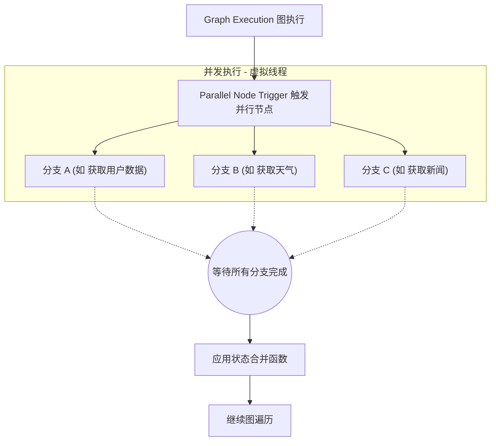

# TraceGraph :: Runtime (运行时模块)

## 📖 运行时简介
欢迎使用 `tracegraph-runtime`！虽然 `tracegraph-core` 提供了定义节点和边的基础抽象，但它以完全同步、单线程的方式执行图。

如果您需要进行异步 API 调用、并行运行多个节点或持久化地暂停/恢复执行，您需要 `tracegraph-runtime` 模块。它扩展了核心图功能以支持非阻塞执行、并行计算、持久性以及容错能力。

### 核心特性
- **异步执行**: 在节点内部深度支持 `CompletableFuture<S>` 而不会阻塞载体线程。针对 Java 21 的虚拟线程（Virtual Threads）进行了高度优化。
- **并行节点**: 以确定性的、声明顺序合并的方式并发执行多个图分支（Fan-Out / Fan-In 扇出与扇入）。
- **检查点 (Checkpointing)**: 持久化的检查点允许显式地挂起和恢复执行（例如，在某个节点之前/之后中断）。包含 `InMemory`（内存）和 `Jdbc` 存储选项。
- **重试机制**: 通过图定义的重试策略自动处理可配置的、具有弹性的容错。

## 🏗️ 并行执行时序

运行时模块使得将图拆分为并行轨道变得轻而易举，并在所有轨道完成后自动将状态合并在一起。



## 🚀 如何实现运行时特性

### 1. 并行分支 (Parallel Branches)
使用 `.parallel()` 构建器配置将图执行拆分为并发分支。

```java
import io.tracegraph.core.Graph;

Graph<MyState> graph = Graph.<MyState>builder()
    // ... 设置之前的节点
    .parallel("gather_data", p -> p
        .branch("fetch_user", (state, ctx) -> fetchUser(state))
        .branch("fetch_weather", (state, ctx) -> fetchWeather(state))
        // 将来自分支的结果合并回主状态
        .merger((originalState, branchStates) -> {
            // 在此实现合并逻辑
            return originalState;
        })
    )
    .build();
```

### 2. 异步节点 (Async Nodes)
从节点返回一个 `CompletableFuture`，以避免在等待网络 I/O 时阻塞执行线程。

```java
graph.node("call_api", (state, ctx) -> {
    return httpClient.sendAsync(request, BodyHandlers.ofString())
        .thenApply(response -> state.withApiData(response.body()));
});
```

### 3. 检查点 (中断与恢复)
通过配置 `CheckpointStore` 并添加 `interruptBefore` 规则，引擎将在到达指定节点之前安全地暂停执行，并将状态保存到数据库。

```java
import site.tracegraph.runtime.checkpoint.JdbcCheckpointStore;

Graph<MyState> graph = Graph.<MyState>builder()
    .node("step1", ... )
    .node("human_approval", ... )
    .checkpointStore(new JdbcCheckpointStore(dataSource))
    .interruptBefore("human_approval") // 图将在此处暂停
    .build();

// 启动图（它将在 human_approval 之前暂停）
ExecutionResult<MyState> r1 = graph.run(initialState);

// ... 稍后，可能在用户在 UI 上点击“批准”之后 ...
// 使用执行 ID 从上次停止的地方恢复执行图
ExecutionResult<MyState> r2 = graph.resume(r1.executionId());
```
