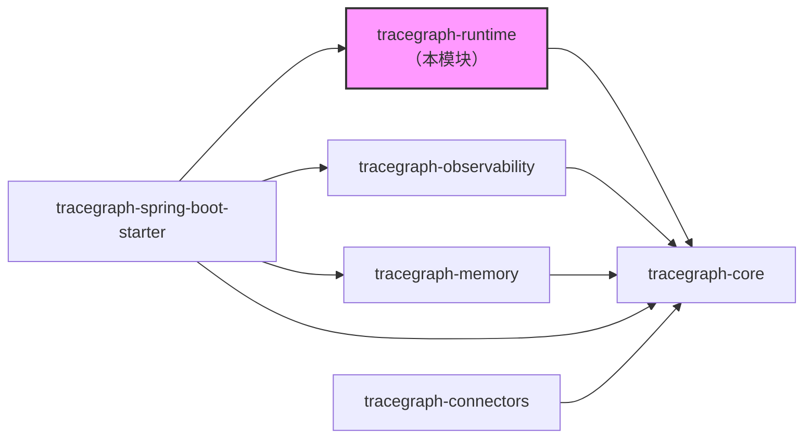
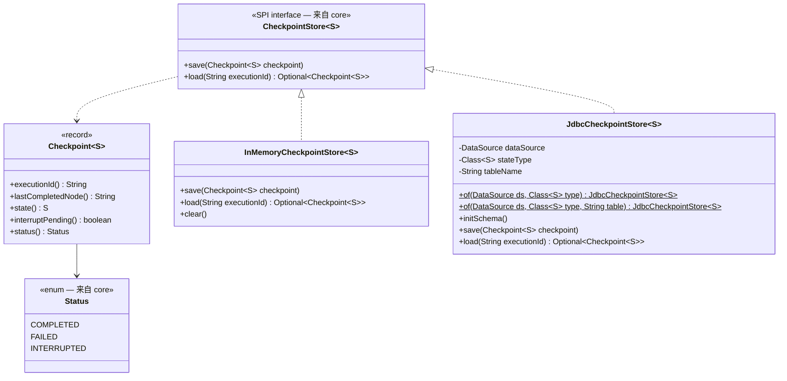
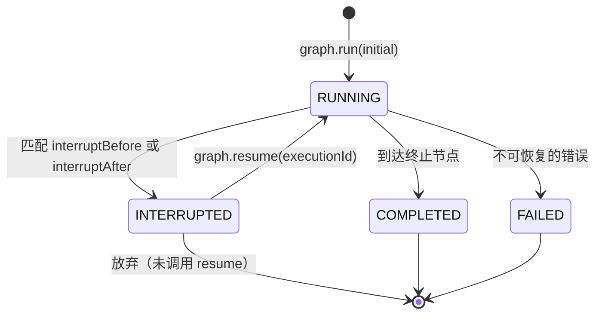
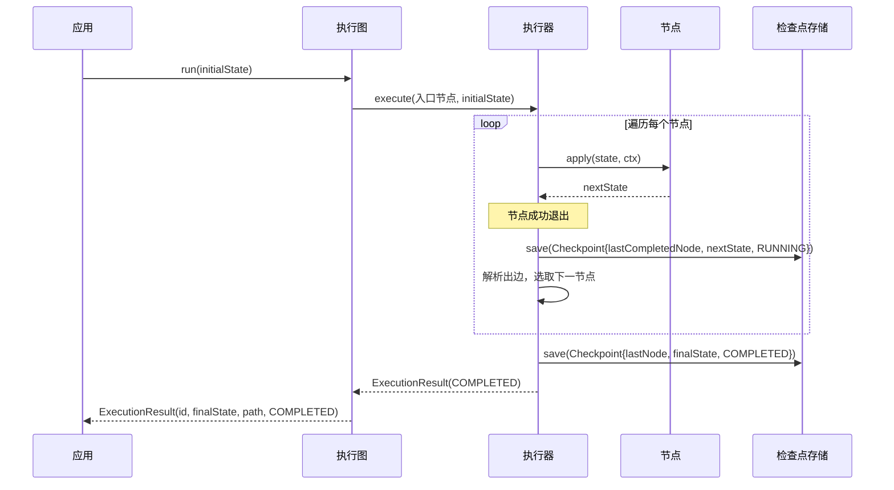
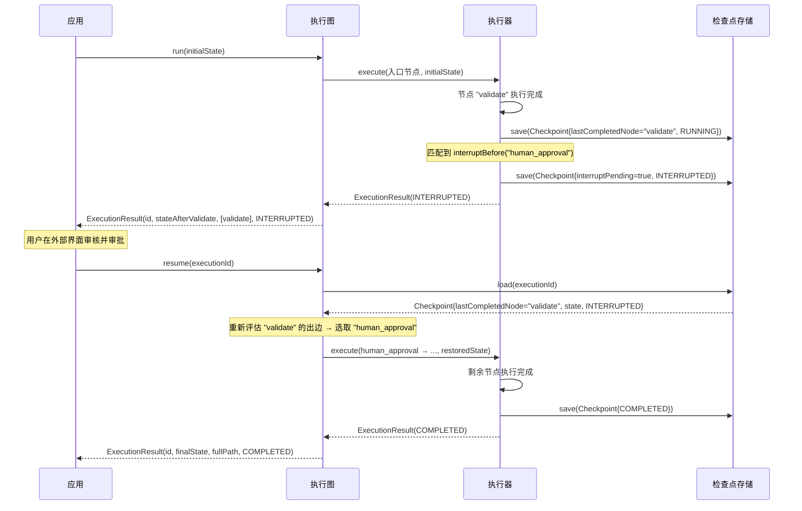
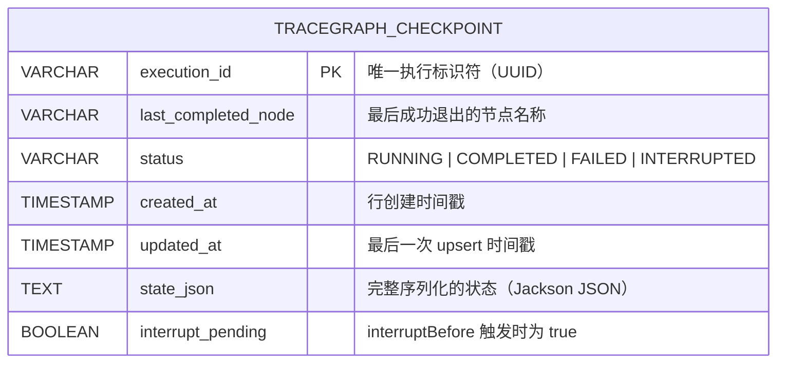
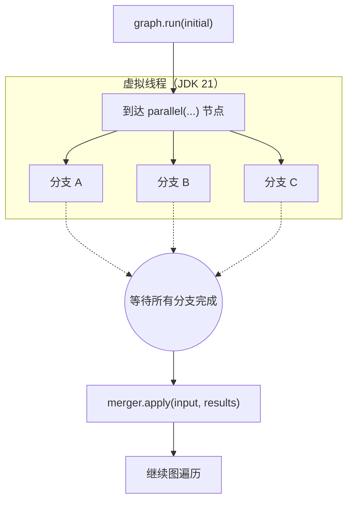

# tracegraph-runtime

[](https://central.sonatype.com/artifact/io.tracegraph/tracegraph-runtime)
[](https://opensource.org/licenses/Apache-2.0)
[](https://openjdk.org/projects/jdk/21/)

异步/并行节点执行、持久化检查点、人机协作中断以及至少一次执行语义的恢复支持——TraceGraph 智能体运行时的生产级扩展。

---

## 模块职责

`tracegraph-runtime` 在 `tracegraph-core` 的基础上，添加了运行长时间、容错性强的智能体工作流所需的生产级功能。它提供两种 `CheckpointStore` 实现——用于开发环境的内存存储和用于生产环境的 JDBC 存储——以及并行扇出、异步节点集成、节点前后中断暂停和持久化恢复的执行机制。

本模块解决三个具体问题：第一，让执行可恢复——进程在图执行中途崩溃后，下次调用 `graph.resume(executionId)` 即可从最后成功完成的节点继续。第二，通过在指定审批节点前暂停执行并向调用方返回 `Status.INTERRUPTED`，实现人机协作工作流。第三，通过 JDK 21 虚拟线程提供真正的并行性，允许你将执行扇出到多个并发节点分支并确定性地合并结果。

关键设计约束是：节点在恢复时遵循至少一次执行语义——如果崩溃发生在节点执行期间，下次调用 `resume()` 时该节点将从第一次尝试重新执行。因此，边谓词必须是状态的纯函数，调用外部 API 的节点应使用 `ctx.idempotencyKey()` 防止重复副作用。

---

## 系统上下文



`tracegraph-runtime` 仅依赖 `tracegraph-core`，不引入 Spring、OpenTelemetry 或固定的序列化库。Jackson 是可选依赖，仅在使用 `JdbcCheckpointStore` 时才会被引入。

---

## 内部架构



---

## 执行状态生命周期



---

## 时序图

### 场景一：正常检查点流程



### 场景二：中断与恢复执行流程



---

## JDBC 检查点表结构



表通过 `initSchema()` 创建，该方法是幂等的，可在每次应用启动时安全调用。持久化使用在事务中包裹的可移植 UPDATE-then-INSERT upsert，即使进程在写入中途崩溃，表数据也始终保持一致。

---

## 并行扇出

并行分支在 JDK 21 虚拟线程上并发执行。分支是匿名的——没有名称，不产生监听器事件，也不生成路径条目。合并函数按声明顺序接收结果，与完成顺序无关。



若任意分支失败，按声明顺序第一个失败的分支胜出，并行节点本身随即失败，异常向上传播到图执行器。其余分支通过 `CompletableFuture.cancel()` 取消。

---

## 核心概念

### InMemoryCheckpointStore\<S\>（内存检查点存储）

基于 `ConcurrentHashMap` 的检查点存储。适用于开发环境、测试和不需要跨重启持久化的单进程部署。JVM 退出时状态丢失。

```java
CheckpointStore<OrderState> store = new InMemoryCheckpointStore<>();

Graph<OrderState> graph = Graph.<OrderState>builder()
    // ... 节点和边 ...
    .checkpointStore(store)
    .build();
```

### JdbcCheckpointStore\<S\>（JDBC 检查点存储）

基于关系型数据库的生产级检查点存储。需要 Jackson 对状态记录进行 JSON 序列化。`Class<S>` 参数在加载时必须提供，以便正确反序列化状态。

```java
JdbcCheckpointStore<OrderState> store = JdbcCheckpointStore.of(dataSource, OrderState.class);
store.initSchema();  // 幂等——可在每次启动时安全调用
```

如果默认表名 `tracegraph_checkpoint` 与现有 schema 冲突，可以自定义表名：

```java
JdbcCheckpointStore<OrderState> store =
    JdbcCheckpointStore.of(dataSource, OrderState.class, "my_schema.workflow_checkpoints");
```

### Checkpoint\<S\> 记录（检查点记录）

`Checkpoint<S>` 是每次节点完成后写入的数据。其字段驱动恢复机制：

| 字段 | 说明 |
|---|---|
| `executionId` | 标识该检查点所属的执行实例。 |
| `lastCompletedNode` | 最后成功退出的节点名称。恢复时重新评估该节点的出边。 |
| `state` | `lastCompletedNode` 退出时的状态快照。 |
| `interruptPending` | `interruptBefore` 触发时为 `true`，否则为 `false`。 |
| `status` | `RUNNING`、`COMPLETED`、`FAILED` 或 `INTERRUPTED`。 |

### 中断机制

`interruptBefore(name)` 在进入指定节点之前写入 `interruptPending=true` 的检查点，然后返回 `Status.INTERRUPTED`。`interruptAfter(name)` 在指定节点退出后写入普通检查点，然后返回 `Status.INTERRUPTED`。两种情况下，`graph.resume(executionId)` 都会加载检查点，重新评估 `lastCompletedNode` 的出边，并从那里继续执行。

```java
// interruptBefore：在进入 "human_approval" 前暂停
Graph<OrderState> graph = Graph.<OrderState>builder()
    .interruptBefore("human_approval")
    .build();

// interruptAfter：在 "notify_manager" 退出后暂停
Graph<OrderState> graph2 = Graph.<OrderState>builder()
    .interruptAfter("notify_manager")
    .build();
```

### 至少一次执行语义

检查点在节点**成功退出后**、**边解析之前**写入。如果进程在节点运行后但检查点写入前崩溃，恢复时该节点将重新执行。产生外部副作用的节点（HTTP 调用、数据库写入、消息发布）必须设计为幂等的，或使用 `ctx.idempotencyKey()` 在远程服务进行去重。

---

## 完整使用示例

### 第一步：添加依赖

```xml
<dependency>
    <groupId>io.tracegraph</groupId>
    <artifactId>tracegraph-runtime</artifactId>
    <version>0.1.0</version>
</dependency>
```

使用 `JdbcCheckpointStore` 时，还需要添加 Jackson（若类路径中尚未存在）：

```xml
<dependency>
    <groupId>com.fasterxml.jackson.core</groupId>
    <artifactId>jackson-databind</artifactId>
    <version>2.17.1</version>
</dependency>
```

### 第二步：开发环境使用 InMemoryCheckpointStore

```java
import io.tracegraph.core.Graph;
import io.tracegraph.core.ExecutionResult;
import io.tracegraph.core.Status;
import io.tracegraph.runtime.checkpoint.InMemoryCheckpointStore;

record ApprovalState(String requestId, boolean validated, boolean approved, boolean processed) {
    ApprovalState withValidated(boolean v)  { return new ApprovalState(requestId, v, approved, processed); }
    ApprovalState withApproved(boolean a)   { return new ApprovalState(requestId, validated, a, processed); }
    ApprovalState withProcessed(boolean p)  { return new ApprovalState(requestId, validated, approved, p); }
}

CheckpointStore<ApprovalState> store = new InMemoryCheckpointStore<>();

Graph<ApprovalState> graph = Graph.<ApprovalState>builder()
    .node("validate",       (s, ctx) -> s.withValidated(true))
    .node("human_approval", (s, ctx) -> s.withApproved(true))
    .node("process",        (s, ctx) -> s.withProcessed(true))
    .entry("validate")
    .edge("validate",       "human_approval")
    .edge("human_approval", "process")
    .terminal("process")
    .checkpointStore(store)
    .interruptBefore("human_approval")
    .build();
```

### 第三步：运行图并观察中断状态

```java
ApprovalState initial = new ApprovalState("req-7", false, false, false);
ExecutionResult<ApprovalState> result = graph.run(initial);

System.out.println(result.status());       // INTERRUPTED
System.out.println(result.path());         // [validate]
System.out.println(result.executionId());  // 例如 9a3b1c2d-...
```

### 第四步：人工审批后恢复执行

```java
// 将 executionId 持久化到某个可靠的地方（数据库、消息队列等）
String executionId = result.executionId();

// ... 用户在你的界面审核请求并点击"批准" ...
// ... 你的应用随即调用 resume() ...

ExecutionResult<ApprovalState> done = graph.resume(executionId);

System.out.println(done.status());          // COMPLETED
System.out.println(done.path());            // [validate, human_approval, process]
System.out.println(done.finalState());
// ApprovalState[requestId=req-7, validated=true, approved=true, processed=true]
```

### 第五步：生产环境切换为 JdbcCheckpointStore

```java
import io.tracegraph.runtime.checkpoint.JdbcCheckpointStore;
import javax.sql.DataSource;

// 从连接池（HikariCP 等）获取 DataSource
DataSource dataSource = createDataSource();

JdbcCheckpointStore<ApprovalState> store =
    JdbcCheckpointStore.of(dataSource, ApprovalState.class);

// 启动时调用一次 initSchema()——幂等，可安全多次调用
store.initSchema();

Graph<ApprovalState> graph = Graph.<ApprovalState>builder()
    .node("validate",       (s, ctx) -> s.withValidated(true))
    .node("human_approval", (s, ctx) -> s.withApproved(true))
    .node("process",        (s, ctx) -> s.withProcessed(true))
    .entry("validate")
    .edge("validate",       "human_approval")
    .edge("human_approval", "process")
    .terminal("process")
    .checkpointStore(store)
    .interruptBefore("human_approval")
    .build();
```

### 第六步：配置并行分支与合并函数

```java
record DashboardState(
    String userId,
    String userData,
    String weatherData,
    String newsData
) {
    DashboardState withUserData(String d)    { return new DashboardState(userId, d, weatherData, newsData); }
    DashboardState withWeatherData(String d) { return new DashboardState(userId, userData, d, newsData); }
    DashboardState withNewsData(String d)    { return new DashboardState(userId, userData, weatherData, d); }
}

Graph<DashboardState> graph = Graph.<DashboardState>builder()
    .parallel("gather",
        List.of(
            (state, ctx) -> state.withUserData(fetchUser(state.userId())),
            (state, ctx) -> state.withWeatherData(fetchWeather()),
            (state, ctx) -> state.withNewsData(fetchNews())
        ),
        // 合并函数接收：(原始输入状态, 按声明顺序排列的各分支结果列表)
        (input, results) -> new DashboardState(
            input.userId(),
            results.get(0).userData(),
            results.get(1).weatherData(),
            results.get(2).newsData()
        )
    )
    .entry("gather")
    .terminal("gather")
    .build();

ExecutionResult<DashboardState> result =
    graph.run(new DashboardState("u-1", null, null, null));
System.out.println(result.finalState());
```

### 第七步：异步节点与 CompletableFuture

异步节点与同步节点在重试和检查点处理上完全一致。执行器等待返回的 `CompletableFuture` 完成后再写入检查点。

```java
import io.tracegraph.core.AsyncNode;
import java.net.http.HttpClient;
import java.net.http.HttpRequest;
import java.net.http.HttpResponse;

AsyncNode<ApprovalState> asyncValidate = (state, ctx) -> {
    HttpRequest request = HttpRequest.newBuilder()
        .uri(URI.create("https://validator.example.com/check/" + state.requestId()))
        .build();
    return HttpClient.newHttpClient()
        .sendAsync(request, HttpResponse.BodyHandlers.ofString())
        .thenApply(resp -> state.withValidated(resp.statusCode() == 200));
};

Graph<ApprovalState> graph = Graph.<ApprovalState>builder()
    .asyncNode("validate", asyncValidate, RetryPolicy.fixed(3, Duration.ofMillis(500)))
    .node("process", (s, ctx) -> s.withProcessed(true))
    .entry("validate")
    .edge("validate", "process", ApprovalState::validated)
    .terminal("process")
    .checkpointStore(store)
    .build();
```

### 第八步：结合 JdbcCheckpointStore 使用重试策略

检查点在节点**成功退出后**写入。若节点经过重试后才成功，期间不会写入中间检查点——每个节点只写入一次检查点，对应其最终成功退出的时刻。

```java
import io.tracegraph.core.retry.RetryPolicy;
import java.time.Duration;

Graph<ApprovalState> graph = Graph.<ApprovalState>builder()
    .node("call_external_api",
        (s, ctx) -> callExternalApi(s, ctx.idempotencyKey()),
        RetryPolicy.exponential(4, Duration.ofMillis(200), 2.0, Duration.ofSeconds(10))
    )
    .entry("call_external_api")
    .terminal("call_external_api")
    .checkpointStore(JdbcCheckpointStore.of(dataSource, ApprovalState.class))
    .build();
```

---

## 配置参考

### 检查点存储选项

| 存储实现 | 适用场景 |
|---|---|
| `InMemoryCheckpointStore` | 本地开发、单元测试、不需要跨重启持久化的单进程部署。 |
| `JdbcCheckpointStore` | 需要检查点在进程重启后仍然存在的生产部署。需要 Jackson 和 JDBC DataSource。 |

### 与运行时相关的构建器方法

| 方法 | 说明 |
|---|---|
| `.checkpointStore(s)` | 挂载 `CheckpointStore<S>`。默认为无操作（不写入检查点）。 |
| `.interruptBefore(names...)` | 在指定节点执行前暂停，写入 `interruptPending=true` 的检查点。 |
| `.interruptAfter(names...)` | 在指定节点退出后暂停，写入正常检查点后返回 INTERRUPTED。 |
| `.executor(e)` | 提供自定义 `ExecutorService`。图自创的执行器使用虚拟线程每任务模式，每次 `run()` 后关闭。用户提供的执行器不会被图关闭。 |
| `.defaultRetryPolicy(p)` | 图级重试策略，应用于未指定节点级策略的节点。 |
| `.node(name, fn, policy)` | 节点级重试策略，优先于默认策略。 |

### JdbcCheckpointStore 配置参数

| 参数 | 说明 |
|---|---|
| `dataSource` | 来自连接池的 JDBC `DataSource`。 |
| `stateType` | `Class<S>`——Jackson 加载时反序列化所必需。 |
| `tableName` | 可选。默认为 `tracegraph_checkpoint`。覆盖以避免 schema 冲突。 |

---

## 与其他模块集成

### 与 tracegraph-core 集成（基础层）

`tracegraph-runtime` 实现了 `tracegraph-core` 中声明的 `CheckpointStore<S>` SPI。它不重新定义节点、边或构建器——这些仍然属于 core 模块。

### 与 tracegraph-spring-boot-starter 集成（自动装配）

Spring Boot starter 不会自动装配 `JdbcCheckpointStore` 或 `InMemoryCheckpointStore`，因为它们需要用户提供 `Class<S>`。请手动声明为 `@Bean`：

```java
import io.tracegraph.runtime.checkpoint.JdbcCheckpointStore;
import org.springframework.context.annotation.Bean;
import org.springframework.context.annotation.Configuration;

@Configuration
public class GraphConfig {

    @Bean
    public CheckpointStore<OrderState> checkpointStore(DataSource dataSource) {
        JdbcCheckpointStore<OrderState> store =
            JdbcCheckpointStore.of(dataSource, OrderState.class);
        store.initSchema();
        return store;
    }

    @Bean
    public Graph<OrderState> orderGraph(CheckpointStore<OrderState> checkpointStore) {
        return Graph.<OrderState>builder()
            .node("validate", (s, ctx) -> s.withValidated(true))
            .node("charge",   (s, ctx) -> s.withCharged(true))
            .entry("validate")
            .edge("validate", "charge")
            .terminal("charge")
            .checkpointStore(checkpointStore)
            .interruptBefore("charge")
            .build();
    }
}
```

### 与 tracegraph-observability 集成（追踪记录与差异对比）

`TraceRecorder` SPI（来自 core，由 observability 实现）与 `CheckpointStore` 相互独立。可以同时使用两者：

```java
Graph<OrderState> graph = Graph.<OrderState>builder()
    // ... 节点和边 ...
    .checkpointStore(JdbcCheckpointStore.of(dataSource, OrderState.class))
    .traceRecorder(new RecordingTraceRecorder<>(traceStore))
    .listener(new OtelNodeListener<>(openTelemetry))
    .build();
```

---

## 测试指南

推荐使用 `InMemoryCheckpointStore` 作为测试替身，无需配置数据库。

### 测试：验证 INTERRUPTED 状态

```java
import io.tracegraph.core.Graph;
import io.tracegraph.core.ExecutionResult;
import io.tracegraph.core.Status;
import io.tracegraph.runtime.checkpoint.InMemoryCheckpointStore;
import org.junit.jupiter.api.Test;

import static org.assertj.core.api.Assertions.assertThat;

class CheckpointTest {

    record Wf(String id, boolean validated, boolean approved) {
        Wf withValidated(boolean v) { return new Wf(id, v, approved); }
        Wf withApproved(boolean a)  { return new Wf(id, validated, a); }
    }

    @Test
    void interruptBeforeYieldsInterruptedStatus() {
        InMemoryCheckpointStore<Wf> store = new InMemoryCheckpointStore<>();

        Graph<Wf> graph = Graph.<Wf>builder()
            .node("validate", (s, ctx) -> s.withValidated(true))
            .node("approve",  (s, ctx) -> s.withApproved(true))
            .entry("validate")
            .edge("validate", "approve")
            .terminal("approve")
            .checkpointStore(store)
            .interruptBefore("approve")
            .build();

        ExecutionResult<Wf> result = graph.run(new Wf("w-1", false, false));

        assertThat(result.status()).isEqualTo(Status.INTERRUPTED);
        assertThat(result.path()).containsExactly("validate");
        assertThat(result.finalState().validated()).isTrue();
        assertThat(result.finalState().approved()).isFalse();
    }
}
```

### 测试：恢复执行从保存的节点继续

```java
@Test
void resumeContinuesFromLastCompletedNode() {
    InMemoryCheckpointStore<Wf> store = new InMemoryCheckpointStore<>();

    Graph<Wf> graph = Graph.<Wf>builder()
        .node("validate", (s, ctx) -> s.withValidated(true))
        .node("approve",  (s, ctx) -> s.withApproved(true))
        .entry("validate")
        .edge("validate", "approve")
        .terminal("approve")
        .checkpointStore(store)
        .interruptBefore("approve")
        .build();

    ExecutionResult<Wf> interrupted = graph.run(new Wf("w-2", false, false));
    assertThat(interrupted.status()).isEqualTo(Status.INTERRUPTED);

    ExecutionResult<Wf> completed = graph.resume(interrupted.executionId());

    assertThat(completed.status()).isEqualTo(Status.COMPLETED);
    assertThat(completed.path()).containsExactly("validate", "approve");
    assertThat(completed.finalState().approved()).isTrue();
}
```

### 测试：通过 onRetry 监听器验证重试次数

```java
@Test
void retryListenerFiresForEachRetryAttempt() {
    List<Integer> retryAttempts = new ArrayList<>();

    NodeListener<Wf> spy = new NodeListener<>() {
        @Override public void onRetry(String name, int attempt, Throwable cause) {
            retryAttempts.add(attempt);
        }
    };

    Graph<Wf> graph = Graph.<Wf>builder()
        .node("flaky", (s, ctx) -> {
            if (!s.validated()) throw new RuntimeException("尚未就绪");
            return s;
        }, RetryPolicy.fixed(3, Duration.ofMillis(1)))
        .entry("flaky")
        .terminal("flaky")
        .listener(spy)
        .build();

    // 因为 validated 始终为 false，所有 3 次尝试均失败
    ExecutionResult<Wf> result = graph.run(new Wf("w-3", false, false));

    assertThat(result.status()).isEqualTo(Status.FAILED);
    // 第 1、2 次触发 onRetry；第 3 次触发 onError（重试已耗尽）
    assertThat(retryAttempts).hasSize(2);
}
```

### 测试：并行分支结果按声明顺序合并

```java
@Test
void parallelBranchesMergeInDeclarationOrder() {
    record PState(String id, String a, String b) {
        PState withA(String v) { return new PState(id, v, b); }
        PState withB(String v) { return new PState(id, a, v); }
    }

    Graph<PState> graph = Graph.<PState>builder()
        .parallel("gather",
            List.of(
                (s, ctx) -> s.withA("结果-A"),
                (s, ctx) -> s.withB("结果-B")
            ),
            (input, results) -> new PState(
                input.id(),
                results.get(0).a(),
                results.get(1).b()
            )
        )
        .entry("gather")
        .terminal("gather")
        .build();

    ExecutionResult<PState> result = graph.run(new PState("p-1", null, null));

    assertThat(result.status()).isEqualTo(Status.COMPLETED);
    assertThat(result.finalState().a()).isEqualTo("结果-A");
    assertThat(result.finalState().b()).isEqualTo("结果-B");
}
```

---

## 常见问题

**Q："至少一次执行语义"对恢复执行意味着什么？**

调用 `graph.resume(executionId)` 时，执行器加载最新检查点，重新评估 `lastCompletedNode` 的出边，然后从所选的下一个节点**从头开始**执行（从第一次尝试）。如果崩溃发生在某个节点正在运行时（上一个检查点已写入，新检查点尚未写入），该节点将再次运行。它不会从上次执行的中间位置继续。这正是调用外部 API 的节点应使用 `ctx.idempotencyKey()` 的原因——通知远程服务"我已经发送过这个请求了，请忽略重复请求。"

**Q：进程在节点执行中途、检查点写入之前崩溃会发生什么？**

该节点在下次 `resume()` 调用时从第一次尝试重新执行。前一个节点的检查点仍然有效，不会丢失数据；只是该节点再次执行。请将节点设计为幂等的，或使用 `ctx.idempotencyKey()` 防止重复副作用。

**Q：能否对 `Status.FAILED` 的执行调用 resume？**

不能。`graph.resume(executionId)` 要求检查点的 `status == INTERRUPTED`。`FAILED` 执行没有定义良好的 `lastCompletedNode` 可供恢复。如需重试失败的执行，请以恢复后的状态启动新的执行：`graph.run(recoveredState, newExecutionId)`。

**Q：并行分支的结果一定按声明顺序排列吗？**

是的。合并函数按分支在 `.parallel(...)` 中的声明顺序接收结果，与哪个分支先完成无关。如果分支 C 比分支 A 先完成，`results.get(0)` 仍然是分支 A 的结果，`results.get(2)` 仍然是分支 C 的结果。这使合并步骤具有确定性。

**Q：可以对同一个节点同时配置 interruptBefore 和 interruptAfter 吗？**

可以在同一个图中对**不同节点**分别配置两者，语义有所不同。`interruptBefore("x")` 在 `x` 执行前暂停，恢复时将执行 `x`；`interruptAfter("x")` 在 `x` 退出后暂停，恢复时将重新评估 `x` 的出边并从下一个节点继续。
