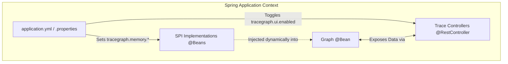

# TraceGraph :: Spring Boot Starter

## 📖 Introduction
Welcome to `tracegraph-spring-boot-starter`! If you are building enterprise Java applications, you are likely using Spring Boot. Manually configuring dependency injection, database connections, and REST endpoints for tracegraph modules can be tedious.

This starter module embeds TraceGraph cleanly into your Spring ecosystem, converting configuration files (`application.yml`) into boilerplate-free dependency injection wiring automatically.

### Key Features
- **Zero-Friction Auto-Configuration**: Automatically wires up configured instances of `NodeListener`, `CheckpointStore`, `TraceStore`, and `MemoryStore` conditional on your Spring environment properties.
- **Boot APIs**: Instantly exposes `GET /tracegraph/traces` and `POST {...}/replay` debug REST endpoints without writing any controller code.
- **LLM Setup**: Auto-generates `LlmClient` Bean implementations leveraging standard configs (e.g. `tracegraph.llm.provider=openai`).

## 🏗️ Internal Spring Architecture

The starter evaluates your `application.yml` at startup and automatically registers the correct Beans into the Spring Application Context.



## 🚀 How to Use the Starter

### 1. Add the Dependency
Include the starter in your `pom.xml`.

```xml
<dependency>
    <groupId>site.tracegraph</groupId>
    <artifactId>tracegraph-spring-boot-starter</artifactId>
    <version>${tracegraph.version}</version>
</dependency>
```

### 2. Configure via YAML
You no longer need to write `@Configuration` classes to instantiate stores. Just define them in your `application.yml`.

```yaml
tracegraph:
  memory:
    store-type: jdbc # Will automatically create a JdbcMemoryStore Bean using your primary DataSource
  checkpoint:
    store-type: in_memory
  observability:
    otel-enabled: true # Automatically hooks into Spring's OpenTelemetry auto-configuration
  llm:
    provider: openai
    api-key: ${OPENAI_API_KEY}
```

### 3. Inject Beans
You can now freely inject `MemoryStore`, `LlmClient`, or `TraceStore` directly into your services.

```java
@Service
public class AgentService {
    
    private final LlmClient llmClient;
    private final MemoryStore memoryStore;
    
    public AgentService(LlmClient llmClient, MemoryStore memoryStore) {
        this.llmClient = llmClient;
        this.memoryStore = memoryStore;
    }
    
    @Bean
    public Graph<MyState> agentGraph() {
        return Graph.<MyState>builder()
            // ... construct graph using injected beans
            .build();
    }
}
```