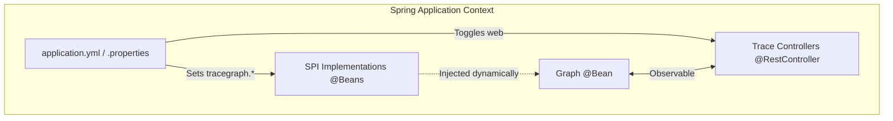

# TraceGraph Spring Boot Starter

`tracegraph-spring-boot-starter` embeds TraceGraph into your Spring ecosystem cleanly, converting configuration to boilerplate-free dependency injection wiring automatically.

## Features
- **Zero-Friction Auto-Configuration**: Automatically wires up configured instances of `NodeListener`, `CheckpointStore`, `TraceStore`, and `MemoryStore` conditional on Spring environment properties.
- **Boot APIs**: Instantly exposes `GET /tracegraph/traces` and `POST {...}/replay` debug REST endpoints.
- **LLM Setup**: Auto-generates `LlmClient` implementations leveraging standard configs (`tracegraph.llm.provider=openai`).

## Internal Spring Architecture

