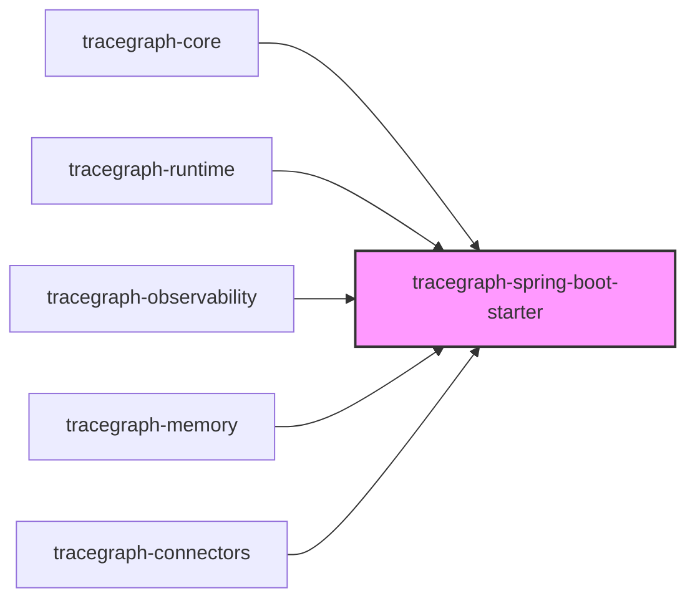
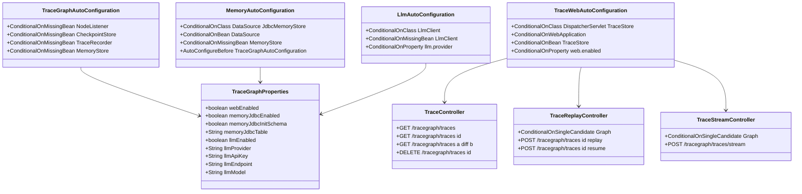
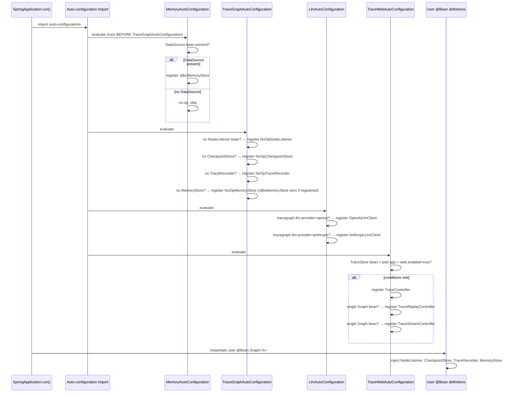
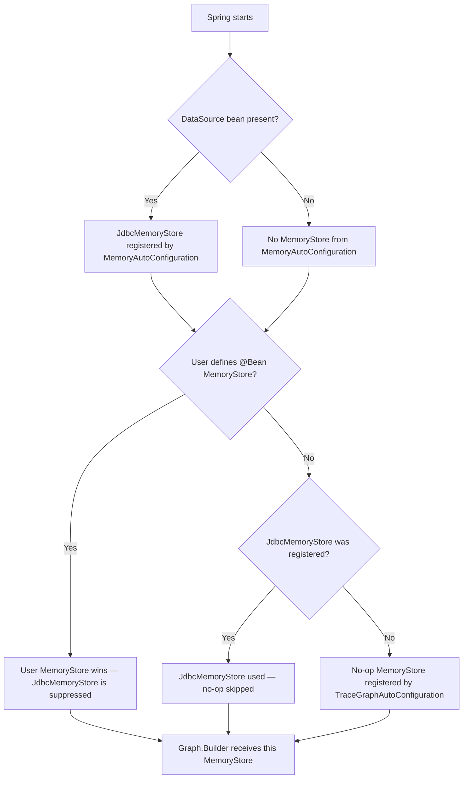

# tracegraph-spring-boot-starter

[](https://central.sonatype.com/artifact/io.tracegraph/tracegraph-spring-boot-starter)
[](LICENSE)
[](https://adoptium.net/)

Spring Boot 3 auto-configuration, REST trace endpoints, SSE streaming, and LLM wiring for the TraceGraph JVM runtime.

---

## What it does

`tracegraph-spring-boot-starter` integrates TraceGraph into a Spring Boot 3 application with zero boilerplate. It auto-configures no-op implementations of all four TraceGraph SPIs — `NodeListener`, `CheckpointStore`, `TraceRecorder`, and `MemoryStore` — each guarded by `@ConditionalOnMissingBean` so your own beans always win. When a `DataSource` bean is present, `MemoryAutoConfiguration` automatically registers a `JdbcMemoryStore` before the no-op fallback is considered. When `tracegraph-connectors` is on the classpath and `tracegraph.llm.provider` is set, `LlmAutoConfiguration` registers a ready-to-use `LlmClient` bean. A full suite of REST endpoints for listing, replaying, diffing, resuming, and streaming graph executions is registered conditionally when a `TraceStore` bean is available. Spring Boot version 3.3.5 is pinned in the parent BOM.

---

## System Context

The following diagram shows all six TraceGraph modules. `tracegraph-spring-boot-starter` is highlighted; it receives all other modules as optional dependencies and acts as the assembly point for your Spring application.



---

## Internal Architecture



---

## Spring Startup Sequence



---

## Conditional Bean Resolution Flowchart



---

## Core Concepts

### TraceGraphAutoConfiguration — SPI No-Op Defaults

`TraceGraphAutoConfiguration` registers safe no-op implementations of all four TraceGraph SPIs. Each registration is guarded by `@ConditionalOnMissingBean`, which means your own `@Bean` declarations always take precedence:

```java
// No explicit configuration needed — auto-configuration kicks in.
// To override, declare a @Bean of the same type:

@Configuration
public class MyConfig {

    // This bean wins over the no-op registered by auto-configuration.
    @Bean
    public NodeListener<MyState> myNodeListener() {
        return new MyCustomNodeListener();
    }
}
```

### MemoryAutoConfiguration — JDBC Memory Store

When a `DataSource` bean is present and `tracegraph-memory` is on the classpath, `MemoryAutoConfiguration` registers a `JdbcMemoryStore` automatically. It runs `initSchema()` on startup by default (idempotent). This auto-configuration runs before `TraceGraphAutoConfiguration` so the JDBC store wins over the no-op fallback:

```yaml
tracegraph:
  memory:
    jdbc:
      enabled: true          # default
      init-schema: true      # default; set false if you manage DDL externally
      table: tracegraph_memory  # default table name
```

To opt out entirely:

```yaml
tracegraph:
  memory:
    jdbc:
      enabled: false
```

### LlmAutoConfiguration — LLM Client Bean

When `tracegraph-connectors` is on the classpath and `tracegraph.llm.provider` is set, `LlmAutoConfiguration` registers either an `OpenAiLlmClient` or `AnthropicLlmClient` bean. The bean is guarded by `@ConditionalOnMissingBean(LlmClient.class)` so you can always define your own:

```yaml
tracegraph:
  llm:
    enabled: true          # default
    provider: openai       # "openai" or "anthropic"
    api-key: ${OPENAI_API_KEY}
    model: gpt-4o
    endpoint: https://api.openai.com/v1   # optional override
```

### TraceWebAutoConfiguration — REST Controllers

`TraceWebAutoConfiguration` registers REST controllers when all of these conditions are true:

- `DispatcherServlet` and `TraceStore` are on the classpath
- The application is a web application
- A `TraceStore` bean is present in the context
- `tracegraph.web.enabled=true` (default)

`TraceReplayController` and `TraceStreamController` additionally require a single `Graph<?>` bean (`@ConditionalOnSingleCandidate(Graph.class)`).

### Graph<S> Is Not Auto-Registered

`Graph<S>` is generic in `S` — the Spring container cannot infer the state type automatically. You must define your own `@Bean Graph<YourState>` and inject the auto-configured SPI beans:

```java
@Configuration
public class AgentGraphConfig {

    @Bean
    public Graph<MyState> agentGraph(
            NodeListener<MyState> nodeListener,
            CheckpointStore checkpointStore,
            TraceRecorder traceRecorder,
            MemoryStore memoryStore,
            LlmClient llmClient) {

        ChatNode<MyState> chatNode = new ChatNode<>(
            llmClient,
            state -> new LlmRequest("gpt-4o", state.messages(), 0.7, 1024),
            (state, resp) -> state.withAnswer(resp.content())
        );

        return Graph.<MyState>builder()
            .node("chat", chatNode)
            .entry("chat")
            .terminal("chat")
            .listener(nodeListener)
            .checkpointStore(checkpointStore)
            .traceRecorder(traceRecorder)
            .memoryStore(memoryStore)
            .build();
    }
}
```

---

## Complete Usage Walkthrough

### Step 1: Add the Starter Dependency

```xml
<dependency>
    <groupId>io.tracegraph</groupId>
    <artifactId>tracegraph-spring-boot-starter</artifactId>
    <version>0.1.0</version>
</dependency>
```

Optionally add other TraceGraph modules as needed:

```xml
<!-- Observability: OTel spans, trace recording, replay -->
<dependency>
    <groupId>io.tracegraph</groupId>
    <artifactId>tracegraph-observability</artifactId>
    <version>0.1.0</version>
</dependency>

<!-- LLM adapters and ReAct agent -->
<dependency>
    <groupId>io.tracegraph</groupId>
    <artifactId>tracegraph-connectors</artifactId>
    <version>0.1.0</version>
</dependency>

<!-- JDBC memory store -->
<dependency>
    <groupId>io.tracegraph</groupId>
    <artifactId>tracegraph-memory</artifactId>
    <version>0.1.0</version>
</dependency>
```

### Step 2: Minimal application.yml

```yaml
tracegraph:
  web:
    enabled: true          # expose REST trace endpoints (default true)
  memory:
    jdbc:
      enabled: true        # register JdbcMemoryStore when DataSource present (default true)
      init-schema: true    # run initSchema() on startup (default true)
  llm:
    enabled: false         # no LLM auto-config unless provider is set
```

### Step 3: Define Your Graph Bean

```java
import io.tracegraph.core.Graph;
import io.tracegraph.core.spi.NodeListener;
import io.tracegraph.core.spi.CheckpointStore;
import io.tracegraph.core.spi.TraceRecorder;
import io.tracegraph.core.spi.MemoryStore;
import org.springframework.context.annotation.Bean;
import org.springframework.context.annotation.Configuration;

@Configuration
public class GraphConfig {

    @Bean
    public Graph<MyState> myGraph(
            NodeListener<MyState> nodeListener,
            CheckpointStore checkpointStore,
            TraceRecorder traceRecorder,
            MemoryStore memoryStore) {

        return Graph.<MyState>builder()
            .node("step1", state -> state.withStep1Done(true))
            .node("step2", state -> state.withStep2Done(true))
            .edge("step1", "step2")
            .entry("step1")
            .terminal("step2")
            .listener(nodeListener)
            .checkpointStore(checkpointStore)
            .traceRecorder(traceRecorder)
            .memoryStore(memoryStore)
            .build();
    }
}
```

### Step 4: Add a DataSource for JDBC Memory Auto-Wiring

Add H2 for development (auto-wired as the primary `DataSource` by Spring Boot):

```xml
<dependency>
    <groupId>com.h2database</groupId>
    <artifactId>h2</artifactId>
    <scope>runtime</scope>
</dependency>
```

```yaml
spring:
  datasource:
    url: jdbc:h2:mem:testdb;DB_CLOSE_DELAY=-1
    driver-class-name: org.h2.Driver
```

With the DataSource present and `tracegraph-memory` on the classpath, `MemoryAutoConfiguration` registers `JdbcMemoryStore` automatically and runs `initSchema()`. No extra configuration is needed.

### Step 5: Enable LLM Auto-Configuration

Add `tracegraph-connectors` to your POM, then configure the provider:

```yaml
tracegraph:
  llm:
    enabled: true
    provider: openai
    api-key: ${OPENAI_API_KEY}
    model: gpt-4o
    temperature: 0.7
```

The registered `LlmClient` bean can then be injected directly into your `@Bean Graph<S>`:

```java
@Bean
public Graph<AgentState> agentGraph(LlmClient llmClient, NodeListener<AgentState> listener) {
    ChatNode<AgentState> chat = new ChatNode<>(
        llmClient,
        state -> new LlmRequest("gpt-4o", state.messages(), 0.7, 1024),
        (state, resp) -> state.withAnswer(resp.content())
    );
    return Graph.<AgentState>builder()
        .node("chat", chat)
        .entry("chat")
        .terminal("chat")
        .listener(listener)
        .build();
}
```

For Anthropic:

```yaml
tracegraph:
  llm:
    provider: anthropic
    api-key: ${ANTHROPIC_API_KEY}
    model: claude-3-5-sonnet-20241022
```

### Step 6: Override a No-Op Bean with Your Own Implementation

Define a `@Bean` of the same SPI type to replace the auto-configured no-op:

```java
import io.tracegraph.core.spi.NodeListener;
import io.tracegraph.observability.OtelNodeListener;
import org.springframework.context.annotation.Bean;
import org.springframework.context.annotation.Configuration;

@Configuration
public class ObservabilityConfig {

    // OtelNodeListener from tracegraph-observability replaces the no-op NodeListener
    @Bean
    public NodeListener<MyState> otelNodeListener(Tracer tracer) {
        return new OtelNodeListener<>(tracer);
    }
}
```

### Step 7: Use the REST API with curl

List recent traces (paginated):

```bash
curl -s "http://localhost:8080/tracegraph/traces?limit=10&offset=0"
# Returns: ["exec-id-1","exec-id-2",...] with X-Total-Count header
```

Get a full execution trace:

```bash
curl -s "http://localhost:8080/tracegraph/traces/exec-id-1"
# Returns: full ExecutionTrace JSON
```

Diff two executions:

```bash
curl -s "http://localhost:8080/tracegraph/traces/exec-id-1/diff/exec-id-2"
# Returns: TraceDiff JSON with divergence index and per-side remainders
```

Delete a trace:

```bash
curl -X DELETE "http://localhost:8080/tracegraph/traces/exec-id-1"
# Returns: 204 No Content on success, 404 if unknown
```

Replay a trace from a specific step:

```bash
curl -X POST "http://localhost:8080/tracegraph/traces/exec-id-1/replay?step=2"
# Returns: {"executionId":"new-id","forkedFromExecutionId":"exec-id-1","forkedFromStepIndex":2}
```

Replay from entry (default):

```bash
curl -X POST "http://localhost:8080/tracegraph/traces/exec-id-1/replay"
# step defaults to -1 (from entry)
```

Resume an interrupted execution:

```bash
curl -X POST "http://localhost:8080/tracegraph/traces/exec-id-1/resume"
# 404 if unknown, 409 if not INTERRUPTED
```

### Step 8: SSE Streaming

```bash
curl -N -X POST "http://localhost:8080/tracegraph/traces/stream" \
     -H "Content-Type: application/json" \
     -d '{"step1Input":"hello"}'
```

The response is a server-sent event stream of `NodeEvent<S>` JSON objects:

```
data: {"type":"NodeEnter","nodeName":"step1","state":{...}}

data: {"type":"NodeExit","nodeName":"step1","state":{...}}

data: {"type":"NodeEnter","nodeName":"step2","state":{...}}

data: {"type":"NodeExit","nodeName":"step2","state":{...}}

data: {"type":"Complete","state":{...}}
```

---

## REST API Reference

| Method | Path | Query Params | Response | Error Codes |
|---|---|---|---|---|
| `GET` | `/tracegraph/traces` | `limit` (int), `offset` (int) | JSON array of executionId strings; `X-Total-Count` header | 400 (negative limit or offset) |
| `GET` | `/tracegraph/traces/{id}` | — | Full `ExecutionTrace` JSON | 404 (unknown id) |
| `GET` | `/tracegraph/traces/{a}/diff/{b}` | — | `TraceDiff` JSON | 404 (either id unknown) |
| `DELETE` | `/tracegraph/traces/{id}` | — | 204 No Content | 404 (unknown id) |
| `POST` | `/tracegraph/traces/{id}/replay` | `step` (int, default -1) | JSON with `executionId`, `forkedFromExecutionId`, `forkedFromStepIndex` | 404 (unknown trace), 400 (out-of-range step) |
| `POST` | `/tracegraph/traces/{id}/resume` | — | `ExecutionResult` JSON | 404 (unknown), 409 (not INTERRUPTED) |
| `POST` | `/tracegraph/traces/stream` | — | SSE stream of `NodeEvent` JSON | — |

**Notes:**
- All endpoints require `tracegraph.web.enabled=true` (the default).
- Replay and stream endpoints additionally require a single `Graph<?>` bean in the context.
- The `X-Total-Count` header on the list endpoint contains the total count before pagination.
- Negative `limit` or `offset` returns 400.
- `step=-1` on the replay endpoint means "replay from the entry node".

---

## Configuration Reference

| Property | Type | Default | Description |
|---|---|---|---|
| `tracegraph.web.enabled` | `boolean` | `true` | Enable or disable `TraceController`, `TraceReplayController`, and `TraceStreamController` |
| `tracegraph.memory.jdbc.enabled` | `boolean` | `true` | Enable `JdbcMemoryStore` auto-registration when `DataSource` is present |
| `tracegraph.memory.jdbc.init-schema` | `boolean` | `true` | Call `initSchema()` on startup; set `false` to manage DDL externally |
| `tracegraph.memory.jdbc.table` | `String` | `tracegraph_memory` | JDBC table name for the memory store |
| `tracegraph.llm.enabled` | `boolean` | `true` | Enable or disable `LlmAutoConfiguration` entirely |
| `tracegraph.llm.provider` | `String` | (unset) | LLM provider: `openai` or `anthropic`; no bean is registered when unset |
| `tracegraph.llm.api-key` | `String` | (required if provider set) | API key for the selected provider |
| `tracegraph.llm.endpoint` | `String` | (provider default) | Override the provider base URL |
| `tracegraph.llm.model` | `String` | (provider default) | Model name, e.g. `gpt-4o` or `claude-3-5-sonnet-20241022` |
| `tracegraph.llm.temperature` | `double` | `1.0` | Sampling temperature |
| `tracegraph.llm.max-tokens` | `int` | `1024` | Maximum tokens in LLM response |

---

## Integration with Other Modules

### With tracegraph-observability: OTel Tracing and Trace Store

Add `tracegraph-observability` and define an `OtelNodeListener` and a `TraceStore` bean:

```java
@Configuration
public class ObservabilityConfig {

    @Bean
    public NodeListener<MyState> otelNodeListener(OpenTelemetry otel) {
        return new OtelNodeListener<>(otel.getTracer("tracegraph"));
    }

    @Bean
    public TraceStore traceStore() {
        // Use InMemoryTraceStore for development; JsonFileTraceStore or JdbcTraceStore for production
        return new InMemoryTraceStore();
    }

    @Bean
    public TraceRecorder traceRecorder(TraceStore traceStore) {
        return new RecordingTraceRecorder(traceStore);
    }
}
```

Once a `TraceStore` bean is present, `TraceWebAutoConfiguration` activates and the REST endpoints become available.

### With tracegraph-memory: JDBC Memory Store

No explicit configuration is needed beyond adding a `DataSource` and `tracegraph-memory` to the classpath. To use a custom table name:

```yaml
tracegraph:
  memory:
    jdbc:
      table: my_agent_memory
```

To define your own `MemoryStore` (suppresses both the JDBC and no-op stores):

```java
@Bean
public MemoryStore myMemoryStore() {
    return new InMemoryMemoryStore(); // or your own implementation
}
```

### With tracegraph-connectors: LLM and ReAct

With the auto-configured `LlmClient` available as a bean, building a ReAct graph in Spring is straightforward:

```java
@Configuration
public class ReActGraphConfig {

    @Bean
    public Graph<AgentState> reactGraph(
            LlmClient llmClient,
            NodeListener<AgentState> listener) {

        ToolDefinition searchDef = new ToolDefinition(
            "web_search", "Search the web.", "{\"type\":\"object\"}");
        Tool searchTool = args -> searchService.search(args);

        Graph<AgentState> inner = ReActAgent.<AgentState>builder()
            .client(llmClient)
            .tool(searchDef, searchTool)
            .requestFactory(state -> new LlmRequest("gpt-4o", state.messages(), 0.5, 4096))
            .responseFolder((state, resp) -> state.withAnswer(resp.content()))
            .toolResultFolder((state, results) -> state.appendToolResults(results))
            .build()
            .buildGraph();

        // Wrap with listener (inner graph does not receive the outer listener automatically)
        return Graph.<AgentState>builder()
            .subgraph("react", inner)
            .entry("react")
            .terminal("react")
            .listener(listener)
            .build();
    }
}
```

---

## Testing Guidance

### @SpringBootTest with H2 and MockLlmClient

```java
import org.springframework.boot.test.context.SpringBootTest;
import org.springframework.boot.test.context.TestConfiguration;
import org.springframework.context.annotation.Bean;
import org.springframework.test.web.servlet.MockMvc;
import org.springframework.boot.test.autoconfigure.web.servlet.AutoConfigureMockMvc;

@SpringBootTest
@AutoConfigureMockMvc
class TraceEndpointTest {

    @TestConfiguration
    static class MockLlmConfig {
        // Override the auto-configured LlmClient with a test double
        @Bean
        public LlmClient llmClient() {
            return MockLlmClient.constant("Test answer");
        }
    }

    @Autowired
    MockMvc mockMvc;

    @Autowired
    Graph<MyState> graph;

    @Test
    void listTracesReturns200() throws Exception {
        mockMvc.perform(get("/tracegraph/traces"))
            .andExpect(status().isOk())
            .andExpect(header().exists("X-Total-Count"));
    }

    @Test
    void listTracesWithNegativeLimitReturns400() throws Exception {
        mockMvc.perform(get("/tracegraph/traces?limit=-1"))
            .andExpect(status().isBadRequest());
    }

    @Test
    void getUnknownTraceReturns404() throws Exception {
        mockMvc.perform(get("/tracegraph/traces/nonexistent-id"))
            .andExpect(status().isNotFound());
    }
}
```

### Verify 409 on Resume of Non-INTERRUPTED Execution

```java
@Test
void resumeNonInterruptedExecutionReturns409() throws Exception {
    // Run a graph to completion
    ExecutionResult<MyState> result = graph.run(MyState.initial());
    String executionId = result.executionId();
    assertThat(result.status()).isEqualTo(Status.COMPLETED);

    // Attempting to resume a COMPLETED execution must return 409
    mockMvc.perform(post("/tracegraph/traces/{id}/resume", executionId))
        .andExpect(status().isConflict()); // 409
}
```

### Verify Replay Endpoint Returns Fork Lineage

```java
@Test
void replayEndpointReturnsForkLineage() throws Exception {
    ExecutionResult<MyState> result = graph.run(MyState.initial());
    String executionId = result.executionId();

    mockMvc.perform(post("/tracegraph/traces/{id}/replay?step=0", executionId))
        .andExpect(status().isOk())
        .andExpect(jsonPath("$.executionId").isNotEmpty())
        .andExpect(jsonPath("$.forkedFromExecutionId").value(executionId))
        .andExpect(jsonPath("$.forkedFromStepIndex").value(0));
}
```

### Verify JdbcMemoryStore Is Auto-Wired with H2

```java
@SpringBootTest
class MemoryAutoConfigTest {

    @Autowired
    MemoryStore memoryStore;

    @Test
    void memoryStoreIsJdbcMemoryStore() {
        // With H2 DataSource and tracegraph-memory on classpath,
        // MemoryAutoConfiguration registers JdbcMemoryStore
        assertThat(memoryStore).isInstanceOf(JdbcMemoryStore.class);
    }

    @Test
    void memoryStoreCanPutAndGet() {
        memoryStore.put("test-scope", "greeting", "hello");
        assertThat(memoryStore.get("test-scope", "greeting")).isEqualTo("hello");
    }
}
```

### Test SSE Streaming with MockMvc

```java
@Test
void streamEndpointEmitsNodeEvents() throws Exception {
    MvcResult result = mockMvc.perform(
            post("/tracegraph/traces/stream")
                .contentType(MediaType.APPLICATION_JSON)
                .content("{}")
        )
        .andExpect(request().asyncStarted())
        .andReturn();

    mockMvc.perform(asyncDispatch(result))
        .andExpect(status().isOk())
        .andExpect(content().contentTypeCompatibleWith(MediaType.TEXT_EVENT_STREAM));
}
```

---

## FAQ

**Q: Why is `Graph<S>` not auto-registered?**

`Graph<S>` has a single type parameter `<S>` for the state type. Spring's `ApplicationContext` cannot infer `S` automatically. Two different graphs in the same application would have different `<S>` types and cannot be registered under the same bean type. You must declare `@Bean Graph<YourState>` explicitly. Auto-configured SPI beans (`NodeListener`, `CheckpointStore`, `TraceRecorder`, `MemoryStore`) are injected into your bean method by Spring as normal.

---

**Q: Why are `JdbcCheckpointStore` and `JdbcTraceStore` not auto-wired?**

Both `JdbcCheckpointStore` and `JdbcTraceStore` require a `Class<S>` parameter at construction time so that Jackson can deserialize state values to their concrete type. The starter cannot determine `S` automatically. Define them manually in a `@Configuration` class:

```java
@Bean
public CheckpointStore checkpointStore(DataSource dataSource) {
    JdbcCheckpointStore<MyState> store =
        new JdbcCheckpointStore<>(dataSource, MyState.class);
    store.initSchema();
    return store;
}

@Bean
public TraceStore traceStore(DataSource dataSource) {
    JdbcTraceStore<MyState> store =
        new JdbcTraceStore<>(dataSource, MyState.class);
    store.initSchema();
    return store;
}
```

---

**Q: How do I disable the web endpoints?**

Set `tracegraph.web.enabled=false` in your configuration:

```yaml
tracegraph:
  web:
    enabled: false
```

`TraceWebAutoConfiguration` is guarded by `@ConditionalOnProperty(name = "tracegraph.web.enabled", havingValue = "true", matchIfMissing = true)`. Setting it to `false` suppresses all three controllers.

---

**Q: How do I add OpenTelemetry tracing?**

Define an `OtelNodeListener` bean from `tracegraph-observability`. Spring's `@ConditionalOnMissingBean` on the no-op listener means your bean wins:

```java
@Bean
public NodeListener<MyState> nodeListener(OpenTelemetry otel) {
    Tracer tracer = otel.getTracer("io.tracegraph");
    return new OtelNodeListener<>(tracer);
}
```

Use `Listeners.compose(...)` from `tracegraph-core` if you want to combine multiple listeners:

```java
@Bean
public NodeListener<MyState> nodeListener(OpenTelemetry otel, LlmCostListener costListener) {
    return Listeners.compose(
        new OtelNodeListener<>(otel.getTracer("io.tracegraph")),
        costListener
    );
}
```

---

**Q: Can I use multiple `Graph<S>` beans in the same application?**

Yes. Define multiple `@Bean Graph<S>` methods with different names. However, `TraceReplayController` and `TraceStreamController` require exactly one `Graph<?>` bean (`@ConditionalOnSingleCandidate`). If you have more than one, those two controllers are not registered. `TraceController` (for listing and diffing traces) is not affected by the number of graph beans.
