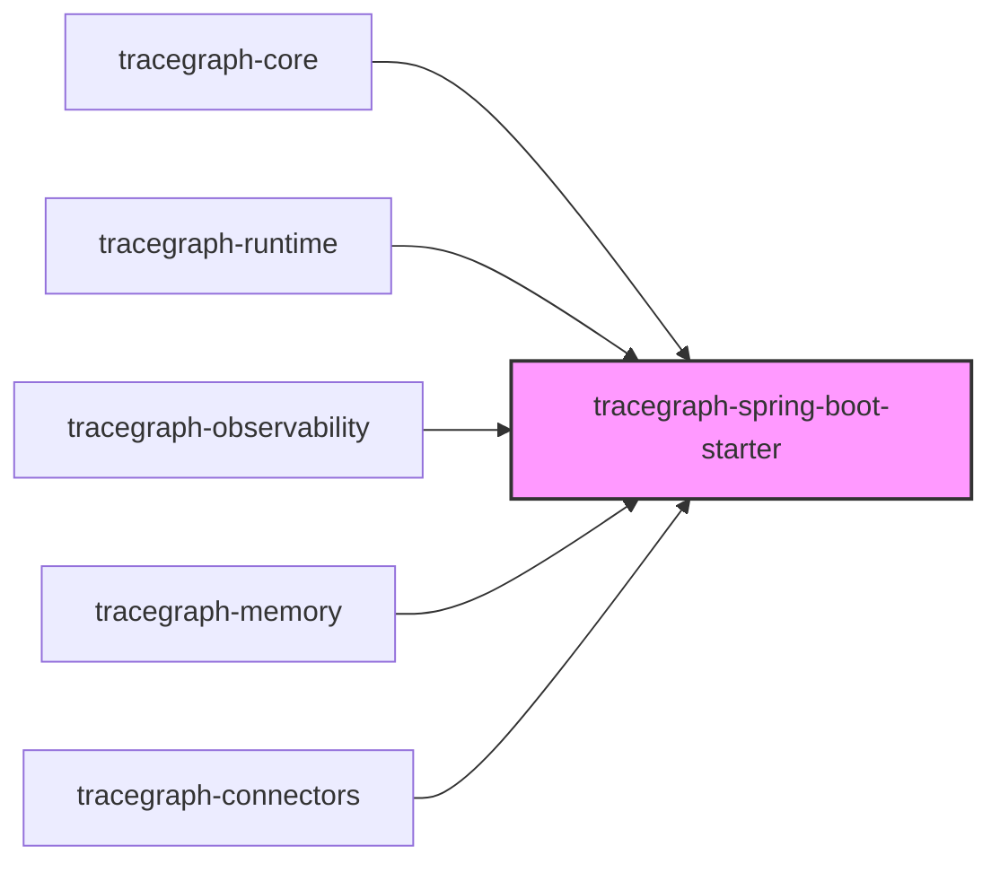
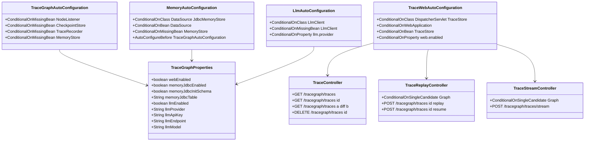
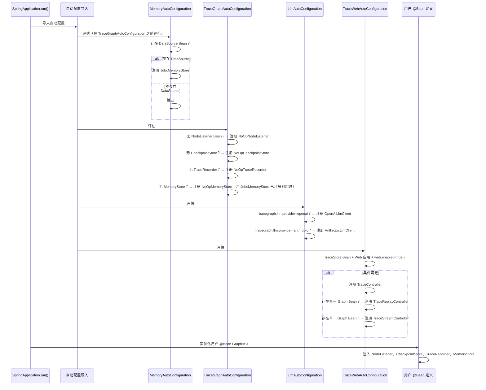
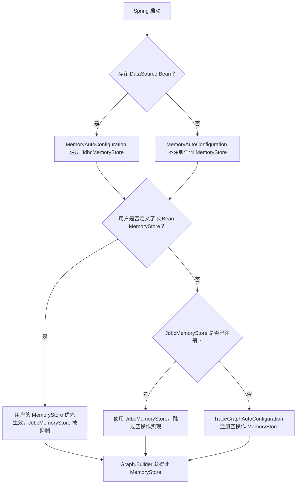

# tracegraph-spring-boot-starter

[](https://central.sonatype.com/artifact/io.tracegraph/tracegraph-spring-boot-starter)
[](LICENSE)
[](https://adoptium.net/)

面向 TraceGraph JVM 运行时的 Spring Boot 3 自动配置、REST 追踪端点、SSE 流式输出与 LLM 自动装配。

---

## 模块功能简介

`tracegraph-spring-boot-starter` 以零样板代码的方式将 TraceGraph 集成到 Spring Boot 3 应用程序中。它为 TraceGraph 的四个服务提供接口（SPI）——`NodeListener`、`CheckpointStore`、`TraceRecorder` 和 `MemoryStore`——自动配置空操作（no-op）实现，每个均受 `@ConditionalOnMissingBean` 保护，因此您自己定义的 Bean 始终优先。当 Spring 应用上下文中存在 `DataSource` Bean 时，`MemoryAutoConfiguration` 会在空操作回退之前自动注册 `JdbcMemoryStore`。当 `tracegraph-connectors` 在类路径上且 `tracegraph.llm.provider` 已设置时，`LlmAutoConfiguration` 会注册一个即用型 `LlmClient` Bean。用于列举、回放、对比、恢复和流式输出图执行记录的完整 REST 端点套件在 `TraceStore` Bean 可用时按条件注册。父 BOM 中固定使用 Spring Boot 3.3.5。

---

## 系统上下文

下图展示了 TraceGraph 的全部六个模块，其中 `tracegraph-spring-boot-starter` 以高亮显示。它将所有其他模块作为可选依赖接收，并作为 Spring 应用程序的组装入口点。



---

## 内部架构



---

## Spring 启动时序图



---

## 条件化 Bean 解析流程图



---

## 核心概念

### TraceGraphAutoConfiguration — SPI 空操作默认实现

`TraceGraphAutoConfiguration` 为 TraceGraph 的四个 SPI 注册安全的空操作实现。每个注册均受 `@ConditionalOnMissingBean` 保护，这意味着您自己的 `@Bean` 声明始终优先：

```java
// 无需显式配置——自动配置会自动生效。
// 若要覆盖，只需声明同类型的 @Bean：

@Configuration
public class MyConfig {

    // 此 Bean 会替换自动配置注册的空操作实现
    @Bean
    public NodeListener<MyState> myNodeListener() {
        return new MyCustomNodeListener();
    }
}
```

### MemoryAutoConfiguration — JDBC 内存存储

当 Spring 应用上下文中存在 `DataSource` Bean 且 `tracegraph-memory` 在类路径上时，`MemoryAutoConfiguration` 会自动注册 `JdbcMemoryStore`，并在启动时调用 `initSchema()`（幂等操作）。此自动配置在 `TraceGraphAutoConfiguration` 之前运行，因此 JDBC 存储优先于空操作回退：

```yaml
tracegraph:
  memory:
    jdbc:
      enabled: true              # 默认值
      init-schema: true          # 默认值；若自行管理 DDL 可设为 false
      table: tracegraph_memory   # 默认表名
```

若要完全退出 JDBC 自动装配：

```yaml
tracegraph:
  memory:
    jdbc:
      enabled: false
```

### LlmAutoConfiguration — LLM 客户端 Bean

当 `tracegraph-connectors` 在类路径上且 `tracegraph.llm.provider` 已设置时，`LlmAutoConfiguration` 会注册 `OpenAiLlmClient` 或 `AnthropicLlmClient` Bean。该 Bean 受 `@ConditionalOnMissingBean(LlmClient.class)` 保护，因此您随时可以定义自己的实现：

```yaml
tracegraph:
  llm:
    enabled: true           # 默认值
    provider: openai        # "openai" 或 "anthropic"
    api-key: ${OPENAI_API_KEY}
    model: gpt-4o
    endpoint: https://api.openai.com/v1  # 可选覆盖
```

### TraceWebAutoConfiguration — REST 控制器

`TraceWebAutoConfiguration` 在以下所有条件满足时注册 REST 控制器：

- `DispatcherServlet` 和 `TraceStore` 在类路径上
- 应用程序是 Web 应用程序
- Spring 应用上下文中存在 `TraceStore` Bean
- `tracegraph.web.enabled=true`（默认值）

`TraceReplayController` 和 `TraceStreamController` 额外要求上下文中只有一个 `Graph<?>` Bean（`@ConditionalOnSingleCandidate(Graph.class)`）。

### Graph<S> 不会被自动注册

`Graph<S>` 对状态类型 `<S>` 是泛型的——Spring 容器无法自动推断状态类型。您必须自行定义 `@Bean Graph<您的状态类型>` 并注入自动配置的 SPI Bean：

```java
@Configuration
public class AgentGraphConfig {

    @Bean
    public Graph<MyState> agentGraph(
            NodeListener<MyState> nodeListener,
            CheckpointStore checkpointStore,
            TraceRecorder traceRecorder,
            MemoryStore memoryStore,
            LlmClient llmClient) {

        ChatNode<MyState> chatNode = new ChatNode<>(
            llmClient,
            state -> new LlmRequest("gpt-4o", state.messages(), 0.7, 1024),
            (state, resp) -> state.withAnswer(resp.content())
        );

        return Graph.<MyState>builder()
            .node("chat", chatNode)
            .entry("chat")
            .terminal("chat")
            .listener(nodeListener)
            .checkpointStore(checkpointStore)
            .traceRecorder(traceRecorder)
            .memoryStore(memoryStore)
            .build();
    }
}
```

---

## 完整使用步骤

### 第一步：添加 Starter 依赖

```xml
<dependency>
    <groupId>io.tracegraph</groupId>
    <artifactId>tracegraph-spring-boot-starter</artifactId>
    <version>0.3.0</version>
</dependency>
```

根据需要添加其他 TraceGraph 模块：

```xml
<!-- 可观测性：OTel Span、执行追踪与回放 -->
<dependency>
    <groupId>io.tracegraph</groupId>
    <artifactId>tracegraph-observability</artifactId>
    <version>0.3.0</version>
</dependency>

<!-- LLM 适配器与 ReAct 代理 -->
<dependency>
    <groupId>io.tracegraph</groupId>
    <artifactId>tracegraph-connectors</artifactId>
    <version>0.3.0</version>
</dependency>

<!-- JDBC 内存存储 -->
<dependency>
    <groupId>io.tracegraph</groupId>
    <artifactId>tracegraph-memory</artifactId>
    <version>0.3.0</version>
</dependency>
```

### 第二步：最简 application.yml 配置

```yaml
tracegraph:
  web:
    enabled: true          # 暴露 REST 追踪端点（默认 true）
  memory:
    jdbc:
      enabled: true        # 当存在 DataSource 时注册 JdbcMemoryStore（默认 true）
      init-schema: true    # 启动时运行 initSchema()（默认 true）
  llm:
    enabled: false         # 未设置 provider 时不进行 LLM 自动配置
```

### 第三步：定义您的 Graph Bean

```java
import io.tracegraph.core.Graph;
import io.tracegraph.core.spi.NodeListener;
import io.tracegraph.core.spi.CheckpointStore;
import io.tracegraph.core.spi.TraceRecorder;
import io.tracegraph.core.spi.MemoryStore;
import org.springframework.context.annotation.Bean;
import org.springframework.context.annotation.Configuration;

@Configuration
public class GraphConfig {

    @Bean
    public Graph<MyState> myGraph(
            NodeListener<MyState> nodeListener,
            CheckpointStore checkpointStore,
            TraceRecorder traceRecorder,
            MemoryStore memoryStore) {

        return Graph.<MyState>builder()
            .node("step1", state -> state.withStep1Done(true))
            .node("step2", state -> state.withStep2Done(true))
            .edge("step1", "step2")
            .entry("step1")
            .terminal("step2")
            .listener(nodeListener)
            .checkpointStore(checkpointStore)
            .traceRecorder(traceRecorder)
            .memoryStore(memoryStore)
            .build();
    }
}
```

### 第四步：添加 DataSource 以自动装配 JDBC 内存存储

添加 H2（Spring Boot 会自动将其配置为主 `DataSource`）：

```xml
<dependency>
    <groupId>com.h2database</groupId>
    <artifactId>h2</artifactId>
    <scope>runtime</scope>
</dependency>
```

```yaml
spring:
  datasource:
    url: jdbc:h2:mem:testdb;DB_CLOSE_DELAY=-1
    driver-class-name: org.h2.Driver
```

DataSource 存在且 `tracegraph-memory` 在类路径上时，`MemoryAutoConfiguration` 会自动注册 `JdbcMemoryStore` 并运行 `initSchema()`，无需任何额外配置。

### 第五步：启用 LLM 自动配置

在 POM 中添加 `tracegraph-connectors`，然后配置提供商：

```yaml
tracegraph:
  llm:
    enabled: true
    provider: openai
    api-key: ${OPENAI_API_KEY}
    model: gpt-4o
    temperature: 0.7
```

注册的 `LlmClient` Bean 可以直接注入到您的 `@Bean Graph<S>` 中：

```java
@Bean
public Graph<AgentState> agentGraph(LlmClient llmClient, NodeListener<AgentState> listener) {
    ChatNode<AgentState> chat = new ChatNode<>(
        llmClient,
        state -> new LlmRequest("gpt-4o", state.messages(), 0.7, 1024),
        (state, resp) -> state.withAnswer(resp.content())
    );
    return Graph.<AgentState>builder()
        .node("chat", chat)
        .entry("chat")
        .terminal("chat")
        .listener(listener)
        .build();
}
```

若使用 Anthropic：

```yaml
tracegraph:
  llm:
    provider: anthropic
    api-key: ${ANTHROPIC_API_KEY}
    model: claude-3-5-sonnet-20241022
```

### 第六步：用自定义实现覆盖空操作 Bean

声明同类型的 `@Bean` 即可替换自动配置的空操作实现：

```java
import io.tracegraph.core.spi.NodeListener;
import io.tracegraph.observability.OtelNodeListener;
import org.springframework.context.annotation.Bean;
import org.springframework.context.annotation.Configuration;

@Configuration
public class ObservabilityConfig {

    // 来自 tracegraph-observability 的 OtelNodeListener 替换空操作 NodeListener
    @Bean
    public NodeListener<MyState> otelNodeListener(Tracer tracer) {
        return new OtelNodeListener<>(tracer);
    }
}
```

### 第七步：通过 curl 使用 REST API

列举最近的追踪记录（分页）：

```bash
curl -s "http://localhost:8080/tracegraph/traces?limit=10&offset=0"
# 返回：["exec-id-1","exec-id-2",...] 以及 X-Total-Count 响应头
```

获取完整的执行追踪记录：

```bash
curl -s "http://localhost:8080/tracegraph/traces/exec-id-1"
# 返回：完整的 ExecutionTrace JSON
```

对比两次执行：

```bash
curl -s "http://localhost:8080/tracegraph/traces/exec-id-1/diff/exec-id-2"
# 返回：TraceDiff JSON，包含分歧索引和各侧的剩余步骤
```

删除追踪记录：

```bash
curl -X DELETE "http://localhost:8080/tracegraph/traces/exec-id-1"
# 成功返回 204，未知 ID 返回 404
```

从指定步骤回放执行：

```bash
curl -X POST "http://localhost:8080/tracegraph/traces/exec-id-1/replay?step=2"
# 返回：{"executionId":"new-id","forkedFromExecutionId":"exec-id-1","forkedFromStepIndex":2}
```

从入口节点重新执行（默认）：

```bash
curl -X POST "http://localhost:8080/tracegraph/traces/exec-id-1/replay"
# step 默认为 -1，即从入口节点开始
```

恢复中断的执行：

```bash
curl -X POST "http://localhost:8080/tracegraph/traces/exec-id-1/resume"
# 未知 ID 返回 404，状态非 INTERRUPTED 返回 409
```

### 第八步：SSE 流式输出

```bash
curl -N -X POST "http://localhost:8080/tracegraph/traces/stream" \
     -H "Content-Type: application/json" \
     -d '{"step1Input":"hello"}'
```

响应是 `NodeEvent<S>` JSON 对象的服务器发送事件（SSE）流：

```
data: {"type":"NodeEnter","nodeName":"step1","state":{...}}

data: {"type":"NodeExit","nodeName":"step1","state":{...}}

data: {"type":"NodeEnter","nodeName":"step2","state":{...}}

data: {"type":"NodeExit","nodeName":"step2","state":{...}}

data: {"type":"Complete","state":{...}}
```

---

## REST API 参考

| 方法 | 路径 | 查询参数 | 响应 | 错误码 |
|---|---|---|---|---|
| `GET` | `/tracegraph/traces` | `limit`（整数）, `offset`（整数） | 执行 ID 字符串 JSON 数组；`X-Total-Count` 响应头 | 400（limit 或 offset 为负数） |
| `GET` | `/tracegraph/traces/{id}` | — | 完整 `ExecutionTrace` JSON | 404（未知 ID） |
| `GET` | `/tracegraph/traces/{a}/diff/{b}` | — | `TraceDiff` JSON | 404（任一 ID 未知） |
| `DELETE` | `/tracegraph/traces/{id}` | — | 204 No Content | 404（未知 ID） |
| `POST` | `/tracegraph/traces/{id}/replay` | `step`（整数，默认 -1） | 包含 `executionId`、`forkedFromExecutionId`、`forkedFromStepIndex` 的 JSON | 404（未知追踪），400（步骤超出范围） |
| `POST` | `/tracegraph/traces/{id}/resume` | — | `ExecutionResult` JSON | 404（未知），409（状态非 INTERRUPTED） |
| `POST` | `/tracegraph/traces/stream` | — | `NodeEvent` JSON 的 SSE 流 | — |

**说明：**
- 所有端点要求 `tracegraph.web.enabled=true`（默认值）。
- 回放与流式输出端点额外要求上下文中存在单一 `Graph<?>` Bean。
- 列举端点的 `X-Total-Count` 响应头包含分页前的总数量。
- `limit` 或 `offset` 为负数时返回 400。
- 回放端点的 `step=-1` 表示"从入口节点开始回放"。

---

## 配置参考

| 属性 | 类型 | 默认值 | 说明 |
|---|---|---|---|
| `tracegraph.web.enabled` | `boolean` | `true` | 启用或禁用 `TraceController`、`TraceReplayController` 和 `TraceStreamController` |
| `tracegraph.memory.jdbc.enabled` | `boolean` | `true` | 当 `DataSource` 存在时启用 `JdbcMemoryStore` 自动注册 |
| `tracegraph.memory.jdbc.init-schema` | `boolean` | `true` | 启动时调用 `initSchema()`；若自行管理 DDL 可设为 `false` |
| `tracegraph.memory.jdbc.table` | `String` | `tracegraph_memory` | 内存存储的 JDBC 表名 |
| `tracegraph.llm.enabled` | `boolean` | `true` | 完全启用或禁用 `LlmAutoConfiguration` |
| `tracegraph.llm.provider` | `String` | （未设置） | LLM 提供商：`openai` 或 `anthropic`；未设置时不注册任何 Bean |
| `tracegraph.llm.api-key` | `String` | （provider 设置时必填） | 所选提供商的 API 密钥 |
| `tracegraph.llm.endpoint` | `String` | （提供商默认值） | 覆盖提供商基础 URL |
| `tracegraph.llm.model` | `String` | （提供商默认值） | 模型名称，例如 `gpt-4o` 或 `claude-3-5-sonnet-20241022` |
| `tracegraph.llm.temperature` | `double` | `1.0` | 采样温度 |
| `tracegraph.llm.max-tokens` | `int` | `1024` | LLM 响应中的最大 Token 数 |

---

## 与其他模块的集成

### 与 tracegraph-observability 集成：OTel 追踪与 Trace Store

添加 `tracegraph-observability` 并定义 `OtelNodeListener` 和 `TraceStore` Bean：

```java
@Configuration
public class ObservabilityConfig {

    @Bean
    public NodeListener<MyState> otelNodeListener(OpenTelemetry otel) {
        return new OtelNodeListener<>(otel.getTracer("tracegraph"));
    }

    @Bean
    public TraceStore traceStore() {
        // 开发环境使用 InMemoryTraceStore；生产环境使用 JsonFileTraceStore 或 JdbcTraceStore
        return new InMemoryTraceStore();
    }

    @Bean
    public TraceRecorder traceRecorder(TraceStore traceStore) {
        return new RecordingTraceRecorder(traceStore);
    }
}
```

一旦上下文中存在 `TraceStore` Bean，`TraceWebAutoConfiguration` 就会激活，REST 端点随即可用。

### 与 tracegraph-memory 集成：JDBC 内存存储

只需将 `DataSource` 和 `tracegraph-memory` 添加到类路径即可，无需任何显式配置。若要自定义表名：

```yaml
tracegraph:
  memory:
    jdbc:
      table: my_agent_memory
```

若要定义自己的 `MemoryStore`（会抑制 JDBC 存储和空操作存储）：

```java
@Bean
public MemoryStore myMemoryStore() {
    return new InMemoryMemoryStore(); // 或您自己的实现
}
```

### 与 tracegraph-connectors 集成：LLM 与 ReAct

有了自动配置的 `LlmClient` Bean，在 Spring 中构建 ReAct 图变得非常简单：

```java
@Configuration
public class ReActGraphConfig {

    @Bean
    public Graph<AgentState> reactGraph(
            LlmClient llmClient,
            NodeListener<AgentState> listener) {

        ToolDefinition searchDef = new ToolDefinition(
            "web_search", "搜索互联网。", "{\"type\":\"object\"}");
        Tool searchTool = args -> searchService.search(args);

        Graph<AgentState> inner = ReActAgent.<AgentState>builder()
            .client(llmClient)
            .tool(searchDef, searchTool)
            .requestFactory(state -> new LlmRequest("gpt-4o", state.messages(), 0.5, 4096))
            .responseFolder((state, resp) -> state.withAnswer(resp.content()))
            .toolResultFolder((state, results) -> state.appendToolResults(results))
            .build()
            .buildGraph();

        return Graph.<AgentState>builder()
            .subgraph("react", inner)
            .entry("react")
            .terminal("react")
            .listener(listener)
            .build();
    }
}
```

---

## 测试指南

### 使用 H2 和 MockLlmClient 进行 @SpringBootTest

```java
import org.springframework.boot.test.context.SpringBootTest;
import org.springframework.boot.test.context.TestConfiguration;
import org.springframework.context.annotation.Bean;
import org.springframework.test.web.servlet.MockMvc;
import org.springframework.boot.test.autoconfigure.web.servlet.AutoConfigureMockMvc;

@SpringBootTest
@AutoConfigureMockMvc
class TraceEndpointTest {

    @TestConfiguration
    static class MockLlmConfig {
        // 用测试替身覆盖自动配置的 LlmClient
        @Bean
        public LlmClient llmClient() {
            return MockLlmClient.constant("测试答案");
        }
    }

    @Autowired
    MockMvc mockMvc;

    @Autowired
    Graph<MyState> graph;

    @Test
    void listTracesReturns200() throws Exception {
        mockMvc.perform(get("/tracegraph/traces"))
            .andExpect(status().isOk())
            .andExpect(header().exists("X-Total-Count"));
    }

    @Test
    void listTracesWithNegativeLimitReturns400() throws Exception {
        mockMvc.perform(get("/tracegraph/traces?limit=-1"))
            .andExpect(status().isBadRequest());
    }

    @Test
    void getUnknownTraceReturns404() throws Exception {
        mockMvc.perform(get("/tracegraph/traces/nonexistent-id"))
            .andExpect(status().isNotFound());
    }
}
```

### 验证恢复非 INTERRUPTED 执行时返回 409

```java
@Test
void resumeNonInterruptedExecutionReturns409() throws Exception {
    // 将图运行至完成
    ExecutionResult<MyState> result = graph.run(MyState.initial());
    String executionId = result.executionId();
    assertThat(result.status()).isEqualTo(Status.COMPLETED);

    // 尝试恢复 COMPLETED 状态的执行必须返回 409
    mockMvc.perform(post("/tracegraph/traces/{id}/resume", executionId))
        .andExpect(status().isConflict()); // 409
}
```

### 验证回放端点返回分叉血缘信息

```java
@Test
void replayEndpointReturnsForkLineage() throws Exception {
    ExecutionResult<MyState> result = graph.run(MyState.initial());
    String executionId = result.executionId();

    mockMvc.perform(post("/tracegraph/traces/{id}/replay?step=0", executionId))
        .andExpect(status().isOk())
        .andExpect(jsonPath("$.executionId").isNotEmpty())
        .andExpect(jsonPath("$.forkedFromExecutionId").value(executionId))
        .andExpect(jsonPath("$.forkedFromStepIndex").value(0));
}
```

### 验证 JdbcMemoryStore 在 H2 环境下自动装配

```java
@SpringBootTest
class MemoryAutoConfigTest {

    @Autowired
    MemoryStore memoryStore;

    @Test
    void memoryStoreIsJdbcMemoryStore() {
        // 当类路径上有 H2 DataSource 和 tracegraph-memory 时，
        // MemoryAutoConfiguration 会注册 JdbcMemoryStore
        assertThat(memoryStore).isInstanceOf(JdbcMemoryStore.class);
    }

    @Test
    void memoryStoreCanPutAndGet() {
        memoryStore.put("test-scope", "greeting", "你好");
        assertThat(memoryStore.get("test-scope", "greeting")).isEqualTo("你好");
    }
}
```

### 使用 MockMvc 测试 SSE 流式输出

```java
@Test
void streamEndpointEmitsNodeEvents() throws Exception {
    MvcResult result = mockMvc.perform(
            post("/tracegraph/traces/stream")
                .contentType(MediaType.APPLICATION_JSON)
                .content("{}")
        )
        .andExpect(request().asyncStarted())
        .andReturn();

    mockMvc.perform(asyncDispatch(result))
        .andExpect(status().isOk())
        .andExpect(content().contentTypeCompatibleWith(MediaType.TEXT_EVENT_STREAM));
}
```

---

## 常见问题

**Q：为什么 `Graph<S>` 不会被自动注册？**

`Graph<S>` 对状态类型 `<S>` 是泛型的——Spring 的 `ApplicationContext` 无法自动推断 `S`。同一个应用程序中的两个不同图会有不同的 `<S>` 类型，无法以相同的 Bean 类型注册。您必须显式声明 `@Bean Graph<您的状态类型>`。自动配置的 SPI Bean（`NodeListener`、`CheckpointStore`、`TraceRecorder`、`MemoryStore`）由 Spring 正常注入到您的 Bean 方法中。

---

**Q：为什么 `JdbcCheckpointStore` 和 `JdbcTraceStore` 没有被自动装配？**

`JdbcCheckpointStore` 和 `JdbcTraceStore` 在构建时都需要一个 `Class<S>` 参数，以便 Jackson 能够将状态值反序列化为其具体类型。Starter 无法自动确定 `S`。请在 `@Configuration` 类中手动定义：

```java
@Bean
public CheckpointStore checkpointStore(DataSource dataSource) {
    JdbcCheckpointStore<MyState> store =
        new JdbcCheckpointStore<>(dataSource, MyState.class);
    store.initSchema();
    return store;
}

@Bean
public TraceStore traceStore(DataSource dataSource) {
    JdbcTraceStore<MyState> store =
        new JdbcTraceStore<>(dataSource, MyState.class);
    store.initSchema();
    return store;
}
```

---

**Q：如何禁用 Web 端点？**

在配置中将 `tracegraph.web.enabled` 设为 `false`：

```yaml
tracegraph:
  web:
    enabled: false
```

`TraceWebAutoConfiguration` 受 `@ConditionalOnProperty(name = "tracegraph.web.enabled", havingValue = "true", matchIfMissing = true)` 保护。设为 `false` 会抑制全部三个控制器的注册。

---

**Q：如何添加 OpenTelemetry 追踪？**

在 `tracegraph-observability` 中定义 `OtelNodeListener` Bean。`@ConditionalOnMissingBean` 机制确保您的 Bean 优先于空操作实现：

```java
@Bean
public NodeListener<MyState> nodeListener(OpenTelemetry otel) {
    Tracer tracer = otel.getTracer("io.tracegraph");
    return new OtelNodeListener<>(tracer);
}
```

若需组合多个监听器，使用 `tracegraph-core` 中的 `Listeners.compose(...)`：

```java
@Bean
public NodeListener<MyState> nodeListener(OpenTelemetry otel, LlmCostListener costListener) {
    return Listeners.compose(
        new OtelNodeListener<>(otel.getTracer("io.tracegraph")),
        costListener
    );
}
```

---

**Q：同一个应用程序中可以有多个 `Graph<S>` Bean 吗？**

可以。定义多个不同名称的 `@Bean Graph<S>` 方法即可。但是，`TraceReplayController` 和 `TraceStreamController` 要求上下文中恰好只有一个 `Graph<?>` Bean（`@ConditionalOnSingleCandidate`）。如果存在多个 Graph Bean，这两个控制器将不会被注册。`TraceController`（用于列举和对比追踪记录）不受 Graph Bean 数量的影响。
