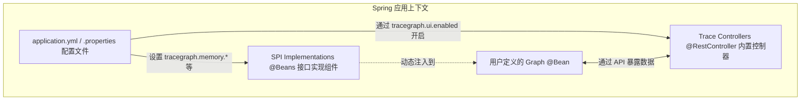

# TraceGraph :: Spring Boot Starter

## 📖 简介
欢迎使用 `tracegraph-spring-boot-starter`！如果您正在构建企业级 Java 应用程序，那么您很可能正在使用 Spring Boot。手动为 tracegraph 的各个模块配置依赖注入、数据库连接和 REST 端点可能会非常繁琐。

该 Starter 模块将 TraceGraph 干净利落地嵌入到您的 Spring 生态系统中，将配置文件 (`application.yml`) 自动转化为无样板代码的依赖注入组装。

### 核心特性
- **零摩擦自动配置 (Auto-Configuration)**: 根据您的 Spring 环境属性条件，自动装配并实例化 `NodeListener`、`CheckpointStore`、`TraceStore` 和 `MemoryStore`。
- **内置 REST API**: 瞬间暴露出 `GET /tracegraph/traces` 和 `POST {...}/replay` 调试 REST 端点，而无需编写任何控制器代码。
- **LLM 客户端设置**: 利用标准配置（如 `tracegraph.llm.provider=openai`）自动生成 `LlmClient` Bean 的具体实现。

## 🏗️ Spring 内部架构

Starter 在启动时会评估您的 `application.yml`，并自动将正确的 Bean 注册到 Spring 应用上下文中。



## 🚀 如何使用 Starter

### 1. 添加依赖
将 starter 包含在您的 `pom.xml` 中。

```xml
<dependency>
    <groupId>site.tracegraph</groupId>
    <artifactId>tracegraph-spring-boot-starter</artifactId>
    <version>${tracegraph.version}</version>
</dependency>
```

### 2. 通过 YAML 进行配置
您不再需要编写 `@Configuration` 类来实例化存储。只需在 `application.yml` 中定义它们即可。

```yaml
tracegraph:
  memory:
    store-type: jdbc # 将使用您的主 DataSource 自动创建 JdbcMemoryStore Bean
  checkpoint:
    store-type: in_memory
  observability:
    otel-enabled: true # 自动钩入 Spring 的 OpenTelemetry 自动配置
  llm:
    provider: openai
    api-key: ${OPENAI_API_KEY}
```

### 3. 注入 Bean 组件
现在，您可以自由地将 `MemoryStore`、`LlmClient` 或 `TraceStore` 直接注入到您的服务中了。

```java
@Service
public class AgentService {
    
    private final LlmClient llmClient;
    private final MemoryStore memoryStore;
    
    public AgentService(LlmClient llmClient, MemoryStore memoryStore) {
        this.llmClient = llmClient;
        this.memoryStore = memoryStore;
    }
    
    @Bean
    public Graph<MyState> agentGraph() {
        return Graph.<MyState>builder()
            // ... 使用注入的 bean 构建图
            .build();
    }
}
```
