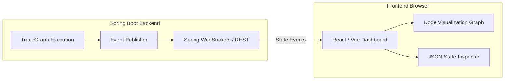

# TraceGraph :: UI

## 📖 Introduction to TraceGraph UI
Welcome to `tracegraph-ui`! Building graph-based agents can get complicated. When an agent loops back on itself, calls multiple tools in parallel, or takes an unexpected path, debugging via standard text logs can be a nightmare.

The UI module provides a **visual, real-time dashboard** for your TraceGraph applications. It allows developers and end-users to see the graph structure, watch the agent move from node to node, and inspect the state data at every step.

### Why Do I Need This?
- **Debugging & Tracing**: Easily see exactly *why* your agent made a specific decision by clicking on the node that performed the routing.
- **State Inspection**: Click on a node execution to see exactly what JSON data was in the state at that moment, including LLM token usage and latencies.
- **Demonstration**: Show off your complex AI workflows to non-technical stakeholders in an interactive, visual way.

## 🏗️ UI Architecture

The UI module hooks into the Observability layer of TraceGraph. As your agent executes, the `OtelNodeListener` or custom event publishers stream state changes to the backend, which are then pushed to the frontend via WebSockets or REST polling.



## 🚀 How to Implement It

Because this is built specifically for Spring Boot, enabling the UI is incredibly easy via Spring's Auto-Configuration. It requires almost zero boilerplate code.

### 1. Add the Dependency
Include this module in your application's `pom.xml`. This automatically brings in the embedded frontend assets and the required backend REST controllers.

```xml
<dependency>
    <groupId>site.tracegraph</groupId>
    <artifactId>tracegraph-ui</artifactId>
    <version>${tracegraph.version}</version>
</dependency>
```

### 2. Enable in Properties
In your `application.yml` or `application.properties`, simply enable the UI endpoint. You must also ensure that trace recording is enabled so the UI has data to display.

```yaml
tracegraph:
  ui:
    enabled: true
    port: 8081 # Optional: Run UI on a separate port to avoid exposing it to public users
  store:
    enabled: true # Ensure traces are stored so the UI can query them
```

### 3. Access the Dashboard
Once you start your Spring Boot application, open your web browser and navigate to the UI path:
`http://localhost:8080/tracegraph-ui`

### 4. Exploring the Features
When you open the UI, you will see:
1. **Trace List**: A historical log of all agent executions.
2. **Graph Visualizer**: A flowchart showing nodes and edges. Green nodes represent successful executions, while red nodes highlight where errors occurred.
3. **State Diff Viewer**: Selecting any node shows you the "Before" and "After" JSON payload of the graph's State.

## 🔒 Security Considerations
By default, the UI exposes internal application state. If you deploy this to production, you MUST protect the `/tracegraph-ui/**` and `/api/tracegraph/**` endpoints using Spring Security (e.g., restricting access to users with the `ADMIN` role).
