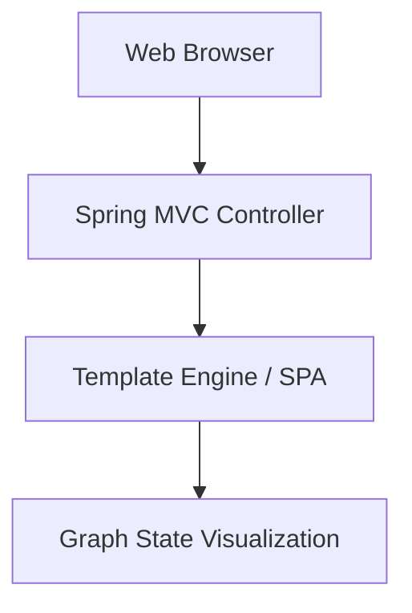

# TraceGraph :: UI

## Overview
The `tracegraph-ui` module provides user interface components and Spring Web MVC auto-configuration to visualize TraceGraph executions, monitor agent states, and provide an interactive developer experience.

## Component Diagram

## Features
- Real-time graph visualization
- Easy Spring Boot integration via auto-configurations
- Built-in debugging utilities
