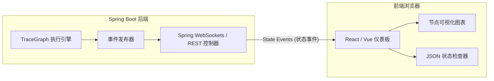

# TraceGraph :: UI (可视化界面)

## 📖 TraceGraph UI 简介
欢迎使用 `tracegraph-ui`！构建基于图的代理（Agent）可能会变得非常复杂。当代理进行自我循环、并行调用多个工具或采取意想不到的路径时，通过标准的文本日志进行调试简直是一场噩梦。

UI 模块为您的 TraceGraph 应用程序提供了一个**直观的、实时的仪表板**。它允许开发人员和最终用户查看图结构、观察代理从一个节点移动到另一个节点的过程，并在每一步检查状态数据。

### 为什么我需要这个？
- **调试与追踪 (Debugging & Tracing)**: 通过单击执行路由的节点，轻松确切地查看您的代理*为什么*做出特定决定。
- **状态检查 (State Inspection)**: 单击某个节点的执行记录，可以确切查看当时状态（State）中包含的 JSON 数据，包括 LLM 的 Token 消耗和延迟。
- **直观演示 (Demonstration)**: 以交互式可视化的方式向非技术人员（如产品经理、客户）展示您复杂的 AI 工作流。

## 🏗️ UI 架构图

UI 模块深度集成到 TraceGraph 的可观测性（Observability）层。当您的代理执行时，`OtelNodeListener` 或自定义事件发布器会将状态更改流式传输到后端，然后通过 WebSockets 或 REST 轮询推送到前端。



## 🚀 如何实现与集成

由于该模块是专门为 Spring Boot 构建的，因此通过 Spring 的自动配置机制启用 UI 非常容易，几乎不需要编写样板代码。

### 1. 添加 Maven 依赖
在应用程序的 `pom.xml` 中包含此模块。这会自动引入嵌入式的前端静态资源和所需的后端 REST 控制器。

```xml
<dependency>
    <groupId>site.tracegraph</groupId>
    <artifactId>tracegraph-ui</artifactId>
    <version>${tracegraph.version}</version>
</dependency>
```

### 2. 在配置文件中启用
在您的 `application.yml` 或 `application.properties` 中，只需启用 UI 端点。您还必须确保启用了追踪记录（Trace Recording），以便 UI 有数据可显示。

```yaml
tracegraph:
  ui:
    enabled: true
    port: 8081 # 可选配置: 在单独的端口上运行 UI，以避免将其暴露给公共用户
  store:
    enabled: true # 确保追踪记录被存储，以便 UI 可以查询它们
```

### 3. 访问仪表板
启动 Spring Boot 应用程序后，打开 Web 浏览器并导航到 UI 路径：
`http://localhost:8080/tracegraph-ui`

### 4. 探索核心功能
当您打开 UI 时，您将看到：
1. **追踪列表 (Trace List)**: 所有代理执行的历史日志记录。
2. **图可视化器 (Graph Visualizer)**: 显示节点和边的流程图。绿色节点代表成功执行，红色节点则高亮显示发生错误的位置。
3. **状态差异查看器 (State Diff Viewer)**: 选择任何节点都会向您显示该图状态（State）的“执行前”和“执行后”JSON 数据差异。

## 🔒 安全注意事项
默认情况下，UI 会暴露应用程序的内部状态数据。如果您将其部署到生产环境，则**必须**使用 Spring Security 保护 `/tracegraph-ui/**` 和 `/api/tracegraph/**` 端点（例如，仅限具有 `ADMIN` 角色的用户访问）。
